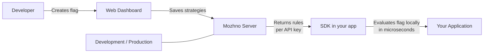

# Introduction

**можно**. is a feature flag management server for teams of any size.

With it you can:

- **Toggle features** on production without deploying code
- **Roll out gradually** — first 1% of users, then 10%, then everyone
- **Target specific users** — show a feature only to users from a certain country, on a Premium plan, or on a specific device
- **Toggle features instantly** — kill switches without deployment
- **Track all changes** through the audit log

## How It Works

1. You create a flag in the web dashboard and configure a strategy: for which environment, with what rules and rollout percentage.
2. You create an API key for the target environment (Development, Production) and pass it to the SDK.
3. The SDK fetches rules from the server using this key once and caches them.
4. On each `isEnabled()` call, the SDK evaluates the flag **locally** — zero network latency.
5. When rules change, the SDK receives updates in the background (every 15 seconds).

## Key Concepts

| Concept | Description |
|---------|-------------|
| **Flag** | A named toggle point in code. Types: RELEASE (feature flag) or KILLSWITCH (emergency shutoff). |
| **Strategy** | Per-environment flag configuration: enabled/disabled, context constraints, segments, percentage rollout. |
| **Segment** | A reusable user group with shared targeting rules. |
| **Context** | User or request attributes used to evaluate flag rules. |
| **Environment** | Development / Production — separate settings per environment. Community limit: 3. |
| **API Key** | SDK access key to the server, tied to a specific environment. |

## Ready to Try?

Head over to [Quick Start](/en/intro/quick-start) — get the server running in 5 minutes.

On first launch, the onboarding wizard will walk you through creating your admin account, project, and first flag — then you're in.

- [Flag Workflow](/en/guide/flags-workflow) — full lifecycle: creation to archival
