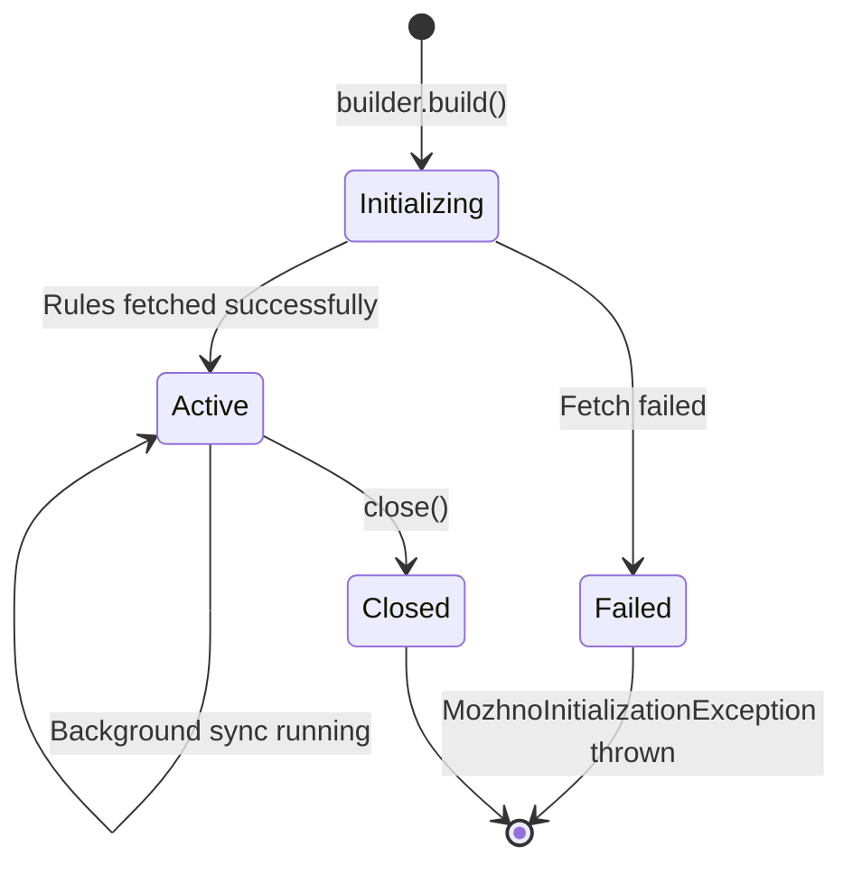

# Java SDK

The можно Java SDK provides local evaluation of feature flags on the JVM. It is compatible with JDK 25+, supports synchronous evaluation, and integrates with Spring Boot via auto-configuration.

## Installation

### Gradle (Kotlin DSL)

```kotlin
repositories {
    mavenCentral()
}

dependencies {
    implementation("com.mozhno:client-java:1.0.0")
}
```

### Gradle (Groovy DSL)

```groovy
repositories {
    mavenCentral()
}

dependencies {
    implementation 'com.mozhno:client-java:1.0.0'
}
```

### Maven

```xml
<dependency>
    <groupId>com.mozhno</groupId>
    <artifactId>client-java</artifactId>
    <version>1.0.0</version>
</dependency>
```

> **Tip:** Check the [GitHub releases page](https://github.com/edgar-dev20/mozhno/releases) for the latest version.

## Configuration

The SDK uses a **builder pattern** for client construction. Create a single client instance and reuse it across your application:

```java
import com.mozhno.client.MozhnoClient;
import com.mozhno.client.MozhnoClientBuilder;

MozhnoClient client = MozhnoClient.builder()
    .serverUrl("https://mozhno.example.com")
    .apiKey("mz_sk_production_abc123")
    .pollingIntervalMs(30_000)
    .streamUpdates(true)
    .connectTimeoutMs(5_000)
    .readTimeoutMs(10_000)
    .maxRetries(3)
    .retryBackoffMs(1_000)
    .build();
```

### Builder Options

| Method | Type | Default | Description |
|--------|------|---------|-------------|
| `serverUrl(String)` | String | **Required** | Base URL of your можно instance (e.g., `https://mozhno.example.com`) |
| `apiKey(String)` | String | **Required** | API key with `flags:read` scope |
| `pollingIntervalMs(long)` | long | `30000` | Polling interval in milliseconds |
| `streamUpdates(boolean)` | boolean | `false` | Enable SSE streaming for real-time updates |
| `connectTimeoutMs(long)` | long | `5000` | HTTP connection timeout in milliseconds |
| `readTimeoutMs(long)` | long | `10000` | HTTP read timeout in milliseconds |
| `maxRetries(int)` | int | `3` | Maximum retries for failed server requests |
| `retryBackoffMs(long)` | long | `1000` | Initial backoff between retries (exponential) |

### Spring Boot Auto-Configuration

Add the Spring Boot starter for automatic client configuration:

```xml
<dependency>
    <groupId>com.mozhno</groupId>
    <artifactId>client-java-spring-boot-starter</artifactId>
    <version>1.0.0</version>
</dependency>
```

Configure via `application.yml`:

```yaml
mozhno:
  server-url: https://mozhno.example.com
  api-key: mz_sk_production_abc123
  polling-interval-ms: 30000
  streaming:
    enabled: true
```

The client is automatically created and available as a Spring bean:

```java
@Service
public class CheckoutService {

    private final MozhnoClient mozhnoClient;

    public CheckoutService(MozhnoClient mozhnoClient) {
        this.mozhnoClient = mozhnoClient;
    }

    public boolean isNewCheckoutEnabled(String userId) {
        EvaluationContext context = EvaluationContext.builder()
            .set("userId", userId)
            .build();
        return mozhnoClient.isFlagEnabled("checkout_v2", context);
    }
}
```

## API Reference

### MozhnoClient

The main entry point. Thread-safe and designed to be a long-lived singleton.

#### `isFlagEnabled(String flagKey, EvaluationContext context)`

Returns `boolean` — the evaluated value of a boolean flag.

```java
EvaluationContext context = EvaluationContext.builder()
    .set("userId", "user-12345")
    .set("country", "DE")
    .build();

boolean enabled = client.isFlagEnabled("dark_mode_v2", context);

if (enabled) {
    renderDarkMode();
} else {
    renderLightMode();
}
```

| Parameter | Type | Description |
|-----------|------|-------------|
| `flagKey` | `String` | The flag key to evaluate |
| `context` | `EvaluationContext` | Evaluation context with user/request attributes |

| Return | Description |
|--------|-------------|
| `true` | Flag evaluates to true (targeting rule matched, or in rollout bucket, or default is true) |
| `false` | Flag evaluates to false, or flag key not found |

#### `getFlagValue(String flagKey, EvaluationContext context)`

Returns `Object` — the evaluated value of any flag (boolean or string).

```java
Object value = client.getFlagValue("theme_color", context);
String theme = value != null ? value.toString() : "light"; // Default fallback
```

| Parameter | Type | Description |
|-----------|------|-------------|
| `flagKey` | `String` | The flag key to evaluate |
| `context` | `EvaluationContext` | Evaluation context with user/request attributes |

| Return | Description |
|--------|-------------|
| `Boolean` / `String` | The evaluated flag value |
| `null` | Flag key not found or no value determined |

#### `getFlags(EvaluationContext context)`

Returns `Map<String, Object>` — all flag values for the given context in a single call.

```java
Map<String, Object> allFlags = client.getFlags(context);

boolean darkMode = (boolean) allFlags.getOrDefault("dark_mode_v2", false);
String theme = (String) allFlags.getOrDefault("theme_color", "light");
```

Use this for bulk evaluation when you need multiple flags at once. It is more efficient than individual calls because the context is processed once.

| Parameter | Type | Description |
|-----------|------|-------------|
| `context` | `EvaluationContext` | Evaluation context with user/request attributes |

#### `close()`

Shuts down the client gracefully. Stops background polling and streaming connections.

```java
// On application shutdown
Runtime.getRuntime().addShutdownHook(new Thread(() -> {
    client.close();
}));
```

### EvaluationContext

A builder-based context object for providing attributes at evaluation time.

```java
import com.mozhno.client.EvaluationContext;

EvaluationContext context = EvaluationContext.builder()
    .set("userId", "user-12345")
    .set("email", "alice@example.com")
    .set("country", "DE")
    .set("plan", "enterprise")
    .set("beta", true)
    .set("appVersion", "2.4.1")
    .build();
```

#### Supported Attribute Types

| Type | Example | Targeting Usage |
|------|---------|-----------------|
| `String` | `"DE"` | equals, not equals, contains, in, regex |
| `Boolean` | `true` | equals, not equals |
| `Integer` / `Long` | `42` | equals, greater than, less than |
| `Double` | `3.14` | equals, greater than, less than |

#### Context Builder Methods

| Method | Description |
|--------|-------------|
| `set(String key, String value)` | Add a string attribute |
| `set(String key, boolean value)` | Add a boolean attribute |
| `set(String key, int value)` | Add an integer attribute |
| `set(String key, long value)` | Add a long attribute |
| `set(String key, double value)` | Add a double attribute |
| `build()` | Create the immutable context |

## Error Handling

```java
try {
    MozhnoClient client = MozhnoClient.builder()
        .serverUrl("https://mozhno.example.com")
        .apiKey("mz_sk_production_abc123")
        .build();

    EvaluationContext context = EvaluationContext.builder()
        .set("userId", userId)
        .build();

    boolean enabled = client.isFlagEnabled("checkout_v2", context);

} catch (MozhnoInitializationException e) {
    // Initial fetch failed — server unreachable or API key invalid
    log.error("Failed to initialize Mozhno client: {}", e.getMessage());
    // Fail fast or fall back to safe defaults

} catch (IllegalArgumentException e) {
    // Invalid flag key format or null context
    log.error("Invalid argument: {}", e.getMessage());

} catch (IllegalStateException e) {
    // Client has been closed
    log.error("Mozhno client is closed: {}", e.getMessage());

} catch (Exception e) {
    // Unexpected error during local evaluation
    log.error("Unexpected error during flag evaluation: {}", e.getMessage());
}
```

| Exception | Cause | Recovery |
|-----------|-------|----------|
| `MozhnoInitializationException` | Server unreachable during initial fetch, invalid API key | Retry initialisation or exit |
| `IllegalArgumentException` | Null context, empty flag key | Fix the calling code |
| `IllegalStateException` | Client already closed | Create a new client instance |

## Connection Lifecycle



1. **Initialization:** `build()` triggers the initial fetch. Blocks until rules are loaded or the request times out.
2. **Active:** Client serves evaluations from the local cache. Background thread polls or maintains SSE connection.
3. **Closed:** All background activity stops. Further evaluation calls throw `IllegalStateException`.

### Graceful Shutdown Example

```java
@PreDestroy
public void shutdown() {
    log.info("Shutting down Mozhno client...");
    client.close();
    log.info("Mozhno client shut down complete.");
}
```

## Usage Patterns

### Singleton Client (Recommended)

```java
@Configuration
public class MozhnoConfig {

    @Bean(destroyMethod = "close")
    public MozhnoClient mozhnoClient() {
        return MozhnoClient.builder()
            .serverUrl("https://mozhno.example.com")
            .apiKey(System.getenv("MOZHNO_API_KEY"))
            .streamUpdates(true)
            .build();
    }
}
```

### Context per Request

Build a new `EvaluationContext` for each request, populated from request data:

```java
@GetMapping("/dashboard")
public DashboardResponse getDashboard(
    @RequestHeader("X-User-Id") String userId,
    @RequestHeader("X-Tenant-Id") String tenantId
) {
    EvaluationContext context = EvaluationContext.builder()
        .set("userId", userId)
        .set("tenantId", tenantId)
        .build();

    boolean showWidget = client.isFlagEnabled("dashboard_new_widget", context);
    // ...
}
```

### Conditional Feature Wrapper

```java
public Result executeWithFlag(String flagKey, EvaluationContext context,
                               Supplier<Result> newPath,
                               Supplier<Result> oldPath) {
    if (client.isFlagEnabled(flagKey, context)) {
        return newPath.get();
    }
    return oldPath.get();
}
```

## Performance

| Scenario | Typical Latency |
|----------|-----------------|
| `isFlagEnabled` (local eval, single rule) | < 0.1 ms |
| `isFlagEnabled` (local eval, 10 rules) | < 0.5 ms |
| `getFlags` (50 flags, single context) | < 5 ms |
| Initial fetch (100 flags, LAN) | ~50 ms |
| Background poll (no changes) | ~5 ms (304 response) |

The SDK is designed for high-throughput applications. Flag evaluation does not allocate memory after the initial cache warm-up.

## Next Steps

- [SDK Overview](./overview.md) — Architecture and evaluation model.
- [JavaScript SDK](./javascript.md) — For Node.js and browser applications.
- [REST API](../api/rest.md) — Manage flags programmatically.
