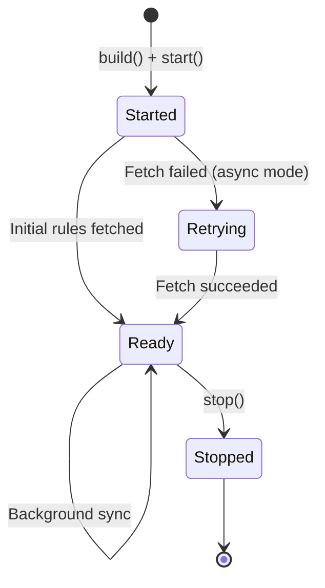

# Java SDK

The можно Java SDK provides local evaluation of feature flags on the JVM. Compatible with JDK 17+, supports synchronous evaluation, and integrates with Spring Boot via auto-configuration.

## Installation

### Gradle (Kotlin DSL)

```kotlin
repositories {
    mavenCentral()
}

dependencies {
    implementation("dev.mozhno:mozhno-client-java:1.0.1")
}
```

### Gradle (Groovy DSL)

```groovy
repositories {
    mavenCentral()
}

dependencies {
    implementation 'dev.mozhno:mozhno-client-java:1.0.1'
}
```

> **Tip:** Check the [GitHub releases page](https://github.com/mozhno-dev/mozhno/releases) for the latest version.

## Configuration

The SDK uses a **builder pattern** for client construction. Create a single client instance and reuse it across your application:

```java
import dev.mozhno.sdk.MozhnoClient;
import dev.mozhno.sdk.MozhnoConfig;
import dev.mozhno.sdk.MozhnoContext;
import dev.mozhno.sdk.DefaultMozhnoClient;

MozhnoConfig config = MozhnoConfig.builder()
    .appName("my-app")
    .instanceId("instance-1")
    .mozhnoUrl("https://mozhno.example.com")
    .apiKey("<api-key>")
    .fetchTogglesInterval(15)
    .sendMetricsInterval(60)
    .environment("production")
    .build();

MozhnoClient client = new DefaultMozhnoClient(config);
client.start();
```

### Builder Options

| Method | Type | Default | Description |
|--------|------|---------|-------------|
| `appName(String)` | String | **Required** | Your application identifier |
| `instanceId(String)` | String | **Required** | Unique instance identifier |
| `mozhnoUrl(String)` | String | **Required** | Base URL of your можно instance |
| `apiKey(String)` | String | **Required** | API key for the target environment |
| `fetchTogglesInterval(int)` | int | `15` | Polling interval in seconds |
| `sendMetricsInterval(int)` | int | `60` | Metrics reporting interval in seconds |
| `environment(String)` | String | `null` | Environment name |
| `disableMetrics(boolean)` | boolean | `false` | Disable metrics reporting |
| `synchronousFetchOnInitialisation(boolean)` | boolean | `false` | Block on initial flag fetch |
| `contextProvider(MozhnoContextProvider)` | — | `null` | Custom context provider |

### Spring Boot Auto-Configuration

The SDK provides auto-configuration via `MozhnoAutoConfiguration`. Configure via `application.yml`:

```yaml
mozhno:
  url: https://mozhno.example.com
  api-key: <api-key>
  app-name: my-app
  instance-id: ${random.uuid}
  environment: production
  fetch-toggles-interval: 15
  send-metrics-interval: 60
```

The client is automatically created and available as a Spring bean:

```java
@Service
public class CheckoutService {

    private final MozhnoClient mozhnoClient;

    public CheckoutService(MozhnoClient mozhnoClient) {
        this.mozhnoClient = mozhnoClient;
    }

    public boolean isNewCheckoutEnabled(String userId) {
        MozhnoContext context = MozhnoContext.builder()
            .userId(userId)
            .addProperty("country", "DE")
            .build();
        return mozhnoClient.isEnabled("checkout_v2", context);
    }
}
```

## API Reference

### MozhnoClient

The main entry point. Thread-safe and designed to be a long-lived singleton.

```java
public interface MozhnoClient {
    void start();
    void stop();
    boolean isEnabled(String flagKey);
    boolean isEnabled(String flagKey, boolean defaultReturn);
    boolean isEnabled(String flagKey, MozhnoContext context);
    boolean isEnabled(String flagKey, MozhnoContext context, boolean defaultReturn);
    void addEventListener(EventListener listener);
}
```

#### `isEnabled(String flagKey, MozhnoContext context, boolean defaultReturn)`

Returns the evaluated value of a flag.

```java
MozhnoContext context = MozhnoContext.builder()
    .userId("user-12345")
    .addProperty("country", "DE")
    .addProperty("plan", "enterprise")
    .build();

boolean enabled = client.isEnabled("dark_mode_v2", context, false);

if (enabled) {
    renderDarkMode();
} else {
    renderLightMode();
}
```

| Parameter | Type | Description |
|-----------|------|-------------|
| `flagKey` | `String` | The flag key to evaluate |
| `context` | `MozhnoContext` | Evaluation context with user/request attributes |
| `defaultReturn` | `boolean` | Value returned when flag is not found (default: `false`) |

#### Lifecycle: `start()` / `stop()`

```java
client.start();   // Begins background polling
client.stop();    // Stops polling, flushes metrics, shuts down executor
```

### MozhnoContext

A builder-based context object for providing attributes at evaluation time.

```java
import dev.mozhno.sdk.MozhnoContext;

MozhnoContext context = MozhnoContext.builder()
    .userId("user-12345")
    .sessionId("session-abc")
    .appName("my-app")
    .environment("production")
    .addProperty("country", "DE")
    .addProperty("plan", "enterprise")
    .addProperty("appVersion", "2.4.1")
    .build();
```

All attribute values are strings. For numeric comparisons, set `contextType: number` in your targeting rules.

#### Context Builder Methods

| Method | Description |
|--------|-------------|
| `userId(String)` | Set the user ID (used for percentage rollout hashing) |
| `sessionId(String)` | Set the session ID (fallback for hashing) |
| `appName(String)` | Set the application name |
| `environment(String)` | Set the environment name |
| `addProperty(String key, String value)` | Add an arbitrary attribute |

## Error Handling

```java
MozhnoConfig config = MozhnoConfig.builder()
    .appName("checkout-service")
    .instanceId("prod-1")
    .mozhnoUrl("https://mozhno.example.com")
    .apiKey(System.getenv("MOZHNO_API_KEY"))
    .synchronousFetchOnInitialisation(true)
    .build();

MozhnoClient client = new DefaultMozhnoClient(config);
client.start();  // Fetches initial rules synchronously if configured

MozhnoContext context = MozhnoContext.builder()
    .userId(userId)
    .build();

boolean enabled = client.isEnabled("checkout_v2", context, false);
```

| Failure Scenario | Behaviour |
|------------------|-----------|
| **Initial fetch fails** | Exception thrown if `synchronousFetchOnInitialisation(true)`. Background retry otherwise. |
| **Flag not found** | Returns `defaultReturn` (default: `false`) |
| **Network failure during polling** | Exponential backoff retry (1s → 2s → 4s). Circuit breaker after 5 consecutive failures (60s cooldown). |

## Connection Lifecycle



## Usage Patterns

### Singleton Client with Spring

```java
@Configuration
public class MozhnoConfig {

    @Bean(destroyMethod = "stop")
    public MozhnoClient mozhnoClient() {
        dev.mozhno.sdk.MozhnoConfig config = dev.mozhno.sdk.MozhnoConfig.builder()
            .appName("my-app")
            .instanceId(UUID.randomUUID().toString())
            .mozhnoUrl("https://mozhno.example.com")
            .apiKey(System.getenv("MOZHNO_API_KEY"))
            .build();
        return new dev.mozhno.sdk.DefaultMozhnoClient(config);
    }
}
```

### Context per Request

```java
public boolean isFeatureEnabled(String featureKey, HttpServletRequest request) {
    MozhnoContext context = MozhnoContext.builder()
        .userId(request.getHeader("X-User-Id"))
        .addProperty("tenantId", request.getHeader("X-Tenant-Id"))
        .build();
    return client.isEnabled(featureKey, context, false);
}
```

## Performance

| Scenario | Typical Latency |
|----------|-----------------|
| `isEnabled` (local eval, single rule) | < 0.1 ms |
| `isEnabled` (local eval, 10 rules) | < 0.5 ms |
| Initial fetch (100 flags, LAN) | ~50 ms |
| Background poll (no changes) | ~5 ms (304 response) |

The SDK is designed for high-throughput applications. Flag evaluation does not allocate memory after the initial cache warm-up. Thread safety is guaranteed via `ConcurrentHashMap`.

## Next Steps

- [SDK Overview](./overview.md) — Architecture and evaluation model.
- [JavaScript SDK](./javascript.md) — For Node.js and browser applications.
- [REST API](../api/rest.md) — Manage flags programmatically.
