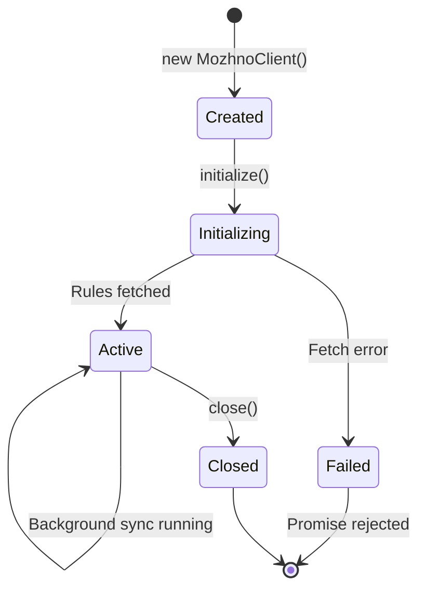

# JavaScript / TypeScript SDK

The можно JavaScript SDK provides local evaluation of feature flags in Node.js and browser environments. It is distributed as the npm package `@mozhno/client-js` with full TypeScript definitions.

## Installation

```bash
npm install @mozhno/client-js
```

```bash
yarn add @mozhno/client-js
```

```bash
pnpm add @mozhno/client-js
```

## Configuration

Create a single client instance and reuse it throughout your application:

```js
import { MozhnoClient } from "@mozhno/client-js";

const client = new MozhnoClient({
  url: "https://mozhno.example.com",
  apiKey: "<api-key>",
  appName: "my-app",
  refreshInterval: 15,
  metricsInterval: 60,
  environment: "production",
});

await client.start();
```

### TypeScript

```ts
import { MozhnoClient, MozhnoClientOptions } from "@mozhno/client-js";

const options: MozhnoClientOptions = {
### Configuration Options

| Option | Type | Default | Description |
|--------|------|---------|-------------|
| `url` | `string` | **Required** | Base URL of your можно instance |
| `apiKey` | `string` | **Required** | API key for the target environment |
| `appName` | `string` | **Required** | Your application identifier |
| `refreshInterval` | `number` | `15` | Polling interval in seconds |
| `metricsInterval` | `number` | `60` | Metrics reporting interval in seconds |
| `environment` | `string` | `"default"` | Environment name |
| `disableMetrics` | `boolean` | `false` | Disable metrics reporting |
| `stickyAnonId` | `boolean` | `true` | Auto-generate anonymous ID for sticky bucketing |

## Initialisation

The client must be explicitly started before use. Call `await client.start()` to fetch initial rules and begin background synchronisation.

### Waiting for Initialisation

```js
const client = new MozhnoClient({
  url: "https://mozhno.example.com",
  apiKey: "<api-key>",
  appName: "my-app",
});

await client.start();

console.log("Mozhno client ready");
```

> **Tip:** Call `await client.start()` during application startup to ensure rules are loaded before serving requests. If initialisation fails, the promise rejects — handle this to fail fast or fall back to safe defaults.

### Error Handling During Initialisation

```js
try {
  const client = new MozhnoClient({ url: "...", apiKey: "...", appName: "..." });
  await client.start();
} catch (error) {
  console.error("Failed to initialize Mozhno client:", error.message);
  process.exit(1);
}
```

> **Tip:** Call `await client.initialize()` during application startup to ensure rules are loaded before serving requests. If initialisation fails, the promise rejects — handle this to fail fast or fall back to safe defaults.

### Error Handling During Initialisation

```js
try {
  await client.initialize();
} catch (error) {
  console.error("Failed to initialize Mozhno client:", error.message);
  // Start with safe defaults or exit
  process.exit(1);
}
```

## API Reference

### MozhnoClient

The main class. Designed as a long-lived singleton.

#### `isEnabled(flagKey: string, context?: EvaluationContext): Promise<boolean>`

Returns a promise that resolves to the evaluated boolean value of a flag.

```js
const context = {
  userId: "user-12345",
  country: "DE",
  plan: "enterprise",
};

const enabled = await client.isEnabled("dark_mode_v2", context);

if (enabled) {
  renderDarkMode();
} else {
  renderLightMode();
}
```

| Parameter | Type | Description |
|-----------|------|-------------|
| `flagKey` | `string` | The flag key to evaluate |
| `context` | `EvaluationContext` (optional) | Context with user/request attributes |

| Return | Description |
|--------|-------------|
| `Promise<boolean>` | Resolves to `true` or `false` |

#### `getValue(flagKey: string, context?: EvaluationContext): Promise<string | boolean | null>`

Returns a promise that resolves to the evaluated value of any flag type.

```js
const themeValue = await client.getValue("theme_color", context);
const theme = themeValue ?? "light";
```

| Parameter | Type | Description |
|-----------|------|-------------|
| `flagKey` | `string` | The flag key to evaluate |
| `context` | `EvaluationContext` (optional) | Context with user/request attributes |

| Return | Description |
|--------|-------------|
| `Promise<string \| boolean \| null>` | The evaluated value, or `null` if not found |

#### `getAllFlags(context?: EvaluationContext): Promise<Record<string, string | boolean>>`

Returns a promise that resolves to an object containing all flag values.

```js
const allFlags = await client.getAllFlags(context);
console.log("All flags:", allFlags);
// { dark_mode_v2: true, theme_color: "blue", checkout_v2: false }
```

| Parameter | Type | Description |
|-----------|------|-------------|
| `context` | `EvaluationContext` (optional) | Context with user/request attributes |

#### `close(): Promise<void>`

Gracefully shuts down the client, closing SSE connections and stopping polling.

```js
process.on("SIGTERM", async () => {
  await client.close();
  process.exit(0);
});
```

## Evaluation Context

The context is a plain object with key-value pairs. Pass it to every evaluation method.

```ts
interface EvaluationContext {
  [key: string]: string | number | boolean;
}
```

**Example:**

```js
const context = {
  userId: "user-12345",
  email: "alice@example.com",
  country: "DE",
  plan: "enterprise",
  beta: true,
  appVersion: "2.4.1",
  customAttribute: "any-value",
};
```

If no context is provided, only the default value and non-targeted percentage rollouts apply.

> **Warning:** Missing context attributes cause targeting conditions that reference them to evaluate to `false`. Make sure to include all attributes referenced by your targeting rules.

## React Integration

The `@mozhno/client-js` package includes React hooks and a provider component.

### Setup: MozhnoProvider

```tsx
import { MozhnoProvider, createMozhnoClient } from "@mozhno/client-js/react";

const client = createMozhnoClient({
  url: "https://mozhno.example.com",
  apiKey: "<api-key>",
  streaming: true,
});

function App() {
  return (
    <MozhnoProvider client={client} context={{ userId: currentUser.id }}>
      <Dashboard />
    </MozhnoProvider>
  );
}
```

### Hook: useFlag

```tsx
import { useFlag } from "@mozhno/client-js/react";

function Dashboard() {
  const showNewWidget = useFlag("dashboard_new_widget");

  return (
    <div>
      {showNewWidget && <NewWidget />}
      <LegacyWidgets />
    </div>
  );
}
```

### Hook: useFlagValue

```tsx
import { useFlagValue } from "@mozhno/client-js/react";

function ThemeWrapper() {
  const theme = useFlagValue("theme_color") ?? "light";

  return (
    <div className={`theme-${theme}`}>
      <App />
    </div>
  );
}
```

### Hook: useAllFlags

```tsx
import { useAllFlags } from "@mozhno/client-js/react";

function DebugPanel() {
  const flags = useAllFlags();

  return (
    <pre>{JSON.stringify(flags, null, 2)}</pre>
  );
}
```

> **Tip:** The `MozhnoProvider` automatically re-renders components when flag rules are updated via background sync. No manual refresh is required.

### Custom Hook Without Provider

```tsx
import { MozhnoClient } from "@mozhno/client-js";
import { useState, useEffect } from "react";

const client = new MozhnoClient({
  url: "https://mozhno.example.com",
  apiKey: "<api-key>",
});

function useFeatureFlag(flagKey: string) {
  const [enabled, setEnabled] = useState(false);

  useEffect(() => {
    client.isEnabled(flagKey, { userId: getUserId() }).then(setEnabled);
  }, [flagKey]);

  return enabled;
}
```

## Async Patterns

### Express Middleware

```js
import express from "express";
import { MozhnoClient } from "@mozhno/client-js";

const app = express();
const client = new MozhnoClient({
  url: "https://mozhno.example.com",
  apiKey: "<api-key>",
});

await client.initialize();

app.get("/checkout", async (req, res) => {
  const context = {
    userId: req.headers["x-user-id"],
    country: req.headers["x-country"],
    plan: req.headers["x-plan"],
  };

  const useNewCheckout = await client.isEnabled("checkout_v2", context);

  if (useNewCheckout) {
    return res.json({ flow: "new", steps: newCheckoutSteps });
  }
  return res.json({ flow: "classic", steps: classicCheckoutSteps });
});

app.listen(3000);
```

### Next.js (App Router)

```ts
// lib/mozhno.ts
import { MozhnoClient } from "@mozhno/client-js";

let client: MozhnoClient;

export function getMozhnoClient(): MozhnoClient {
  if (!client) {
    client = new MozhnoClient({
      url: process.env.MOZHNO_SERVER_URL!,
      apiKey: process.env.MOZHNO_API_KEY!,
      streaming: true,
    });
  }
  return client;
}
```

```tsx
// app/dashboard/page.tsx
import { getMozhnoClient } from "@/lib/mozhno";
import { cookies } from "next/headers";

export default async function DashboardPage() {
  const client = getMozhnoClient();
  await client.initialize();

  const context = {
    userId: cookies().get("userId")?.value ?? "anonymous",
  };

  const showWidget = await client.isEnabled("dashboard_new_widget", context);

  return (
    <div>
      <h1>Dashboard</h1>
      {showWidget && <NewWidget />}
    </div>
  );
}
```

### Browser (CDN / Direct Script)

```html
<script type="module">
  import { MozhnoClient } from "https://cdn.example.com/@mozhno/client-js/index.js";

  const client = new MozhnoClient({
    url: "https://mozhno.example.com",
    apiKey: "<api-key>",
  });

  await client.initialize();

  const context = { userId: getCurrentUserId() };
  const darkMode = await client.isEnabled("dark_mode_v2", context);

  if (darkMode) {
    document.body.classList.add("dark-mode");
  }
</script>
```

## Error Handling

```js
try {
  await client.initialize();
} catch (error) {
  if (error.code === "MOZHNO_INIT_FAILED") {
    console.error("Server unreachable or API key invalid:", error.message);
  } else {
    console.error("Unexpected initialisation error:", error);
  }
}

const enabled = await client.isEnabled("my_flag", context).catch((error) => {
  console.warn("Flag evaluation failed:", error.message);
  return false; // Safe default
});
```

| Scenario | Behaviour |
|----------|-----------|
| Initialisation fails | `initialize()` rejects with `MOZHNO_INIT_FAILED` |
| Flag key not found | `isEnabled()` resolves to `false`; `getValue()` resolves to `null` |
| Context missing attribute | Targeting condition evaluates to `false` |
| Network failure during sync | Last known rules continue to be used |
| Client closed | Methods reject with `MOZHNO_CLIENT_CLOSED` |

## Connection Lifecycle



1. **Created:** Client is instantiated but not yet connected to the server.
2. **Initializing:** `await client.initialize()` fetches initial rules. Blocks until complete.
3. **Active:** Client serves evaluations from the local cache. Background sync keeps rules current.
4. **Closed:** All background activity stops. Further calls reject.

## TypeScript Types

```ts
// Client options
interface MozhnoClientOptions {
  url: string;
  apiKey: string;
  refreshInterval?: number;
  streaming?: boolean;
  connectTimeoutMs?: number;
  readTimeoutMs?: number;
  maxRetries?: number;
  retryBackoffMs?: number;
}

// Evaluation context
interface EvaluationContext {
  [key: string]: string | number | boolean;
}

// React hooks
function useFlag(flagKey: string): boolean;
function useFlagValue(flagKey: string): string | boolean | null;
function useAllFlags(): Record<string, string | boolean>;
```

## Performance

| Scenario | Typical Latency |
|----------|-----------------|
| `isEnabled` (local eval, single rule) | < 0.05 ms |
| `isEnabled` (local eval, 10 rules) | < 0.2 ms |
| `getAllFlags` (50 flags, single context) | < 3 ms |
| Initial fetch (100 flags, LAN) | ~50 ms |

## Next Steps

- [SDK Overview](./overview.md) — Architecture and local evaluation model.
- [Java SDK](./java.md) — For JVM-based applications.
- [Targeting Rules](../guide/targeting.md) — Configure who sees each flag value.
