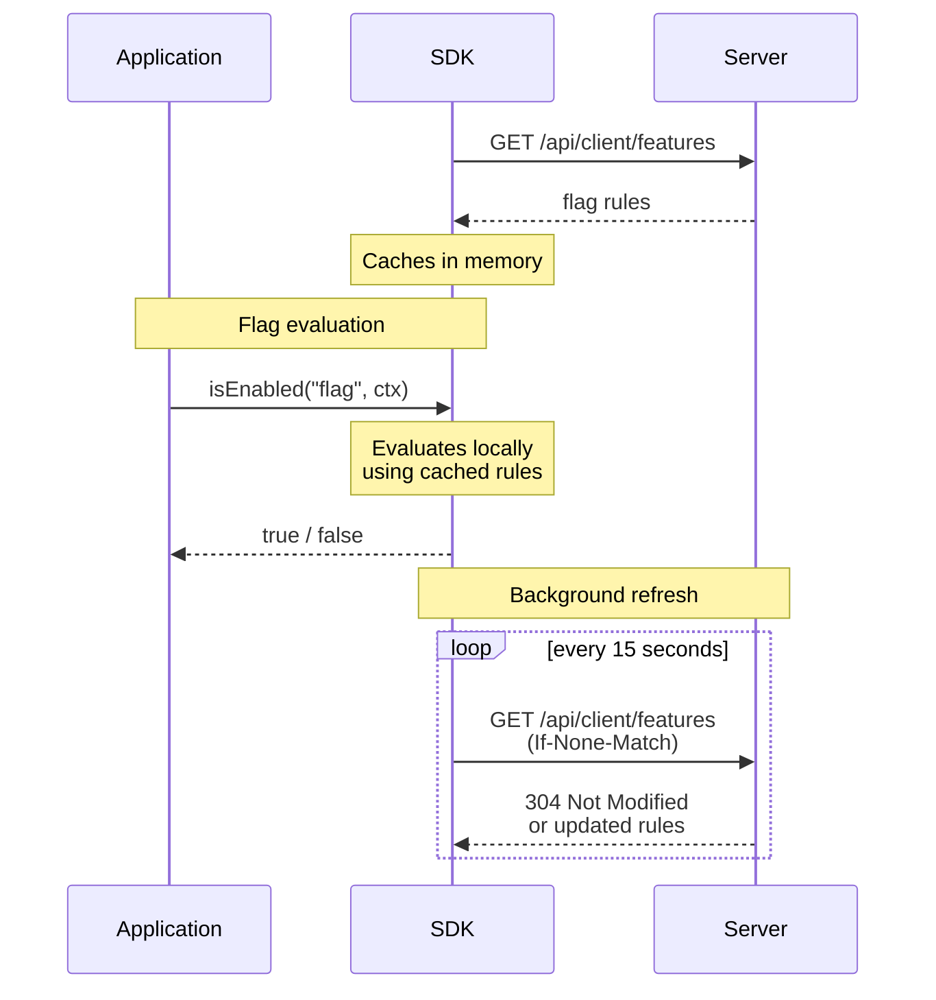
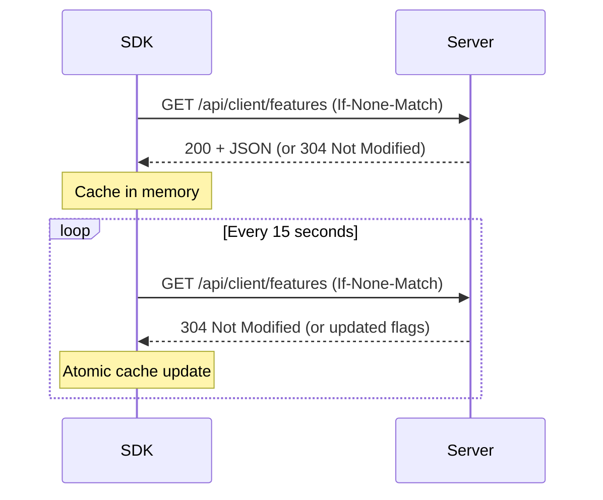

# SDK Overview

SDKs for **можно**<span class=brand-dot>.</span> are client libraries that fetch rule sets from the server and **evaluate feature flags locally** in your application.

## Architecture



### How Local Evaluation Works

1. **Startup:** The SDK fetches all flag rules from the server **once**.
2. **Caching:** Rules are stored in memory.
3. **Local evaluation:** Each `isEnabled()` call is evaluated **locally** — no network latency.
4. **Background refresh:** The SDK periodically polls the server (default every 15 seconds) and updates the cache. Uses `ETag` / `If-None-Match` for efficient delta updates.

| Benefit | Description |
|---------|-------------|
| **Zero latency** | Flag evaluation: sub-millisecond |
| **No single point of failure** | If the server is unavailable, the SDK continues working with cached rules |
| **Scalable** | The server is not loaded with flag evaluation requests |

## Evaluation Logic

Evaluation order — [Targeting](/en/guide/targeting#how-targeting-works). Operators and context types — [Contexts](/en/concepts/contexts#context-types-and-operators).

## Polling

The SDK uses **polling** (periodic requests) to stay in sync. Default interval is **15 seconds**.



| Parameter | Default | Description |
|-----------|---------|-------------|
| Polling interval | 15 seconds | `refreshInterval` (JS) / `fetchTogglesInterval` (Java) |
| Retry on error | Exponential backoff | 1s → 2s → 4s |
| Circuit breaker (Java) | 5 failures → 60s pause | Server overload protection |

## Evaluation Context

The context carries user/request attributes used for targeting:

```java
MozhnoContext context = MozhnoContext.builder()
    .userId("user-123")
    .sessionId("session-abc")
    .addProperty("country", "US")
    .addProperty("plan", "premium")
    .build();
```

```typescript
const context = {
  userId: 'user-123',
  sessionId: 'session-abc',
  country: 'US',
  plan: 'premium',
};
```

## Error Handling & Resilience

### Behavior Rules

| Scenario | Behavior |
|----------|----------|
| **Server unreachable at startup** | SDK starts and keeps retrying in the background. `isEnabled()` returns `false` until rules are loaded |
| **Server becomes unreachable** | SDK continues working with cached rules. Background reconnection attempts |
| **Flag not found** | Returns `false` (fail-closed) |
| **Context attribute missing** | Rule referencing that attribute returns `false` |
| **Cache is empty** | Returns `false` |

### Propagation Delay

Flag changes in the dashboard reach the SDK within one **polling interval** (default 15 seconds).

## Next Steps

- [Java SDK](/en/sdk/java) — setup, configuration, and API for Java
- [JavaScript / TypeScript SDK](/en/sdk/javascript) — setup and React integration
- [Quick Start](/en/intro/quick-start) — create your first flag
- [API Overview](/en/api/overview) — auth and base concepts
