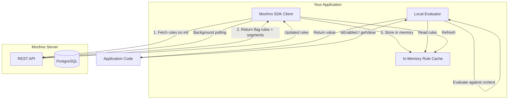
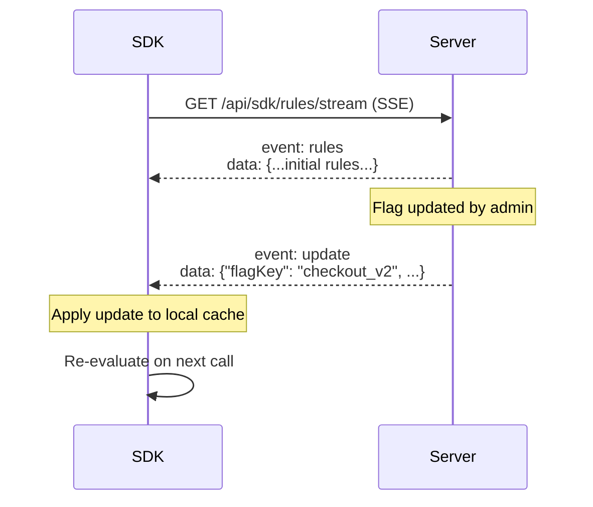
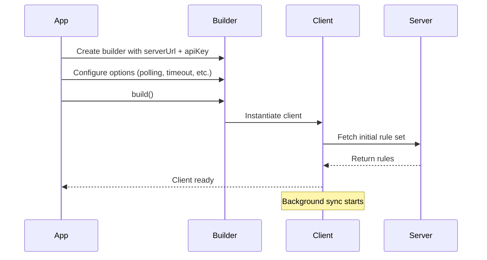

# SDK Overview

можно SDKs use **local evaluation** to deliver flag values with minimal latency. Rule sets are fetched once from the server and evaluated locally in your application process — no network round-trip per flag check.

## Architecture



### How Local Evaluation Works

1. **Initialisation:** The SDK connects to the можно server and downloads all flag rules, targeting configurations, and segments for the environment associated with your API key.
2. **Caching:** Rules are stored in an in-memory cache within your application process.
3. **Evaluation:** When your code calls `isFlagEnabled()` or `getFlagValue()`, the SDK evaluates the rules locally against the provided context. No network call is made.
4. **Background Sync:** The SDK periodically polls the server for rule updates. Changes are applied to the in-memory cache automatically.

> **Tip:** Local evaluation means flag checks are **sub-millisecond** and work even during temporary network disruptions. The SDK always falls back to the last known rule set.

## Polling vs Streaming

можно SDKs support two mechanisms for receiving rule updates:

| Mechanism | Latency | Resource Usage | Configuration |
|-----------|---------|----------------|---------------|
| **Polling** | Up to polling interval (default: 30 seconds) | Low (periodic HTTP request) | Default mode. Configure via `pollingIntervalMs`. |
| **Streaming (SSE)** | Near real-time (< 1 second) | Persistent connection | Enable with `streamUpdates(true)`. Uses Server-Sent Events. |

### Polling

The SDK sends a `GET` request to the server at a configurable interval. If the server detects that rules have changed (via ETag or `If-None-Match`), it returns the updated data. Otherwise, it returns `304 Not Modified`, saving bandwidth.

### Streaming (SSE)

When streaming is enabled, the SDK opens a persistent SSE connection to the server. The server pushes updates as soon as they occur. This is recommended for production environments where flag changes need to propagate quickly.



> **Tip:** Use polling during development and testing. Enable streaming for production deployments that require fast rule propagation.

## Caching Strategy

### Cache Structure

The SDK maintains a compact, immutable representation of all flag rules. The cache is structured for efficient evaluation:

```
Cache
├── Flags Map (key → FlagDefinition)
│   ├── flagKey: "checkout_v2"
│   │   ├── targetingRules: [...]
│   │   ├── rolloutPercentage: 25
│   │   ├── defaultVariant: false
│   │   └── state: ACTIVE
│   └── ...
└── Segments Map (name → SegmentDefinition)
    ├── name: "beta_testers"
    │   └── conditions: [...]
    └── ...
```

### Cache Update Behaviour

| Scenario | Behaviour |
|----------|-----------|
| **Rule update from server** | Entire flag or segment definition is replaced atomically. No partial updates. |
| **New flag added** | Flag is inserted into the cache. Available immediately for evaluation. |
| **Flag deleted** | Flag is removed from the cache. Subsequent evaluations return the SDK's default value. |
| **Flag archived/paused** | Flag stays in cache with updated state. Evaluations return default value. |
| **Network failure** | SDK continues serving from the last successful cache state. |

### Cache Persistence

The SDK does **not** persist the cache to disk. On application restart, the SDK re-fetches rules from the server. This ensures the application always starts with a fresh, consistent rule set.

## General SDK API Surface

All можно SDKs expose a consistent set of methods, tailored to the language's idioms.

| Method | Description | Returns |
|--------|-------------|---------|
| `isFlagEnabled(key, context)` | Check if a boolean flag is enabled | `boolean` |
| `getFlagValue(key, context)` | Get the value of any flag (boolean or string) | `boolean` or `String` |
| `getFlags(context)` | Get all flag values at once | `Map<String, Object>` |
| `close()` / `shutdown()` | Gracefully close the client, stopping background tasks | `void` |

### Evaluation Context

Every evaluation method accepts a context object with arbitrary key-value pairs:

```java
// Java
EvaluationContext context = EvaluationContext.builder()
    .set("userId", "12345")
    .set("country", "DE")
    .set("plan", "enterprise")
    .build();
```

```js
// JavaScript
const context = {
  userId: "12345",
  country: "DE",
  plan: "enterprise",
};
```

Context attributes are matched against targeting rules and used for percentage rollout hashing. Provide enough attributes to satisfy all targeting conditions you have configured.

## Client Initialisation Pattern

All SDKs follow the same initialisation pattern:



The client is a **singleton** — create one instance per application and reuse it across all threads, requests, or components.

```java
// Java
MozhnoClient client = MozhnoClient.builder()
    .serverUrl("https://mozhno.example.com")
    .apiKey("mz_sk_production_abc123")
    .pollingIntervalMs(30_000)
    .streamUpdates(true)
    .build();
```

```js
// JavaScript
import { MozhnoClient } from "@mozhno/client-js";

const client = new MozhnoClient({
  serverUrl: "https://mozhno.example.com",
  apiKey: "mz_sk_production_abc123",
  pollingIntervalMs: 30000,
  streaming: true,
});
```

### Configuration Options

| Option | Type | Default | Description |
|--------|------|---------|-------------|
| `serverUrl` | String | **Required** | Base URL of your можно instance |
| `apiKey` | String | **Required** | API key with `flags:read` scope |
| `pollingIntervalMs` | Integer | `30000` | Polling interval in milliseconds |
| `streamUpdates` / `streaming` | Boolean | `false` | Enable SSE streaming for real-time updates |
| `connectTimeoutMs` | Integer | `5000` | Connection timeout for HTTP requests |
| `readTimeoutMs` | Integer | `10000` | Read timeout for HTTP requests |
| `maxRetries` | Integer | `3` | Maximum retry attempts for failed requests |
| `retryBackoffMs` | Integer | `1000` | Initial backoff between retries (exponential) |

## Error Handling & Resilience

The SDK is designed to be resilient to server unavailability:

| Failure Scenario | SDK Behaviour |
|------------------|---------------|
| **Initial fetch fails** | Client creation throws an exception. Application should retry or fail fast. |
| **Background poll fails** | SDK logs a warning and retries with backoff. Last known rules continue to be used. |
| **Flag key not found** | `isFlagEnabled` returns `false`; `getFlagValue` returns `null`. |
| **Context missing attribute** | Rule condition that references missing attribute evaluates to `false` (rule does not match). |
| **Invalid context type** | SDK throws `IllegalArgumentException` (Java) or `TypeError` (JS). |

> **Warning:** If the initial fetch fails, the SDK does **not** silently start with empty rules. This avoids the risk of all flags returning defaults and silently breaking features. Handle initialisation failures explicitly in your application startup.

## SDK Comparison

| Feature | [Java SDK](./java.md) | [JavaScript SDK](./javascript.md) |
|---------|----------------------|----------------------------------|
| **Platform** | JVM 25+ | Node.js, Browser |
| **Package** | Maven / Gradle | npm (`@mozhno/client-js`) |
| **Evaluation** | Synchronous | Async (Promise-based) |
| **Streaming** | SSE via OkHttp | SSE via EventSource / fetch |
| **Thread safety** | Fully thread-safe | Single-threaded event loop |
| **Framework integration** | Spring Boot auto-config | React hook (`useFlag`) |

## Performance Characteristics

| Metric | Typical Value |
|--------|---------------|
| **Initial fetch latency** | 50–200 ms (depending on rule set size) |
| **Local evaluation time** | < 1 ms per flag check |
| **Memory overhead** | ~1 KB per flag (rule definitions) |
| **Background poll data transfer** | < 1 KB (304 Not Modified) or ~100 KB (full refresh for 500 flags) |

## Next Steps

- [Java SDK](./java.md) — Maven/Gradle setup, builder API, full reference.
- [JavaScript SDK](./javascript.md) — npm setup, React integration, async patterns.
- [REST API](../api/rest.md) — Programmatic access to flags, segments, and environments.
