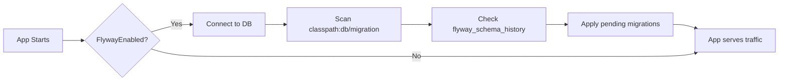

# Database

**можно**<span class=brand-dot>.</span> uses PostgreSQL 15+ for all persistent storage: flags, strategies, segments, users, audit logs, and API keys. This page covers setup, connection pooling, migrations, backups, and performance.

## Configuration

Database connection is configured via environment variables:

```bash
SPRING_DATASOURCE_URL=jdbc:postgresql://localhost:5432/feature_flags
SPRING_DATASOURCE_USERNAME=flags_user
SPRING_DATASOURCE_PASSWORD=your-password
```

| Variable | Description |
|----------|-------------|
| `SPRING_DATASOURCE_URL` | JDBC URL. Use `postgresql://` scheme, not `postgres://`. |
| `SPRING_DATASOURCE_USERNAME` | Database user with full schema ownership |
| `SPRING_DATASOURCE_PASSWORD` | Database password |

## Flyway Migrations

Flyway manages database schema versioning. Migrations run automatically on application startup (`SPRING_FLYWAY_ENABLED=true` by default).

### How It Works



### Migration Files

Migrations are embedded in the server JAR at `classpath:db/migration/` and follow Flyway naming conventions:

```
V1__initial_schema.sql
V2__add_segments.sql
V3__add_api_keys.sql
V4__add_last_used_at_to_api_keys.sql
...
V44__add_context_strict.sql
```

### Migration Commands

| Command | Purpose |
|---------|---------|
| `migrate` | Apply all pending migrations (default on startup) |
| `info` | Show migration state |
| `validate` | Check that applied migrations match source |
| `repair` | Fix schema history after a failed migration |
| `undo` | Roll back the last migration (Enterprise only) |

If a migration fails, Flyway marks it as failed in `flyway_schema_history`. The application will not start until the issue is resolved. Fix the cause, then run:

```bash
# Option 1: Repair the history table and try again
java -jar mozhno.jar flyway:repair

# Option 2: Manually fix the database, then repair
psql -U mozhno -d mozhno -c "ALTER TABLE ..."
java -jar mozhno.jar flyway:repair
```

### Migration Rollback

Flyway Community (used by можno.) does not support automatic rollback (`undo` is an Enterprise feature). To roll back a migration:

1. **Take a backup before migrating** — always your safest path.
2. **Restore from backup** — the most reliable rollback method.
3. **Write a down-migration manually** — create a new `V<N+1>` migration that reverses the changes.

Example: if `V3__add_segment_overrides.sql` created a table, write `V4__remove_segment_overrides.sql`:

```sql
DROP TABLE IF EXISTS segment_overrides CASCADE;
DELETE FROM flyway_schema_history WHERE version = '3';
```

Then restart — Flyway will apply V4, effectively rolling back V3. Remove V4 afterward to keep the migration history clean.

## Connection Pool (HikariCP)

можно. uses HikariCP for connection pooling. The pool is configured via Spring Boot properties:

```yaml
spring:
  datasource:
    hikari:
      maximum-pool-size: 30
      minimum-idle: 5
      idle-timeout: 600000         # 10 min
      max-lifetime: 1800000        # 30 min (shorter than PostgreSQL idle timeout)
      connection-timeout: 30000    # 30 sec
      validation-timeout: 5000     # 5 sec
      leak-detection-threshold: 60000  # 1 min
```

| Property | Default | Description |
|----------|---------|-------------|
| `maximum-pool-size` | `30` | Max concurrent connections per pod |
| `minimum-idle` | `5` | Keep at least 5 idle connections ready |
| `idle-timeout` | `600000` (10 min) | Close idle connections after this |
| `max-lifetime` | `1800000` (30 min) | Close connections after this age |
| `connection-timeout` | `30000` (30 sec) | Wait time before failing a request |
| `leak-detection-threshold` | `60000` (1 min) | Log warning if a connection is held longer |

### Sizing Guidelines

Connection pool sizing depends on replica count:

```
PostgreSQL max_connections = (max-pool-size × replicas) + 10 (admin overhead)
```

| Replicas | Max Pool Size | PostgreSQL max_connections |
|----------|--------------|---------------------------|
| 1 | 30 | 40 |
| 2 | 30 | 70 |
| 4 | 20 | 90 |
| 8 | 10 | 90 |

Reduce `maximum-pool-size` as replica count grows to avoid exhausting PostgreSQL connection limits. Adjust `max_connections` in `postgresql.conf` to match.

Set the pool size via environment variable:

```bash
HIKARI_MAX_POOL_SIZE=30
HIKARI_MIN_IDLE=5
```

## Backup Strategies

### pg_dump (Logical Backup)

Scheduled backup with `pg_dump` for small to medium datasets:

```bash
#!/bin/bash
# Backup script: /etc/cron.daily/mozhno-backup

TIMESTAMP=$(date -u +%Y%m%d_%H%M%S)
BACKUP_DIR="/var/backups/mozhno"
RETENTION_DAYS=30

pg_dump -U mozhno -d mozhno \
  --format=custom \
  --compress=9 \
  --file="${BACKUP_DIR}/mozhno_${TIMESTAMP}.dump"

# Remove backups older than retention
find "${BACKUP_DIR}" -name "mozhno_*.dump" -mtime +${RETENTION_DAYS} -delete
```

Restore from `pg_dump`:

```bash
pg_restore -U mozhno -d mozhno --clean --if-exists mozhno_20250101_120000.dump
```

### Continuous Archiving (WAL)

For point-in-time recovery, configure WAL archiving in `postgresql.conf`:

```ini
wal_level = replica
archive_mode = on
archive_command = 'test ! -f /archive/%f && cp %p /archive/%f'
```

This enables recovery to any point in time, not just the last backup.

## Database Versioning

Each database schema version corresponds to a Flyway migration. Track your current version:

```sql
SELECT version, description, installed_on, success
FROM flyway_schema_history
ORDER BY installed_rank DESC
LIMIT 5;
```

### Compatibility

The server expects all Flyway migrations up to the version it ships with to be applied. Flyway ensures that your database schema matches the server version — the server will not start if a required migration is missing or has been tampered with.

## Index Recommendations

The following indexes are recommended for production workloads. Most are created by Flyway migrations; verify they exist:

```sql
-- Core flag lookups
CREATE INDEX IF NOT EXISTS idx_flags_key ON flags (key, environment_id);

-- SDK flag streaming (bulk fetch by environment)
CREATE INDEX IF NOT EXISTS idx_flags_env ON flags (environment_id, updated_at);

-- Audit log pagination and filtering
CREATE INDEX IF NOT EXISTS idx_audit_log_created ON audit_log (created_at DESC);
CREATE INDEX IF NOT EXISTS idx_audit_log_user ON audit_log (user_id, created_at DESC);

-- API key validation (hot path during SDK sync)
CREATE INDEX IF NOT EXISTS idx_api_keys_hash ON api_keys (key_hash);
CREATE INDEX IF NOT EXISTS idx_api_keys_env ON api_keys (environment_id, revoked);

-- JWT refresh token lookup (SELECT FOR UPDATE)
CREATE INDEX IF NOT EXISTS idx_refresh_tokens_family ON refresh_tokens (family_id);
CREATE INDEX IF NOT EXISTS idx_refresh_tokens_user ON refresh_tokens (user_id, revoked);

-- User lookup by login
CREATE UNIQUE INDEX IF NOT EXISTS idx_users_email ON users (email);
```

Run `VACUUM ANALYZE` periodically to maintain index statistics:

```sql
VACUUM ANALYZE flags;
VACUUM ANALYZE audit_log;
```

## JdbcTemplate (Not JPA)

можно. uses Spring's `JdbcTemplate` with `RowMapper` for all database access — not JPA/Hibernate. This choice provides:

- **Predictable SQL** — every query is explicit, no generated SQL surprises
- **Performance** — no session management overhead, no dirty checking, no lazy loading
- **Debuggability** — SQL is visible in logs, not buried in Hibernate traces
- **RowMapper** — lightweight mapping from `ResultSet` to domain objects

Example pattern used throughout the codebase:

```java
private static final RowMapper<FeatureFlag> ROW_MAPPER = (rs, rowNum) -> new FeatureFlag(
    rs.getLong("id"),
    rs.getString("key"),
    rs.getString("name"),
    FlagType.valueOf(rs.getString("type")),
    rs.getTimestamp("created_at").toInstant(),
    rs.getTimestamp("updated_at").toInstant()
);

public List<FeatureFlag> findByEnvironment(long environmentId) {
    return jdbcTemplate.query(
        "SELECT * FROM flags WHERE environment_id = ? ORDER BY key",
        ROW_MAPPER,
        environmentId
    );
}
```

## Related Pages

- [Docker](/en/self-hosting/docker) — Docker deployment with PostgreSQL
- [Scaling](/en/self-hosting/scaling) — Connection pool sizing across replicas
