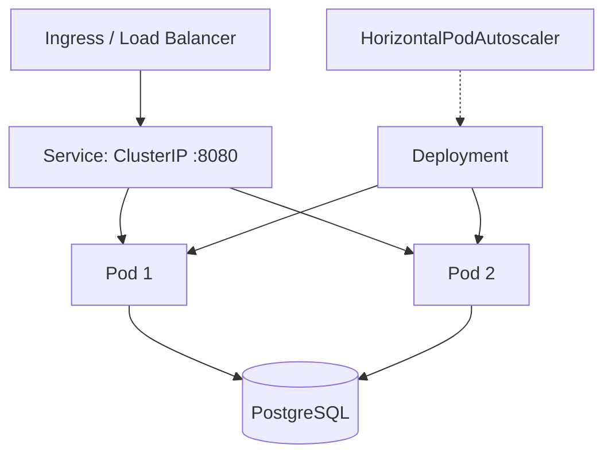

# Kubernetes

Deploy **можно.** on Kubernetes with production-grade configuration: high availability, auto-scaling, rolling updates, and health probes.

## Architecture



## Prerequisites

- Kubernetes 1.27+
- `kubectl` configured for your cluster
- PostgreSQL 16 accessible from the cluster (managed or StatefulSet)

## Deployment Manifest

```yaml
apiVersion: apps/v1
kind: Deployment
metadata:
  name: mozhno
  labels:
    app: mozhno
spec:
  replicas: 2
  strategy:
    type: RollingUpdate
    rollingUpdate:
      maxUnavailable: 0
      maxSurge: 1
  selector:
    matchLabels:
      app: mozhno
  template:
    metadata:
      labels:
        app: mozhno
    spec:
      terminationGracePeriodSeconds: 60
      securityContext:
        runAsUser: 1001
        runAsGroup: 1001
        fsGroup: 1001
        runAsNonRoot: true
      containers:
        - name: mozhno
          image: ghcr.io/edgar-dev20/mozhno:latest
          imagePullPolicy: IfNotPresent
          ports:
            - containerPort: 8080
              name: http
              protocol: TCP
          env:
            - name: SPRING_DATASOURCE_URL
              valueFrom:
                secretKeyRef:
                  name: mozhno-secrets
                  key: database-url
            - name: SPRING_DATASOURCE_USERNAME
              valueFrom:
                secretKeyRef:
                  name: mozhno-secrets
                  key: database-username
            - name: SPRING_DATASOURCE_PASSWORD
              valueFrom:
                secretKeyRef:
                  name: mozhno-secrets
                  key: database-password
            - name: JWT_SECRET
              valueFrom:
                secretKeyRef:
                  name: mozhno-secrets
                  key: jwt-secret
            - name: JAVA_OPTS
              value: >-
                -XX:+UseZGC
                -XX:MaxRAMPercentage=75
                -XX:+ExitOnOutOfMemoryError
                -XX:ConcGCThreads=2
                -XX:ParallelGCThreads=2
          resources:
            requests:
              memory: "512Mi"
              cpu: "250m"
            limits:
              memory: "2Gi"
              cpu: "2000m"
          readinessProbe:
            httpGet:
              path: /actuator/health/readiness
              port: 8080
            initialDelaySeconds: 30
            periodSeconds: 10
            timeoutSeconds: 5
            failureThreshold: 3
          livenessProbe:
            httpGet:
              path: /actuator/health/liveness
              port: 8080
            initialDelaySeconds: 60
            periodSeconds: 20
            timeoutSeconds: 5
            failureThreshold: 3
          startupProbe:
            httpGet:
              path: /actuator/health
              port: 8080
            initialDelaySeconds: 10
            periodSeconds: 5
            timeoutSeconds: 5
            failureThreshold: 30
          securityContext:
            readOnlyRootFilesystem: true
            allowPrivilegeEscalation: false
            capabilities:
              drop:
                - ALL
          volumeMounts:
            - name: tmp
              mountPath: /tmp
      volumes:
        - name: tmp
          emptyDir:
            sizeLimit: 64Mi
```

## Rolling Update Strategy

| Parameter | Value | Explanation |
|-----------|-------|-------------|
| `maxUnavailable` | `0` | Never drop below the desired replica count during updates |
| `maxSurge` | `1` | Allow one extra pod during rollout for zero-downtime |

With 2 replicas, a rolling update creates a 3rd pod with the new version, waits for it to become ready, then terminates one old pod. This guarantees at least 2 healthy pods at all times.

The JVM is configured with ZGC (`-XX:+UseZGC`) for sub-millisecond pause times, ensuring no request timeouts during GC cycles.

## Horizontal Pod Autoscaler (HPA)

```yaml
apiVersion: autoscaling/v2
kind: HorizontalPodAutoscaler
metadata:
  name: mozhno-hpa
spec:
  scaleTargetRef:
    apiVersion: apps/v1
    kind: Deployment
    name: mozhno
  minReplicas: 2
  maxReplicas: 8
  metrics:
    - type: Resource
      resource:
        name: cpu
        target:
          type: Utilization
          averageUtilization: 70
    - type: Resource
      resource:
        name: memory
        target:
          type: Utilization
          averageUtilization: 80
  behavior:
    scaleDown:
      stabilizationWindowSeconds: 300
      policies:
        - type: Percent
          value: 50
          periodSeconds: 60
    scaleUp:
      stabilizationWindowSeconds: 0
      policies:
        - type: Percent
          value: 100
          periodSeconds: 15
```

| Parameter | Value | Reason |
|-----------|-------|--------|
| `minReplicas` | 2 | High availability baseline |
| `maxReplicas` | 8 | Reasonable upper bound for most deployments |
| CPU target | 70% | Trigger scale-out before saturation |
| Memory target | 80% | Leave headroom for GC and spikes |
| Scale-down window | 5 min | Avoid flapping from brief traffic dips |
| Scale-up window | 0 | React immediately to traffic surges |

## Pod Disruption Budget (PDB)

```yaml
apiVersion: policy/v1
kind: PodDisruptionBudget
metadata:
  name: mozhno-pdb
spec:
  minAvailable: 1
  selector:
    matchLabels:
      app: mozhno
```

`minAvailable: 1` ensures that at least one pod remains available during voluntary disruptions (node drains, cluster upgrades). Combined with 2 replicas and `maxUnavailable: 0`, the deployment tolerates one node failure without downtime.

## Service

```yaml
apiVersion: v1
kind: Service
metadata:
  name: mozhno
  labels:
    app: mozhno
spec:
  type: ClusterIP
  selector:
    app: mozhno
  ports:
    - name: http
      port: 8080
      targetPort: 8080
      protocol: TCP
```

`ClusterIP` is sufficient — expose the service externally via Ingress or a LoadBalancer at the edge, not directly.

### Ingress Example

```yaml
apiVersion: networking.k8s.io/v1
kind: Ingress
metadata:
  name: mozhno
  annotations:
    cert-manager.io/cluster-issuer: letsencrypt-prod
spec:
  ingressClassName: nginx
  tls:
    - hosts:
        - mozhno.example.com
      secretName: mozhno-tls
  rules:
    - host: mozhno.example.com
      http:
        paths:
          - path: /
            pathType: Prefix
            backend:
              service:
                name: mozhno
                port:
                  number: 8080
```

## Health Probes

| Probe | Endpoint | Initial Delay | Period | Failure Threshold | Purpose |
|-------|----------|---------------|--------|-------------------|---------|
| **startup** | `/actuator/health` | 10s | 5s | 30 (150s total) | Wait for JVM + Flyway + cache warm |
| **liveness** | `/actuator/health/liveness` | 60s | 20s | 3 | Detect deadlocked/unresponsive JVM |
| **readiness** | `/actuator/health/readiness` | 30s | 10s | 3 | Stop routing to pod if DB is unreachable |

- **Startup probe** gives the JVM up to 150 seconds to start (including Flyway migrations) before Kubernetes kills the pod. The liveness probe is disabled until startup succeeds.
- **Liveness probe** checks that the JVM is alive. A failed liveness probe triggers a pod restart.
- **Readiness probe** checks that the pod can serve traffic (DB is reachable). A failed readiness probe removes the pod from the Service endpoints without restarting it.

## Secrets Management

```yaml
apiVersion: v1
kind: Secret
metadata:
  name: mozhno-secrets
  labels:
    app: mozhno
type: Opaque
stringData:
  database-url: jdbc:postgresql://postgres.production:5432/mozhno
  database-username: mozhno
  database-password: <strong-random-password>
  jwt-secret: <64-character-hex-secret>
```

In production, use a secrets management solution:

| Approach | Tool |
|----------|------|
| External Secrets Operator | Sync from AWS Secrets Manager, GCP Secret Manager, Azure Key Vault, HashiCorp Vault |
| Sealed Secrets | Encrypt secrets for GitOps workflows |
| SOPS + Age | Encrypt secret files in Git |

### External Secrets Operator Example

```yaml
apiVersion: external-secrets.io/v1beta1
kind: ExternalSecret
metadata:
  name: mozhno-secrets
spec:
  refreshInterval: 1h
  secretStoreRef:
    name: vault-backend
    kind: SecretStore
  target:
    name: mozhno-secrets
  data:
    - secretKey: database-url
      remoteRef:
        key: mozhno/production/database-url
    - secretKey: database-password
      remoteRef:
        key: mozhno/production/database-password
    - secretKey: jwt-secret
      remoteRef:
        key: mozhno/production/jwt-secret
```

## Security Context

| Setting | Value | Effect |
|---------|-------|--------|
| `runAsNonRoot` | `true` | Block containers that run as root |
| `runAsUser` / `runAsGroup` | `1001` | Mozhno user inside the image |
| `fsGroup` | `1001` | Volume ownership |
| `readOnlyRootFilesystem` | `true` | Immutable container filesystem |
| `allowPrivilegeEscalation` | `false` | No `setuid` binaries |
| `capabilities.drop` | `ALL` | No Linux capabilities |

## Resource Tuning

Adjust resource requests and limits based on observed usage:

```bash
kubectl top pods -l app=mozhno
```

General guidance:

| Workload Size | CPU Request | CPU Limit | Memory Request | Memory Limit |
|---------------|-------------|-----------|----------------|--------------|
| Small (<100 flags) | 100m | 500m | 256Mi | 1Gi |
| Medium (100–1000 flags) | 250m | 2000m | 512Mi | 2Gi |
| Large (1000+ flags) | 500m | 4000m | 1Gi | 4Gi |

The `MaxRAMPercentage=75` JVM flag means the heap will use 75% of the memory limit. For a 2Gi limit, that's 1.5Gi heap, leaving ~500Mi for off-heap memory, Metaspace, thread stacks, and OS overhead.

## Verification

After deploying, verify everything is healthy:

```bash
kubectl get pods -l app=mozhno
kubectl get hpa mozhno-hpa
kubectl get pdb mozhno-pdb
kubectl get svc mozhno
kubectl logs -l app=mozhno --tail=20
```

## Related Pages

- [Docker](/en/self-hosting/docker) — Single-node deployment
- [Database](/en/self-hosting/database) — PostgreSQL setup and backups
- [Scaling](/en/self-hosting/scaling) — Horizontal scaling architecture
