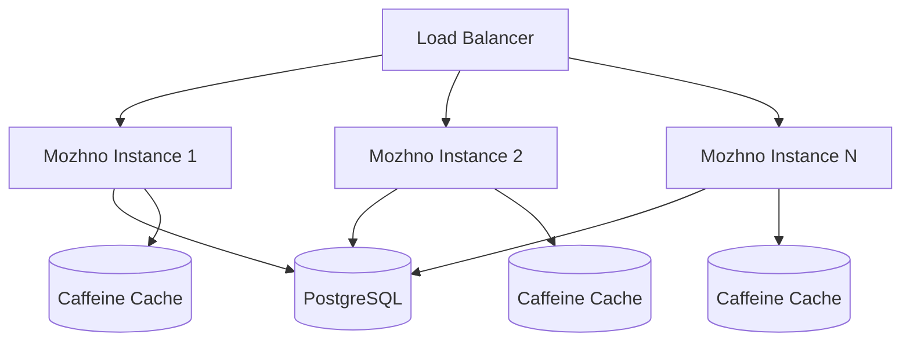

# Scaling

**можно.** is designed for horizontal scaling. Every server instance is stateless — all persistent state lives in PostgreSQL. Add more replicas to handle more traffic.

## Stateless Architecture



Each instance:
- Maintains its own local Caffeine cache (in-memory, no shared state)
- Connects to the same PostgreSQL database
- Has no affinity or sticky sessions

## Load Balancing

### No Sticky Sessions Required

Authentication uses JWT (HMAC-SHA256). The token contains all necessary claims encoded in the token itself. Any instance can validate the token without querying a shared session store or the issuing instance. This means:

- Any load balancer algorithm works (round-robin, least-connections, random)
- No session affinity cookies needed
- An instance can be terminated without losing user sessions

### Load Balancer Configuration

| Setting | Recommendation |
|---------|---------------|
| Algorithm | Least connections (`least_conn` in nginx) |
| Health check | `GET /actuator/health/readiness` every 10 s |
| Timeout | 30 s connect, 60 s read |
| Keep-alive | Enable for reduced connection overhead |

### nginx Example

```nginx
upstream mozhno_backend {
    least_conn;
    server mozhno-1:8080 max_fails=3 fail_timeout=30s;
    server mozhno-2:8080 max_fails=3 fail_timeout=30s;
    keepalive 32;
}

server {
    listen 443 ssl;
    server_name mozhno.example.com;

    location / {
        proxy_pass http://mozhno_backend;
        proxy_http_version 1.1;
        proxy_set_header Connection "";
        proxy_set_header Host $host;
        proxy_set_header X-Real-IP $remote_addr;
        proxy_read_timeout 60s;
    }

    location /actuator/health {
        proxy_pass http://mozhno_backend;
    }
}
```

## Caching Layers

можно. uses **Caffeine** — a high-performance, in-process cache for the JVM. There is no external cache (Redis, Memcached) required for standard operation.

### What Is Cached

| Cache | TTL | Purpose |
|-------|-----|---------|
| Flag rules | 30 s (stale-while-revalidate) | SDK flag streaming endpoint |
| API key validation | 5 min | Inbound request authentication |
| User sessions | Duration of access token | Avoid DB lookup per request |

### Caffeine Configuration

```java
Cache<Long, FeatureFlag> flagCache = Caffeine.newBuilder()
    .expireAfterWrite(30, TimeUnit.SECONDS)
    .maximumSize(10_000)
    .recordStats()
    .build();
```

Caffeine uses the Window TinyLFU eviction policy — nearly optimal hit rates with low memory overhead. Cache statistics are exposed via `/actuator/metrics` (Micrometer).

### Cache Consistency

Each instance has its own local cache. When a flag is updated via the REST API:

1. The write goes to PostgreSQL on the handling instance
2. The updated `updated_at` timestamp serves as a version marker
3. Other instances pick up the change on their next TTL expiration (max 30 s staleness)

For instant propagation across all instances (Enterprise), webhook events or a message queue can be configured.

## Connection Pool Sizing

As you scale horizontally, adjust HikariCP's `maximum-pool-size` to avoid overwhelming PostgreSQL:

| Instances | Pool Size per Instance | Total Connections | PostgreSQL max_connections |
|-----------|----------------------|-------------------|---------------------------|
| 1 | 30 | 30 | 40 |
| 2 | 30 | 60 | 70 |
| 4 | 15 | 60 | 70 |
| 8 | 8 | 64 | 80 |

Formula:
```
pool_size = min(30, floor(max_connections / instances) - 2)
```

Set via environment variable:

```bash
HIKARI_MAX_POOL_SIZE=15
HIKARI_MIN_IDLE=3
```

## Performance Characteristics

### Request Profile

можно. is a **read-heavy** workload:

| Operation | Ratio | Typical Latency |
|-----------|-------|-----------------|
| SDK flag sync (read) | ~80% | 5–20 ms |
| Dashboard API (read) | ~15% | 10–50 ms |
| Flag write/update (write) | ~5% | 20–100 ms |

### Throughput

Benchmarks on a 2 vCPU / 2 GB instance, PostgreSQL on the same network:

| Endpoint | Requests/sec |
|----------|-------------|
| `GET /api/client/features` (100 flags) | ~8,000 |
| `GET /api/v1/flags` (dashboard) | ~2,000 |
| `POST /api/v1/flags` (create) | ~500 |
| `POST /api/v1/auth/login` | ~1,000 |

Linear scaling: 4 instances ≈ 4× throughput (bottleneck shifts to PostgreSQL at high instance counts).

### Bottleneck Analysis

| Scale | Primary Bottleneck | Mitigation |
|-------|-------------------|------------|
| 1–4 instances | Application CPU | Scale horizontally |
| 4–8 instances | PostgreSQL connections | Reduce pool size, add read replicas |
| 8–16 instances | PostgreSQL I/O | Read replicas, connection pooling (PgBouncer) |
| 16+ instances | PostgreSQL writes | Partitioned tables, async writes (Enterprise) |

### JVM Tuning

For consistent performance under load:

```bash
JAVA_TOOL_OPTIONS="
  -XX:+UseZGC
  -XX:MaxRAMPercentage=75
  -XX:+ExitOnOutOfMemoryError
  -XX:ConcGCThreads=2
  -XX:ParallelGCThreads=2
  -XX:ZCollectionInterval=30
  -Djava.net.preferIPv4Stack=true
"
```

ZGC provides sub-millisecond pause times regardless of heap size. It's well-suited for latency-sensitive HTTP APIs where even a 50ms GC pause would cause request timeouts.

## Vertical vs Horizontal

| Approach | When to Use | Limits |
|----------|-------------|--------|
| **Vertical** (bigger instance) | Single node, < 100 req/s | CPU sockets, memory slots |
| **Horizontal** (more instances) | > 100 req/s, HA required | PostgreSQL becomes bottleneck |
| **Both** | High throughput + headroom | Budget |

Start vertical, scale horizontally when you need high availability or exceed a single instance's capacity.

## Monitoring Scaling Behavior

Key metrics to watch:

| Metric | Source | Action When |
|--------|--------|-------------|
| CPU usage | `/actuator/metrics/system.cpu.usage` | > 70% sustained → scale up |
| Heap memory | `/actuator/metrics/jvm.memory.used` | > 75% limit → scale up or increase limit |
| DB connection pool active | `/actuator/metrics/hikaricp.connections.active` | Approaching max → increase pool or add instances |
| HTTP 503 responses | Access log | Readiness probe failing → check DB |
| Request latency p99 | `/actuator/metrics/http.server.requests` | > 200 ms → investigate bottleneck |

## Related Pages

- [Kubernetes](/en/self-hosting/kubernetes) — HPA, PDB, rolling updates
- [Database](/en/self-hosting/database) — Connection pool, backups
- [Docker](/en/self-hosting/docker) — Single-node deployment
