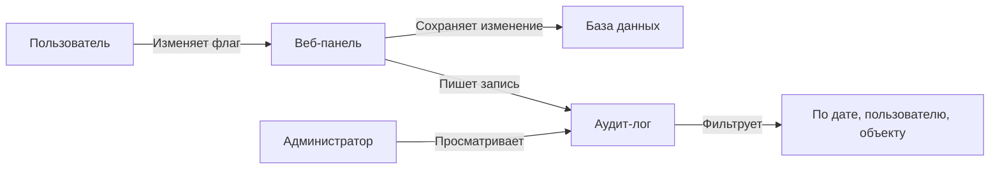

# Аудит

Аудит-лог фиксирует **каждое изменение** в системе: кто, что, когда и какие именно поля изменил. **можно.** хранит полную историю изменений флагов, сегментов, API-ключей и настроек.

## Что попадает в аудит-лог

| Объект | События |
|--------|---------|
| **Флаги** | Создание, изменение стратегий, изменение таргетинга, переименование, архивация, восстановление, удаление |
| **Сегменты** | Создание, изменение правил, переименование, удаление |
| **API-ключи** | Создание, перевыпуск, отзыв, удаление |
| **Окружения** | Создание, переименование, удаление |
| **Проект** | Изменение настроек, смена названия |
| **Пользователи** | Приглашение, смена роли, удаление |

## Просмотр аудит-лога

### В веб-панели

Раздел **Аудит** доступен из главного меню.

Каждая запись содержит:

| Поле | Описание | Пример |
|------|----------|--------|
| **Дата и время** | Когда произошло изменение (UTC) | `2026-06-21 13:41:05` |
| **Пользователь** | Кто внёс изменение | `admin@example.com` |
| **Объект** | Что было изменено | `Флаг new-checkout` |
| **Действие** | Тип изменения | `Изменение стратегии` |
| **Детали** | Diff между старым и новым состоянием | `percentage: 25 → 50` |



## Diff изменений

Для каждого изменения **можно.** показывает **diff** — что именно поменялось.

### Пример diff

```
Флаг: new-checkout
Изменил: dev@example.com
Время: 2026-06-21 13:41:05 UTC

--- До
+++ После
{
  "strategies": [
    {
      "type": "gradual",
-     "percentage": 25
+     "percentage": 50
    }
  ]
}
```

### Форматы представления diff

| Формат | Описание |
|--------|----------|
| **JSON Diff** | Построчное сравнение JSON-структур (RFC 6902) |
| **Inline** | Изменения выделены цветом: красный — удалено, зелёный — добавлено |
| **Side-by-side** | Два столбца: «До» и «После» |

## Фильтрация аудит-лога

### По времени

| Фильтр | Пример |
|--------|--------|
| Произвольный диапазон | `dateFrom=2026-06-01T00:00:00Z&dateTo=2026-06-21T23:59:59Z` |

### По пользователю

```
Пользователь: admin@example.com
```

Показывает все действия конкретного администратора или разработчика.

### По объекту

```
Объект: Флаг new-checkout
```

Вся история изменений одного флага — от создания до архивации.

### По типу действия

| Фильтр | Описание |
|--------|----------|
| **Создание** | Новые флаги, сегменты, ключи |
| **Изменение** | Обновление стратегий, правил, настроек |
| **Удаление** | Удалённые объекты |
| **Архивация** | Архивные флаги |
| **Аутентификация** | Входы в систему, смена паролей |

### Комбинирование фильтров

```
Время: последние 7 дней
Пользователь: dev@example.com
Объект: Флаг
Действие: Изменение
```

Покажет все изменения флагов, сделанные разработчиком за последнюю неделю.

## Экспорт аудит-лога

> **Enterprise-функция:** Экспорт аудит-лога в CSV/JSON/PDF доступен в Enterprise-версии **можно.** через `FeatureGateSpi.audit.export`. Подробнее — [Open Core](/advanced/open-core).

### Экспорт через веб-панель

1. Настройте фильтры для нужного диапазона записей
2. Если Enterprise-функция активна — нажмите **«Экспорт»**
3. Выберите формат
4. Скачайте файл

### Поля в экспортированном CSV

| Поле | Тип | Пример |
|------|-----|--------|
| `timestamp` | `datetime` | `2026-06-21T13:41:05Z` |
| `actor_email` | `string` | `admin@example.com` |
| `actor_role` | `string` | `ADMIN` |
| `entity_type` | `string` | `FLAG` |
| `entity_key` | `string` | `new-checkout` |
| `action` | `string` | `STRATEGY_UPDATED` |
| `changes_json` | `json` | `{"percentage": {"from": 25, "to": 50}}` |
| `ip_address` | `string` | `192.168.1.1` |

## Аудит для compliance

**можно.** хранит аудит-лог в базе данных PostgreSQL. Записи не удаляются и не модифицируются — аудит-лог является append-only хранилищем.

### Соответствие требованиям

| Требование | Как обеспечивается |
|------------|-------------------|
| **SOC 2** | Полный лог всех изменений конфигурации. Экспорт для аудиторов. |
| **GDPR** | Записи аудита не содержат пользовательских данных приложения — только email администраторов. |
| **PCI DSS** | Аудит доступа к критическим настройкам (API-ключи, окружения). |

### Хранение аудит-лога

| Параметр | Значение по умолчанию | Описание |
|----------|----------------------|----------|
| `AUDIT_RETENTION_DAYS` | `365` | Срок хранения записей аудита в днях |

Для продакшен-сред с большим объёмом изменений рекомендуется настроить периодическую очистку:

```sql
-- Удаление записей аудита старше 2 лет (выполнять раз в месяц)
DELETE FROM audit_log WHERE created_at < NOW() - INTERVAL '2 years';
```

### Целостность аудит-лога

- Записи **не редактируются** после создания
- Записи **не удаляются** через веб-панель (только прямой SQL)
- Каждая запись имеет уникальный идентификатор и timestamp с точностью до микросекунд

## Уведомления об изменениях

**можно.** отправляет уведомления о важных изменениях:

| Событие | Канал | Получатели |
|---------|-------|------------|
| Изменение production-флага | Email | Все администраторы |
| Создание/отзыв API-ключа | Email | Владелец ключа, администраторы |
| Удаление флага | Email | Администраторы |

Настройка уведомлений — в разделе **Настройки → Уведомления**.

## Интеграция с внешними системами

Настройте [вебхук](/guide/integrations) на одно из событий (например, `flag.updated`) для получения оповещений при изменениях.

### Пример: еженедельный отчёт аудита

```yaml
# .github/workflows/audit-weekly.yml
name: Audit Weekly Report
on:
  schedule:
    - cron: '0 9 * * 1'  # Каждый понедельник в 9:00

jobs:
  report:
    runs-on: ubuntu-latest
    steps:
      - name: Получить аудит за неделю
        run: |
          curl "${{ secrets.MOZHNO_URL }}/api/v1/audit?dateFrom=$(date -d '7 days ago' -u +%Y-%m-%dT00:00:00Z)&dateTo=$(date -u +%Y-%m-%dT23:59:59Z)" \
            -H "Authorization: Bearer ${{ secrets.MOZHNO_TOKEN }}" \
            -o audit.json
        env:
          MOZHNO_URL: ${{ secrets.MOZHNO_URL }}
          MOZHNO_TOKEN: ${{ secrets.MOZHNO_TOKEN }}
```

## Что дальше?

- [Интеграции](/guide/integrations) — настройка вебхуков
- [Лучшие практики](/guide/best-practices) — стратегия очистки и управление флагами
- [Работа с флагами](/guide/flags-workflow) — жизненный цикл флага
