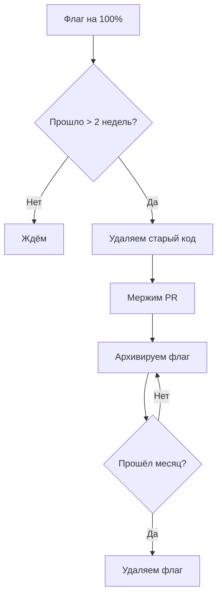
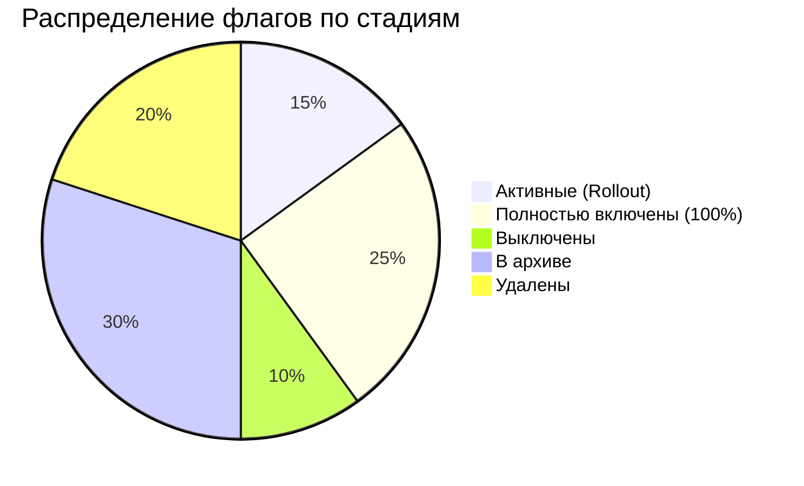

# Лучшие практики

Свод рекомендаций по работе с фиче-флагами в **можно.**: от именования до стратегии очистки и управления флаговым долгом.

## Именование флагов

Хорошее имя флага — самодокументированное и однозначное. Плохое — требует телепатии.

### Конвенция именования

```
<функциональность>-<действие/статус>
```

| Шаблон | Пример | Хорошо/Плохо |
|--------|--------|--------------|
| `новый-компонент` | `new-checkout` | Хорошо |
| `фича-enabled` | `ai-search-enabled` | Хорошо |
| `kill-компонент` | `kill-payment-gw` | Хорошо |
| `эксперимент-описание` | `exp-cta-color` | Хорошо |
| `flag1` | — | Плохо |
| `test` | — | Плохо |
| `feature_flag_new` | — | Плохо (неинформативно) |

### Рекомендации

| Правило | Пример |
|---------|--------|
| **kebab-case** | `new-checkout`, `dark-mode-rollout` |
| **Только латиница, цифры и дефисы** | `api-v2`, `search-v3` |
| **Не используйте `flag` или `feature` в ключе** | ❌ `feature-new-checkout-flag` → ✅ `new-checkout` |
| **Kill switch — префикс `kill-`** | `kill-payment-gateway`, `kill-third-party-api` |
| **Эксперименты — префикс `exp-`** | `exp-pricing-layout`, `exp-cta-placement` |
| **Временные фичи — префикс `tmp-`** | `tmp-holiday-banner-2026` |
| **Перманентные конфигурации — префикс `cfg-`** | `cfg-rate-limit`, `cfg-max-upload-size` |

### Именование мультивариативных вариантов

| Правило | Хорошо | Плохо |
|---------|--------|-------|
| Короткие осмысленные идентификаторы | `A`, `B`, `control`, `treatment` | `variant1`, `variant2` |
| Контрольная группа — `control` или `A` | `control` | `old`, `current` |
| В описании флага — расшифровка вариантов | A = старый дизайн, B = новый | — |

## Когда архивировать, а когда удалять

| Критерий | Архив | Удаление |
|----------|-------|----------|
| Флаг отработал, старый код удалён | ✅ Да | ❌ Нет |
| Нужна история изменений для аудита | ✅ Да | ❌ Нет |
| Экспериментальный флаг, не пошёл в прод | ❌ Нет | ✅ Да |
| Флаг создан по ошибке (опечатка в ключе) | ❌ Нет | ✅ Да |
| Тестовый флаг для локальной разработки | ❌ Нет | ✅ Да |
| Флаг-дубликат | ❌ Нет | ✅ Да |

> **Совет:** Правило по умолчанию — архивируйте. Удаление необратимо. Если сомневаетесь, отправьте в архив и удалите через месяц, если флаг точно не понадобится.

## Модель разрешений (Permission Model)

**можно.** использует ролевую модель доступа:

| Действие | Admin | Developer | Viewer |
|----------|-------|-----------|--------|
| Просмотр флагов и сегментов | ✅ | ✅ | ✅ |
| Создание флагов | ✅ | ✅ | ❌ |
| Изменение стратегий на dev/staging | ✅ | ✅ | ❌ |
| Изменение стратегий на production | ✅ | ⚠️ * | ❌ |
| Удаление флагов | ✅ | ❌ | ❌ |
| Архивация флагов | ✅ | ✅ | ❌ |
| Управление API-ключами | ✅ | ❌ | ❌ |
| Управление пользователями | ✅ | ❌ | ❌ |
| Управление вебхуками | ✅ | ❌ | ❌ |
| Экспорт аудит-лога | ✅ | ❌ | ❌ |

*\* — настраивается: можно разрешить Developer изменять production-стратегии или ограничить только Admin.*

### Рекомендации по ролям

| Принцип | Описание |
|---------|----------|
| **Принцип наименьших привилегий** | Developer не должен иметь доступ к удалению флагов и управлению ключами |
| **Production — только Admin** | По умолчанию изменения на production только через Admin |
| **Viewer для сторонних** | Аудиторы, менеджеры продукта — только просмотр |
| **Регулярный аудит** | Раз в квартал проверяйте список пользователей и их роли |

## Стратегия очистки флагов

Флаги, оставленные в коде после полного роллаута, создают **флаговый долг** (flag debt) — технический долг, характерный для систем с фиче-флагами.

### Признаки флагового долга

- Условные конструкции `if (flag)` с мёртвой веткой старого кода
- Флаги, включённые на 100% больше месяца
- Сложные цепочки зависимостей между флагами
- Код, который невозможно понять без знания состояния флагов

### Процесс очистки



### Чек-лист очистки флага

1. **Флаг на 100%** минимум 2 недели
2. **Метрики стабильны** — нет регрессий
3. **Старый код не нужен** — никто не планирует откат
4. **Удалить `if (flag)`**: оставить только новый код, удалить старый
5. **Удалить импорт/зависимость SDK**, если флаг был последним
6. **Заархивировать флаг** в веб-панели
7. **Документировать удаление** в описании флага: дата, причина

### Автоматизация очистки

Добавьте в CI проверку «просроченных» флагов:

```yaml
# .github/workflows/flag-cleanup-check.yml
name: Flag Cleanup Check
on:
  schedule:
    - cron: '0 8 * * 1'  # Каждый понедельник

jobs:
  stale-flags:
    runs-on: ubuntu-latest
    steps:
      - name: Поиск просроченных флагов
        run: |
          curl "${{ secrets.MOZHNO_URL }}/api/v1/flags?environment=production" \
            -H "Authorization: Bearer ${{ secrets.MOZHNO_TOKEN }}" | \
            jq -r '.[] | select(.rolloutPercentage == 100) | "\(.key): включён на 100%"'

      - name: Поиск флагов без описания
        run: |
          curl "${{ secrets.MOZHNO_URL }}/api/v1/flags" \
            -H "Authorization: Bearer ${{ secrets.MOZHNO_TOKEN }}" | \
            jq -r '.[] | select(.description == null or .description == "") | "⚠ Нет описания: \(.key)"'
```

### Календарь очистки

| Периодичность | Действие |
|---------------|----------|
| **Еженедельно** | Проверить флаги на 100% дольше 2 недель |
| **Раз в спринт** | Заархивировать флаги после удаления старого кода |
| **Раз в месяц** | Удалить архивные флаги старше месяца |
| **Раз в квартал** | Полный аудит активных флагов, обновление описаний |

## Тестирование с фиче-флагами

### Модульное тестирование

Тестируйте **обе** ветки кода — с флагом и без флага:

```java
@Test
void testNewCheckoutFlow() {
    var ctx = new EvaluationContext().set("userId", "test-user");
    when(client.isFlagEnabled("new-checkout", ctx)).thenReturn(true);

    var result = checkoutService.process(order, ctx);

    assertThat(result.getFlow()).isEqualTo("new");
}

@Test
void testOldCheckoutFlow() {
    var ctx = new EvaluationContext().set("userId", "test-user");
    when(client.isFlagEnabled("new-checkout", ctx)).thenReturn(false);

    var result = checkoutService.process(order, ctx);

    assertThat(result.getFlow()).isEqualTo("old");
}
```

```typescript
test('new checkout flow', async () => {
  jest.spyOn(client, 'isEnabled').mockResolvedValue(true);
  const result = await checkoutService.process(order, { userId: 'test-user' });
  expect(result.flow).toBe('new');
});

test('old checkout flow', async () => {
  jest.spyOn(client, 'isEnabled').mockResolvedValue(false);
  const result = await checkoutService.process(order, { userId: 'test-user' });
  expect(result.flow).toBe('old');
});
```

> **Совет:** Мокайте SDK-клиент в тестах, а не сервер **можно.**. Тесты должны быть быстрыми и не зависеть от сети.

### Интеграционное тестирование

Для интеграционных тестов поднимите реальный сервер **можно.** в тестовом окружении:

```java
@SpringBootTest
@AutoConfigureMockMvc
class CheckoutIntegrationTest {

    @Autowired
    private MozhnoClient client;

    @Test
    void testWithRealFlagEvaluation() {
        var ctx = new EvaluationContext().set("userId", "test-user");
        boolean enabled = client.isFlagEnabled("new-checkout", ctx);
        // Поведение зависит от конфигурации флага в тестовом окружении
    }
}
```

### Тестирование стратегий роллаута

| Сценарий | Как тестировать |
|----------|-----------------|
| **0% роллаут** | Убедиться, что ни один пользователь не получает фичу |
| **100% роллаут** | Убедиться, что все пользователи получают фичу |
| **50% роллаут** | Проверить детерминированность: один userId всегда даёт один результат |
| **Правило таргетинга** | Проверить, что правило срабатывает для подходящих пользователей и не срабатывает для остальных |
| **Kill Switch** | Убедиться, что фича мгновенно отключается для всех |

### Тестирование с разными окружениями

Используйте разные API-ключи для разных окружений в тестах:

```java
// application-test.properties
mozhno.server-url=http://localhost:8080
mozhno.api-key=test-env-api-key
```

Флаги в тестовом окружении можно менять без влияния на production.

## Управление флаговым долгом

### Метрики флагового долга

| Метрика | Целевое значение | Почему важно |
|---------|-----------------|--------------|
| Средний возраст флага | < 30 дней | Старые флаги — кандидаты на удаление |
| Флагов на 100% старше 7 дней | 0 | Они должны быть удалены |
| Флагов без описания | 0 | Неописанный флаг = неизвестный риск |
| Активных постоянных флагов | < 10% от общего числа | Если флагов > 50, пора чистить |
| Глубина вложенности флагов | ≤ 2 | Глубокая вложенность усложняет отладку |

### Категории флагов по жизненному циклу



Стремитесь к тому, чтобы большинство флагов находилось в архиве или было удалено — это признак здорового управления жизненным циклом.

### Антипаттерны

| Антипаттерн | Почему плохо | Как исправить |
|-------------|-------------|---------------|
| **Флаг на флаге** | `if (flagA && flagB)` — невозможно отлаживать | Объединить в сегмент или один флаг |
| **Флаги в циклах** | Проверка флага на каждой итерации — накладные расходы | Проверить флаг до цикла |
| **Флаг как конфиг** | `if (flag) timeout = 30 else timeout = 60` | Использовать настоящий конфиг, не фиче-флаг |
| **Вечные флаги** | Флаг существует 6+ месяцев | Запланировать удаление или пометить как перманентный |
| **Флаги без владельца** | Никто не отвечает за очистку | Назначить ответственного в описании флага |
| **Копипаста контекста** | Дублирование `new EvaluationContext().set(...)` | Вынести в фабричный метод или middleware |

### Здоровые паттерны

| Паттерн | Пример |
|---------|--------|
| **Фабрика контекста** | `ContextFactory.forUser(user)` — создаёт контекст с нужными атрибутами |
| **Middleware для контекста** | Перехватчик HTTP-запросов, автоматически добавляющий атрибуты в контекст |
| **Feature Wrapper** | `featureService.executeIfEnabled("flag", ctx, () -> newCode())` — обёртка, убирающая повторяющийся `if` |
| **Флаги как dependency** | Инжектить `MozhnoClient` как бин, а не создавать в каждом методе |

## Документирование флагов

### Что должно быть в описании флага

```markdown
# Описание флага: new-checkout

**Зачем:** Переработка процесса оформления заказа для увеличения конверсии.

**Кто создал:** @dev-team-lead

**План роллаута:**
- 2026-06-21: 1% (канареечный)
- 2026-06-22: 10%
- 2026-06-23: 50%
- 2026-06-24: 100%

**План очистки:** Удалить старый код до 2026-07-08

**Зависимости:** Нет

**Связанные задачи:** JIRA-1234, PR #567
```

### Шаблон описания

```
Зачем: [краткое описание]
Кто создал: [email или GitHub username]
План роллаута: [даты и проценты]
План очистки: [дата или условие]
Зависимости: [другие флаги или системы]
Связанные задачи: [ссылки на тикеты/PR]
```

## Что дальше?

- [Работа с флагами](/guide/flags-workflow) — жизненный цикл и командный процесс
- [Таргетинг](/guide/targeting) — правила и сегменты
- [Аудит](/guide/audit) — отслеживание изменений
- [SDK: Обзор](/sdk/overview) — архитектура SDK и интеграция в код
