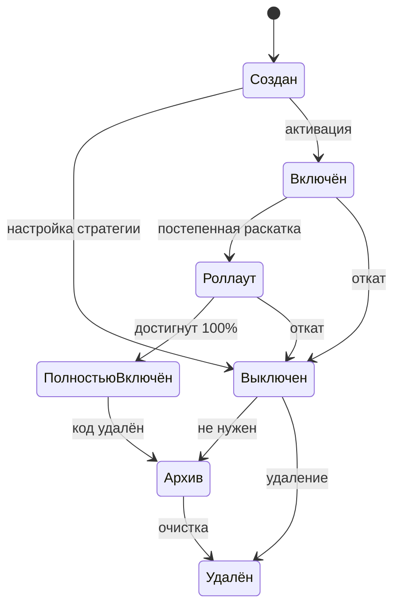
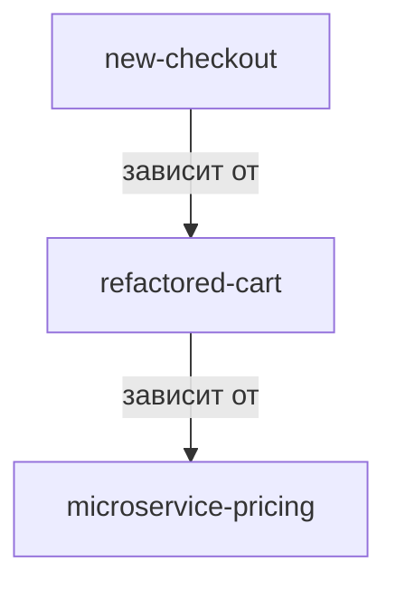
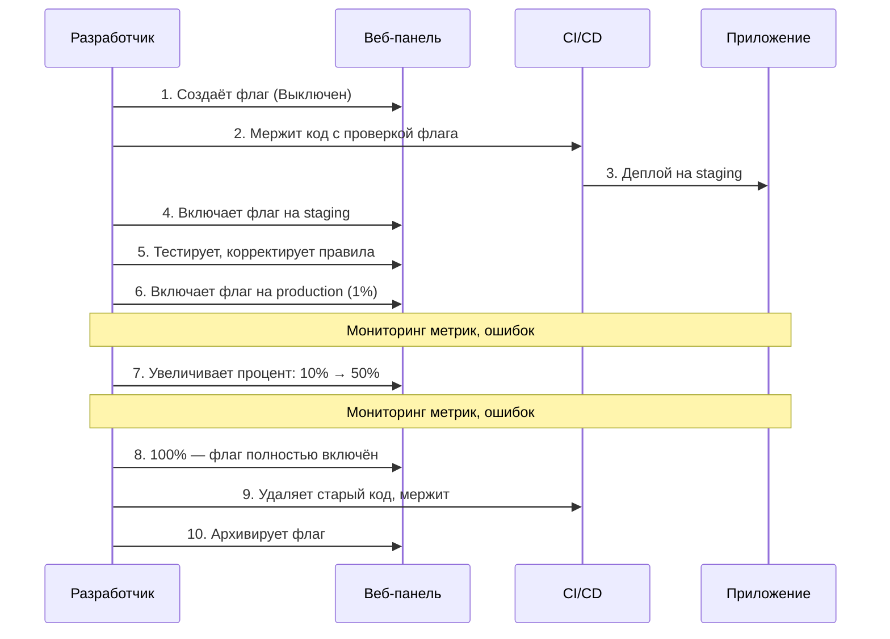

# Работа с флагами

В этой статье описан полный жизненный цикл фиче-флага в **можно.**: от создания до удаления, организация флагов по тегам, зависимости между флагами и лучший workflow для команд.

## Жизненный цикл флага

Каждый флаг в **можно.** проходит через определённые стадии. Понимание этого цикла помогает команде поддерживать порядок и вовремя избавляться от ненужных флагов.



### Стадии жизненного цикла

| Стадия | Описание | Что делать |
|--------|----------|------------|
| **Создан** | Флаг зарегистрирован в системе, но не имеет активных правил. Возвращает значение по умолчанию (`false`). | Выберите тип (Boolean или Multi-variate) и добавьте стратегию. |
| **Выключен** | Все стратегии флага отключены. Флаг гарантированно возвращает `false` для всех пользователей. | Используйте как kill switch или временное отключение фичи. |
| **Включён** | Флаг активен для заданной аудитории: конкретных пользователей, сегментов или процента. | Контролируйте охват через стратегии и правила таргетинга. |
| **Роллаут** | Процент пользователей, получающих фичу, постепенно увеличивается. | Наращивайте процент поэтапно: 1% → 10% → 50% → 100%. Мониторьте метрики на каждом шаге. |
| **Полностью включён** | Флаг возвращает `true` (или целевое значение) для 100% пользователей. | Удалите старый код из приложения. Подготовьте флаг к архивации. |
| **Архив** | Флаг помечен как архивный: не участвует в оценке, не отображается в основных списках. | Используйте вместо удаления, когда нужно сохранить историю. |
| **Удалён** | Флаг физически удалён из базы данных. | Применяйте только для экспериментальных или ошибочно созданных флагов. |

## Создание флага

### Через веб-панель

1. Перейдите в раздел **Флаги** и нажмите **«Создать флаг»**.
2. Заполните поля:

| Поле | Обязательно | Описание |
|------|-------------|----------|
| **Ключ** | Да | Уникальный строковый идентификатор флага: `new-checkout`, `ai-search-enabled`. Только латиница, цифры, дефисы и подчёркивания. |
| **Название** | Да | Человекочитаемое имя: «Новый чекаут», «AI-поиск». |
| **Описание** | Нет | Контекст: что делает флаг, кто создал, когда планируется удалить. Заполняйте всегда. |
| **Тип** | Да | `Boolean` (вкл/выкл) или `Multi-variate` (A/B/C варианты). |
| **Теги** | Нет | Метки для группировки: `checkout`, `search`, `experiment`. |
| **Окружение** | Да | В каком окружении флаг будет активен: dev, staging, production. |

3. Нажмите **«Сохранить»**.

### Через REST API

```bash
curl -X POST "http://localhost:8080/api/v1/flags" \
  -H "Authorization: Bearer $JWT_TOKEN" \
  -H "Content-Type: application/json" \
  -d '{
    "key": "new-checkout",
    "name": "Новый чекаут",
    "description": "Переработка процесса оформления заказа",
    "type": "BOOLEAN",
    "tags": ["checkout", "ui-redesign"]
  }'
```

## Редактирование флага

Все изменения флага немедленно подхватываются SDK при следующем цикле синхронизации.

| Действие | Где | Вступает в силу |
|----------|-----|-----------------|
| Изменить стратегию | Вкладка **Стратегии** | Мгновенно (SDK получает обновление в фоне) |
| Изменить правила таргетинга | Вкладка **Таргетинг** | Мгновенно |
| Изменить процент роллаута | Ползунок на стратегии Gradual | Мгновенно |
| Переименовать / сменить описание | Вкладка **Настройки** | Мгновенно (метаданные) |
| Сменить тип флага | Вкладка **Настройки** | Только для флагов без активных стратегий |

> **Предупреждение:** Смена типа флага с `BOOLEAN` на `MULTI_VARIATE` или обратно возможна только если у флага нет активных стратегий. Удалите все стратегии перед сменой типа.

## Переключение (Toggling)

### Ручное переключение

Самый простой способ — включить или выключить флаг вручную через стратегию **Default**:

1. Откройте флаг в веб-панели.
2. На вкладке **Стратегии** переключите значение `true` / `false`.
3. Изменение применяется мгновенно.

### Kill Switch

Для экстренного отключения фичи используйте выключение всех стратегий:

1. Откройте флаг.
2. На вкладке **Стратегии** деактивируйте все активные стратегии.
3. Флаг немедленно возвращает `false` для всех пользователей.

```java
// В коде ничего менять не нужно — kill switch срабатывает
// на уровне платформы, без деплоя
if (client.isFlagEnabled("critical-feature", ctx)) {
    // этот блок больше не выполняется после kill switch
}
```

### Запланированное переключение

Используйте стратегию **Scheduled** для включения/выключения по расписанию:

```json
{
  "type": "scheduled",
  "startAt": "2026-06-25T12:00:00Z",
  "endAt": "2026-07-01T12:00:00Z"
}
```

Флаг будет активен только в указанном временном окне. Идеально для акций, holiday-тематики и ограниченных по времени экспериментов.

## Архивация

Архивация — предпочтительный способ вывода флага из эксплуатации.

### Когда архивировать

- Флаг полностью включён (100%) больше 2 недель
- Старый код удалён из приложения
- Флаг больше не нужен, но вы хотите сохранить историю изменений

### Как архивировать

1. Откройте флаг → вкладка **Настройки**.
2. Нажмите **«Архивировать»**.
3. Подтвердите действие.

Архивный флаг:
- Исключается из выборки правил (SDK не загружает архивные флаги)
- Не отображается в основных списках
- Сохраняется в аудит-логе
- Может быть восстановлен при необходимости

### Восстановление из архива

На странице флагов включите фильтр **«Архивные»**. Откройте нужный флаг и нажмите **«Восстановить»**.

## Удаление

> **Предупреждение:** Удаление необратимо. Удалённый флаг нельзя восстановить. Все связанные аудит-записи также удаляются.

### Когда удалять

- Экспериментальные флаги, которые никогда не пойдут в прод
- Флаги, созданные по ошибке
- Флаги, архив которых не требуется хранить

### Как удалить

1. Откройте флаг → вкладка **Настройки**.
2. Нажмите **«Удалить»**.
3. Подтвердите, введя ключ флага.

## Организация флагов по тегам

Теги — основной инструмент навигации при большом количестве флагов.

### Соглашение по тегам

| Тег | Назначение | Примеры флагов |
|-----|------------|----------------|
| `team:payments` | Команда Payments | `new-checkout`, `p24-support` |
| `team:search` | Команда Search | `ai-search`, `elastic-v8` |
| `service:api` | Сервис API | `rate-limit-v2`, `new-auth` |
| `service:web` | Веб-интерфейс | `dark-mode`, `new-onboarding` |
| `type:experiment` | A/B-эксперимент | `cta-color-test`, `pricing-layout` |
| `type:killswitch` | Аварийный рубильник | `payment-gateway-switch` |
| `status:permanent` | Долгоживущий флаг | `maintenance-mode` |
| `status:temporary` | Временный флаг | `holiday-banner-2026` |

### Групповые операции

В веб-панели можно фильтровать флаги по тегам и выполнять массовые действия:

- Архивация всех флагов с тегом `status:temporary`
- Экспорт конфигурации для команды `team:search`
- Массовое добавление/удаление тегов

## Зависимости флагов

Иногда один флаг должен включаться только если другой уже активен.



**можно.** поддерживает явные зависимости:

| Настройка | Поведение |
|-----------|-----------|
| **Родительский флаг** | Дочерний флаг оценивается только если родительский вернул `true` |
| **Блокировка отката родителя** | Если родитель выключается, все зависимые флаги также выключаются |

Настройка зависимостей — на вкладке **Зависимости** при редактировании флага.

> **Совет:** Избегайте глубоких цепочек зависимостей (больше 2 уровней). Это усложняет отладку и увеличивает риск каскадных отказов. Рассмотрите объединение логики в сегмент или правило таргетинга.

## Командный workflow

### Рекомендуемый процесс



### Роли и ответственность

| Роль | Может создавать флаги | Может менять стратегии | Может удалять флаги | Может управлять ключами |
|------|----------------------|------------------------|---------------------|------------------------|
| **Admin** | Да | Да | Да | Да |
| **Developer** | Да | Да (staging) | Нет | Нет |
| **Viewer** | Нет | Нет | Нет | Нет |

### Code Review и флаги

При ревью кода с новым флагом проверяйте:

1. **Ключ флага** следует конвенции именования
2. **Значение по умолчанию** безопасно (`false` для новых фич)
3. **Старый код** не удалён (он понадобится для отката)
4. **Контекст** передаётся с нужными атрибутами
5. **Описание флага** заполнено в веб-панели
6. **План очистки** указан: дата или условие архивации

### Ежедневные и еженедельные ритуалы

| Периодичность | Действие |
|---------------|----------|
| **Ежедневно** | Проверка активных kill switch-флагов |
| **Еженедельно** | Ревизия флагов со статусом «Полностью включён» дольше недели |
| **Раз в спринт** | Архивация флагов, готовых к удалению. Обновление описаний. |
| **Раз в месяц** | Полный аудит: какие флаги активны, какие можно удалить |

## Что дальше?

- [Таргетинг](/guide/targeting) — настройка правил и сегментов
- [Роллаут](/guide/rollout) — стратегии постепенной раскатки
- [Аудит](/guide/audit) — история всех изменений
- [Лучшие практики](/guide/best-practices) — конвенции и стратегия очистки
- [Флаги](/concepts/flags) — типы флагов и правила оценки
