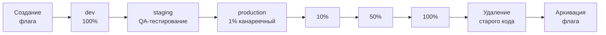

# Работа с флагами

Полный жизненный цикл фиче-флага в **можно**<span class=brand-dot>.</span>: от создания до архивации. Организация флагов по тегам, именование и типичный workflow для команд.

## Жизненный цикл флага

Флаг в **можно**<span class=brand-dot>.</span> существует в двух состояниях:

| Состояние | Что происходит |
|-----------|---------------|
| **Активен** | Флаг виден в панели. Его конфигурацию получают SDK и оценивают локально. Состояние по умолчанию после создания. |
| **В архиве** | Флаг скрыт из основных списков. SDK не получают его конфигурацию. История изменений сохраняется. |

Правила активации флага настраиваются **отдельно для каждого окружения** — включён/выключен, контекстные условия, сегменты и процентный роллаут. Подробнее — [Таргетинг](/guide/targeting) и [Роллаут](/guide/rollout).

## Создание флага

Перейдите в раздел **Флаги** и нажмите **«Создать флаг»**. Обязательные поля:

| Поле | Обязательно | Описание |
|------|-------------|----------|
| **Ключ** | Да | Уникальный идентификатор, неизменяем после создания |
| **Название** | Да | Человекочитаемое имя, отображается в панели. |
| **Описание** | Нет | Для чего флаг, какую проблему решает. |
| **Тип** | Да | `RELEASE` — стандартный фиче-флаг для постепенной раскатки. `KILLSWITCH` — аварийный выключатель. |
| **Теги** | Нет | Метки для группировки и фильтрации. |

После создания флаг сразу активен. Настройте правила активации — иначе флаг будет возвращать `false` для всех.

> **Совет:** Ключ флага — это его идентификатор в коде (`isEnabled("new-checkout", ctx)`). Делайте ключи осмысленными. Избегайте `flag-42`.

## Изменение флага

Все поля кроме **ключа** можно редактировать. Изменения записываются в [аудит](/guide/audit) с полной разницей между версиями.

Типичные изменения:
- Настройка правил активации (включён/выключен, контекстные условия, сегменты, процент)
- Уточнение названия и описания
- Управление тегами

## Типичный путь флага в команде



Каждый этап — это изменение правил активации на конкретном окружении. Этапы D–G — постепенная раскатка в production с мониторингом метрик на каждом шаге.

| Этап | Окружение | Настройка | Кто |
|------|-----------|-----------|-----|
| Создание | — | Флаг создан, без правил | Разработчик |
| Разработка | dev | Включён, 100% | Разработчик |
| Тестирование | staging | Включён, сегмент QA | QA |
| Канареечный | production | 1–5% | Релиз-инженер |
| Раскатка | production | 10% → 50% → 100% | Релиз-инженер |
| Очистка кода | — | Старый код удалён из приложения | Разработчик |
| Архивация | — | Флаг в архив | Разработчик |

## Архивация и удаление

### Когда архивировать

- Флаг на 100% и старый код удалён
- Нужно сохранить историю изменений для аудита
- Флаг может понадобиться в будущем

### Когда удалять

- Флаг создан по ошибке (опечатка в ключе)
- Экспериментальный флаг, который не пошёл в прод
- Тестовый флаг из локальной разработки

### Через API

```bash
# Архивация
curl -X POST "http://localhost:8080/api/v1/flags/42/archive" \
  -H "Authorization: Bearer $TOKEN"

# Восстановление из архива
curl -X POST "http://localhost:8080/api/v1/flags/42/unarchive" \
  -H "Authorization: Bearer $TOKEN"
```

## Именование флагов

Используйте kebab-case с осмысленными префиксами:

| Тип | Префикс | Пример |
|-----|---------|--------|
| Обычная фича | без префикса | `new-checkout`, `ai-search` |
| Kill switch | `kill-` | `kill-payment-gw`, `kill-third-party` |
| Эксперимент | `exp-` | `exp-pricing-layout`, `exp-cta-color` |
| Временная фича | `tmp-` | `tmp-holiday-banner-2026` |

## Организация флагов тегами

Группируйте флаги по командам, типам и сервисам:

| Тег | Для чего | Примеры флагов |
|-----|----------|---------------|
| `team:checkout` | Команда оформления заказа | `new-checkout`, `one-click-buy` |
| `type:killswitch` | Аварийные выключатели | `kill-payment-gw`, `kill-third-party` |
| `service:api` | API-сервис | `rate-limit-v2`, `new-auth` |

## Что дальше?

- [Таргетинг](/guide/targeting) — контекстные правила, сегменты
- [Роллаут](/guide/rollout) — процентная раскатка и канареечные релизы
- [Аудит](/guide/audit) — кто и когда менял флаг
- [Метрики](/guide/metrics) — мониторинг использования
- [Лучшие практики](/guide/best-practices) — управление флаговым долгом
