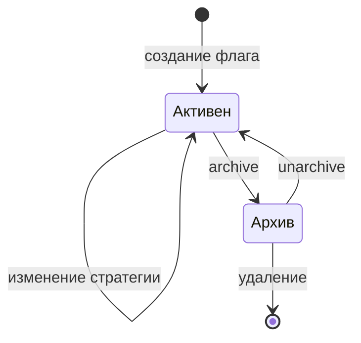
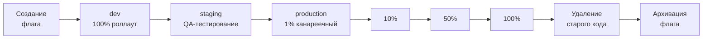

# Работа с флагами

В этой статье описан полный жизненный цикл фиче-флага в **можно.**: от создания до архивации, организация флагов по тегам и лучший workflow для команд.

## Жизненный цикл флага

Флаг в **можно.** имеет два основных состояния:

| Состояние | Описание |
|-----------|----------|
| **Активен** | Флаг используется, доступен для оценки SDK. По умолчанию после создания. |
| **В архиве** | Флаг заархивирован. SDK не получают его конфигурацию. Не отображается в основных списках. |

Дополнительно, для каждого окружения стратегия определяет, **включён** ли флаг (`enabled: true/false`) и с каким процентом.



## Создание флага

### Через веб-панель

1. Перейдите в раздел **Флаги** и нажмите **«Создать флаг»**
2. Заполните ключ (уникальный идентификатор, kebab-case), название и описание
3. Выберите тип: **RELEASE** (стандартный фиче-флаг) или **KILLSWITCH** (аварийный выключатель)
4. Нажмите **«Сохранить»**

### Через REST API

```bash
curl -X POST "http://localhost:8080/api/v1/flags" \
  -H "Authorization: Bearer $TOKEN" \
  -H "Content-Type: application/json" \
  -d '{
    "key": "new-checkout",
    "name": "Новый чекаут",
    "description": "Переработка оформления заказа",
    "flagType": "RELEASE",
    "projectId": 1
  }'
```

## Настройка стратегии

После создания флага настройте стратегию для нужного окружения:

1. На странице флага выберите окружение (dev, staging, production)
2. Настройте состояние: включить/выключить флаг
3. Добавьте контекстные правила (constraints) для таргетинга
4. Подключите сегменты (переиспользуемые группы пользователей)
5. Задайте процентный роллаут (0–100%)
6. Сохраните

## Полный цикл: от создания до архивации



Каждый этап — это изменение стратегии флага на конкретном окружении. Этапы D–G — постепенная раскатка в production с мониторингом метрик на каждом шаге.

## Типичный workflow команды

1. **Создание флага** — разработчик создаёт флаг с описанием
2. **Разработка** — флаг включён в dev для всех разработчиков (100% роллаут или без правил)
3. **Тестирование** — флаг включён в staging для QA (сегмент тестировщиков)
4. **Канареечный запуск** — 1-5% роллаут в production, мониторинг метрик
5. **Постепенная раскатка** — увеличение процента: 5% → 25% → 50% → 100%
6. **Очистка кода** — после полного роллаута удаление старого кода из приложения
7. **Архивация флага** — перевод в архив через веб-панель или API

## Архивация и удаление

### Когда архивировать

- Флаг полностью включён (100%) и старый код удалён
- Нужно сохранить историю изменений для аудита
- Флаг может понадобиться в будущем

### Когда удалять

- Флаг создан по ошибке (опечатка в ключе)
- Экспериментальный флаг, который не пошёл в прод
- Тестовый флаг для локальной разработки

### Архивация через API

```bash
curl -X POST "http://localhost:8080/api/v1/flags/42/archive" \
  -H "Authorization: Bearer $TOKEN"
```

### Восстановление из архива

```bash
curl -X POST "http://localhost:8080/api/v1/flags/42/unarchive" \
  -H "Authorization: Bearer $TOKEN"
```

## Организация флагов

### Теги

Группируйте флаги с помощью тегов:

| Тег | Описание | Примеры флагов |
|-----|----------|----------------|
| `team:checkout` | Команда оформления заказа | `new-checkout`, `one-click-buy` |
| `type:killswitch` | Аварийные выключатели | `kill-payment-gw`, `kill-third-party` |
| `service:api` | Сервис API | `rate-limit-v2`, `new-auth` |

### Рекомендации по именованию

Используйте kebab-case с осмысленными префиксами:

- **Обычные фичи:** `new-checkout`, `ai-search-enabled`
- **Kill switch:** `kill-payment-gateway`, `kill-third-party-api`
- **Эксперименты:** `exp-pricing-layout`, `exp-cta-placement`
- **Временные фичи:** `tmp-holiday-banner-2026`

## Что дальше?

- [Таргетинг](/guide/targeting) — настройка правил и сегментов
- [Роллаут](/guide/rollout) — процентная раскатка
- [Аудит](/guide/audit) — отслеживание изменений
- [Метрики](/guide/metrics) — мониторинг использования флагов
- [Лучшие практики](/guide/best-practices) — управление флаговым долгом
