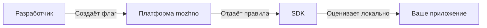

# Что такое можно?

**можно**. — платформа управления фиче-флагами для команд любого размера. Веб-панель, REST API, нативные SDK и self-hosting из коробки.

С ней вы можете:

- **Включать и выключать фичи** в продакшене без деплоя — kill switch срабатывает мгновенно
- **Раскатывать изменения постепенно** — 1% → 10% → 50% → 100%, с метриками на каждом шаге
- **Таргетировать аудиторию** по атрибутам: страна, подписка, устройство, версия приложения
- **Автоматизировать через API и интеграции** — CI/CD, вебхуки, Slack — флаги меняются без участия человека
- **Видеть полную историю изменений** — кто, когда и что поменял, через аудит-лог

## Как это работает

1. Вы создаёте флаг в веб-панели и настраиваете правила активации для нужного окружения.
2. SDK в вашем приложении загружает правила по API-ключу и кеширует их.
3. При каждом вызове `isEnabled("my-flag", ctx)` SDK оценивает флаг **локально** — за микросекунды, без сети.
4. Если правила изменились — вручную или через API/интеграцию — SDK получает обновление в фоне (каждые 15 секунд).

## Ключевые понятия

| Понятие | Описание |
|---------|----------|
| **Флаг** | Именованная точка переключения в коде. Типы: RELEASE (фиче-флаг) или KILLSWITCH (аварийный выключатель). |
| **Правила активации** | Что определяет, кто увидит фичу. Пример: флаг `new-checkout` включён для Premium-пользователей из России с роллаутом 25%. |
| **Сегмент** | Переиспользуемая группа пользователей с общими правилами таргетинга. |
| **Контекст** | Атрибуты пользователя или запроса (`userId`, `country`, `plan`…), по которым оценивается флаг. |
| **Окружение** | Development / Production — можно добавить свои. Флаг имеет независимые правила на каждом. |
| **API-ключ** | Ключ доступа SDK к платформе, привязанный к конкретному окружению. |

## Часто задаваемые вопросы

| Вопрос | Ответ |
|--------|-------|
| **Что такое фиче-флаг?** | Точка переключения в коде. `if (isEnabled("flag", ctx))` — вы управляете условием из панели, без деплоя. |
| **Как быстро флаг меняется после настройки?** | SDK опрашивает платформу каждые 15 секунд (по умолчанию, настраивается). Изменение доходит в пределах этого интервала. |
| **Сервер хранит данные пользователей?** | Нет. Сервер хранит только правила активации. SDK оценивает флаг **локально** — атрибуты (`userId`, `country`…) не покидают ваше приложение. |
| **Одни и те же пользователи всегда получат одинаковый результат?** | Да. Процентный роллаут использует MurmurHash32 от `flagKey + userId` — детерминированное распределение. Пользователь не будет «прыгать» между группами. |
| **Что будет, если сервер недоступен?** | SDK продолжает работать на закешированных правилах. При перезапуске без сервера — все флаги вернут `false` (безопасное поведение). |

## Готовы попробовать?

Переходите к [Быстрому старту](/guide/quick-start) — запустите платформу за 5 минут.

При первом открытии веб-панели вас встретит мастер настройки: создайте учётную запись администратора, проект и первый флаг — и вы в системе.

- [Решение проблем](/guide/troubleshooting) — если что-то пошло не так
