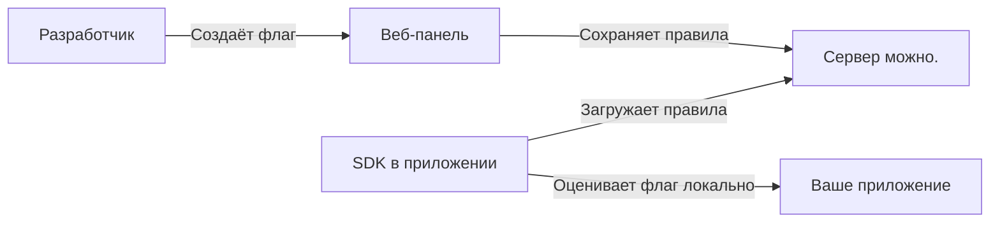

# Введение

**можно.** — это сервер фиче-флагов для команд любого размера.

С ним вы можете:

- **Включать и выключать фичи** на продакшене без деплоя кода
- **Раскатывать изменения постепенно** — сначала 1% пользователей, потом 10%, потом всем
- **Сегментировать аудиторию** — показывать фичу только пользователям из определённой страны, с Premium-подпиской или на конкретном устройстве
- **Проводить A/B-тесты** с мультивариативными флагами
- **Отслеживать все изменения** через аудит-лог

## Как это работает

1. Вы создаёте флаг в веб-панели и настраиваете правила: для каких пользователей, на каких окружениях, с каким процентом роллаута.
2. SDK в вашем приложении загружает правила с сервера один раз и кеширует их.
3. При каждом обращении к флагу SDK **локально** принимает решение — без задержек сети.
4. Если правила меняются, SDK получает обновление в фоне.

## Ключевые понятия

| Понятие | Описание |
|---------|----------|
| **Флаг** | Именованная точка переключения в коде. Может быть булевой (вкл/выкл) или мультивариативной (A/B/C). |
| **Стратегия** | Способ раскатки флага: мгновенно, плавно, по расписанию, кастомная логика. |
| **Сегмент** | Переиспользуемая группа пользователей с общими правилами таргетинга. |
| **Контекст** | Атрибуты пользователя или запроса, по которым оцениваются правила флага. |
| **Окружение** | dev / staging / production — флаг может иметь разные настройки на каждом. |
| **API-ключ** | Ключ доступа SDK к серверу, привязанный к конкретному окружению. |

## Готовы попробовать?

Переходите к [Быстрому старту](/guide/quick-start) — запустите сервер за 5 минут.
