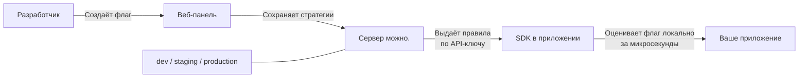

# Введение

**можно.** — это сервер фиче-флагов для команд любого размера.

С ним вы можете:

- **Включать и выключать фичи** на продакшене без деплоя кода
- **Раскатывать изменения постепенно** — сначала 1% пользователей, потом 10%, потом всем
- **Контролировать аудиторию** — показывать фичу только пользователям из определённой страны, с Premium-подпиской или на конкретном устройстве
- **Включать и выключать фичи мгновенно** — через kill switch без деплоя
- **Отслеживать все изменения** через аудит-лог

## Как это работает

1. Вы создаёте флаг в веб-панели и настраиваете стратегию: для какого окружения, с какими правилами и процентом роллаута.
2. Вы создаёте API-ключ для нужного окружения (dev, staging, production) и передаёте его в SDK.
3. SDK загружает правила с сервера по этому ключу один раз и кеширует их.
4. При каждом вызове `isEnabled()` SDK оценивает флаг **локально** — без задержек сети.
5. Если правила меняются, SDK получает обновление в фоне (каждые 15 секунд).

## Ключевые понятия

| Понятие | Описание |
|---------|----------|
| **Флаг** | Именованная точка переключения в коде. Типы: RELEASE (фиче-флаг) или KILLSWITCH (аварийный выключатель). |
| **Стратегия** | Конфигурация флага на окружении: включён/выключен, контекстные правила, сегменты, процентный роллаут. |
| **Сегмент** | Переиспользуемая группа пользователей с общими правилами таргетинга. |
| **Контекст** | Атрибуты пользователя или запроса, по которым оцениваются правила флага. |
| **Окружение** | dev / staging / production — флаг может иметь разные настройки на каждом. |
| **API-ключ** | Ключ доступа SDK к серверу, привязанный к конкретному окружению. |

## Готовы попробовать?

Переходите к [Быстрому старту](/guide/quick-start) — запустите сервер за 5 минут.
- [Решение проблем](/guide/troubleshooting) — если что-то пошло не так
