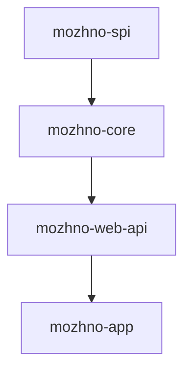

# Установка

**можно.** можно развернуть через Docker или вручную. На этой странице — оба способа и системные требования.

## Системные требования

| Компонент | Минимальная версия | Назначение |
|-----------|--------------------|------------|
| JDK | 25 | Компиляция и запуск Spring Boot 4.0 |
| Node.js | 24 | Сборка React-фронтенда (только ручная установка) |
| PostgreSQL | 15+ | Хранение флагов, сегментов, аудит-логов |
| Docker | 24+ | Контейнеризация (опционально) |

## Docker (рекомендованный способ)

Готовый образ публикуется в GitHub Container Registry:

```
ghcr.io/mozhno-dev/mozhno:latest
```

### Docker Compose

Создайте `docker-compose.yml`:

```yaml
services:
  postgres:
    image: postgres:15-alpine
    environment:
      POSTGRES_DB: feature_flags
      POSTGRES_USER: flags_user
      POSTGRES_PASSWORD: flags_password
    volumes:
      - pgdata:/var/lib/postgresql/data
    healthcheck:
      test: ["CMD-SHELL", "pg_isready -U flags_user -d feature_flags"]
      interval: 5s
      timeout: 5s
      retries: 5

  mozhno:
    image: ghcr.io/mozhno-dev/mozhno:latest
    ports:
      - '8080:8080'
    environment:
      SPRING_DATASOURCE_URL: jdbc:postgresql://postgres:5432/feature_flags
      SPRING_DATASOURCE_USERNAME: flags_user
      SPRING_DATASOURCE_PASSWORD: flags_password
      JWT_SECRET: change-me-to-a-real-256-bit-secret
      APP_BASE_URL: http://localhost:8080
    depends_on:
      postgres:
        condition: service_healthy

volumes:
  pgdata:
```

Запустите:

```bash
docker compose up -d
```

Сервер будет доступен на [`http://localhost:8080`](http://localhost:8080). При первом запуске создаётся администратор и проект.

### Переменные окружения для Docker

Все переменные передаются через секцию `environment` в docker-compose. Полный список — на странице [Конфигурация](/guide/configuration).

## Ручная установка

Если Docker не подходит, соберите проект из исходников.

### Шаг 1: Клонируйте репозиторий

```bash
git clone https://github.com/mozhno-dev/mozhno.git
cd mozhno
```

### Шаг 2: Установите зависимости

Убедитесь, что установлены JDK 25, Node.js 24 и PostgreSQL 15+.

```bash
java --version   # должно быть 25
node --version   # должно быть 24 или выше
psql --version   # должно быть 15 или выше
```

### Шаг 3: Создайте базу данных

```sql
CREATE DATABASE feature_flags;
CREATE USER flags_user WITH PASSWORD 'flags_password';
GRANT ALL PRIVILEGES ON DATABASE feature_flags TO flags_user;
```

### Шаг 4: Настройте переменные окружения

Создайте файл `.env` в корне проекта:

```bash
SPRING_DATASOURCE_URL=jdbc:postgresql://localhost:5432/feature_flags
SPRING_DATASOURCE_USERNAME=flags_user
SPRING_DATASOURCE_PASSWORD=flags_password
JWT_SECRET=your-256-bit-secret-change-me
APP_BASE_URL=http://localhost:8080
```

### Шаг 5: Соберите и запустите

Используйте Make-команды:

```bash
make dev          # запуск БД (PostgreSQL) + сервера + веб-интерфейса
make server-run   # только сервер (Spring Boot, Gradle)
make web-dev      # только веб-интерфейс (HMR)
```

Сервер запустится на порту `8080`.

## Make-команды

| Команда | Описание |
|---------|----------|
| `make dev` | Полное dev-окружение: БД + сервер + веб-интерфейс |
| `make db-up` | Запуск PostgreSQL |
| `make db-down` | Остановка PostgreSQL |
| `make server-run` | Запуск Spring Boot сервера (Gradle) |
| `make server-test` | Тесты сервера |
| `make web-dev` | Веб-интерфейс в режиме разработки (HMR) |
| `make web-test` | Тесты веб-интерфейса |
| `make web-lint` | Линтинг веб-интерфейса |
| `make js-sdk-test` | Тесты JS SDK |
| `make java-sdk-test` | Тесты Java SDK |
| `make docker-build` | Сборка Docker-образа |
| `make docker-up` | Запуск полного стека через docker-compose |
| `make docker-down` | Остановка стека |
| `make lint` | Запуск всех линтеров |
| `make docs-dev` | Запуск dev-сервера документации |
| `make docs-build` | Сборка сайта документации |
| `make clean` | Очистка сборочных артефактов |

## Модули сервера

Проект состоит из четырёх модулей:



| Модуль | Назначение |
|--------|------------|
| `mozhno-spi` | Service Provider Interface — контракты для подключаемых расширений |
| `mozhno-core` | Бизнес-логика: флаги, сегменты, стратегии, аудит |
| `mozhno-web-api` | REST-контроллеры, Spring Security, API-ключи |
| `mozhno-app` | Точка входа, конфигурация Spring Boot, статические ресурсы |

Стек технологий: Spring Boot 4.0, JdbcTemplate (без JPA), Flyway для миграций.

## Что дальше?

- [Конфигурация](/guide/configuration) — все переменные окружения
- [Быстрый старт](/guide/quick-start) — создайте первый флаг за 5 минут
- [Docker](/self-hosting/docker) — продакшен-деплой
- [Kubernetes](/self-hosting/kubernetes) — манифесты из `k8s/`
