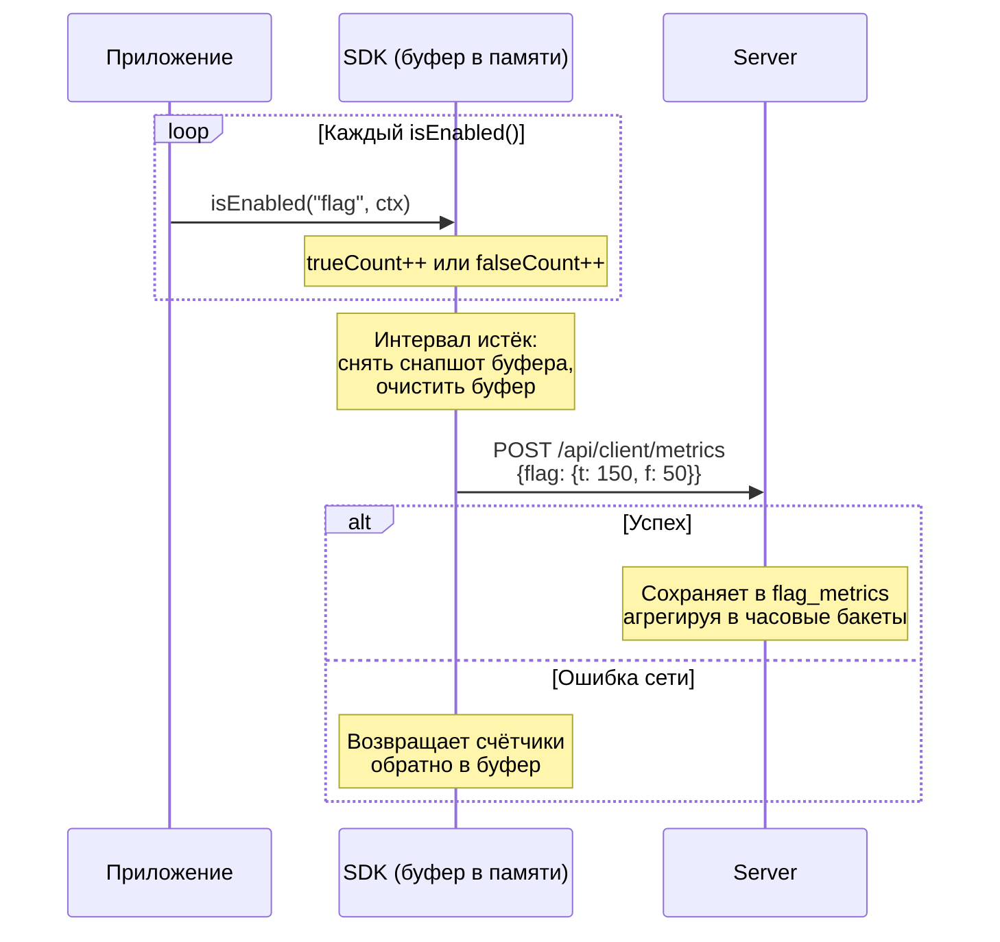

# Метрики и аналитика

**можно**<span class=brand-dot>.</span> собирает метрики использования фиче-флагов: сколько раз флаг оценивался и какой результат вернул. Метрики визуализируются в веб-панели через sparkline-графики и доступны через REST API.

## Как собираются метрики

SDK накапливает счётчики `true`/`false` для каждого флага в локальном буфере (`ConcurrentHashMap`). Раз в заданный интервал (по умолчанию — 60 секунд) буфер отправляется на сервер одним запросом:



Каждая запись содержит:

| Поле | Описание |
|------|----------|
| `flagId` | ID флага |
| `environmentId` | ID окружения |
| `evaluationTrueCount` | Количество возвратов `true` |
| `evaluationFalseCount` | Количество возвратов `false` |
| `timeBucket` | Часовой интервал |
| `instanceId` | Идентификатор экземпляра SDK |
| `appName` | Имя приложения |

## Просмотр метрик в веб-панели

На странице флага отображается sparkline-график — миниатюрный график, показывающий тренд оценки флага за выбранный период. Зелёная линия — `true`, серая — `false`.

При клике на sparkline открывается диалог с полным графиком и списком SDK-экземпляров, сгруппированных по приложениям. Доступна фильтрация по приложению и конкретному экземпляру. Метрики хранятся за последние 48 часов.

## Отключение метрик

Если метрики не нужны, отключите их в SDK:

```java
MozhnoConfig config = MozhnoConfig.builder()
    .appName("my-app")
    .instanceId("instance-1")
    .mozhnoUrl("http://localhost:8080")
    .apiKey("<api-key>")
    .disableMetrics(true)
    .build();
```


## Что значат метрики

| Паттерн | Интерпретация |
|---------|---------------|
| `trueCount` растёт | Флаг включается для всё большей аудитории — роллаут работает |
| `falseCount` растёт, `trueCount = 0` | Флаг выключен или никто не подпадает под правила |
| Резкий скачок `falseCount` | Возможная проблема: флаг внезапно перестал включаться |
| Нет метрик | SDK не отправляет данные — проверьте подключение |

## Лимиты

Интервал отправки метрик — 60 секунд по умолчанию.

## Что дальше?

- [SDK: Обзор](/sdk/overview) — как SDK отправляет метрики
- [Мониторинг](/self-hosting/monitoring) — Prometheus, health checks
- [Таргетинг](/guide/targeting) — правила и сегменты