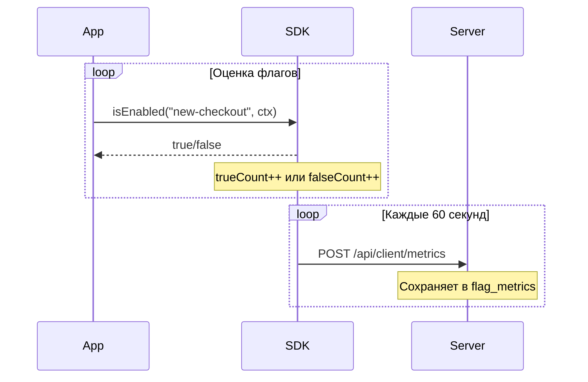

# Метрики и аналитика

**можно.** собирает метрики использования фиче-флагов: сколько раз флаг оценивался и какой результат вернул. Метрики визуализируются в веб-панели через sparkline-графики и доступны через REST API.

## Как собираются метрики

SDK накапливает счётчики оценок каждого флага в памяти и отправляет их на сервер с заданным интервалом (по умолчанию — 60 секунд):



Каждая запись содержит:

| Поле | Описание |
|------|----------|
| `flagId` | ID флага |
| `environmentId` | ID окружения |
| `evaluationTrueCount` | Количество возвратов `true` |
| `evaluationFalseCount` | Количество возвратов `false` |
| `timeBucket` | Временной интервал (округление до минуты) |
| `instanceId` | Идентификатор экземпляра SDK |
| `appName` | Имя приложения |

## Просмотр метрик в веб-панели

На странице флага отображается sparkline-график — миниатюрный график, показывающий тренд оценки флага за выбранный период. Зелёная линия — `true`, серая — `false`.

При клике на sparkline открывается диалог **«Метрики флага»** с полным графиком и фильтрами:

| Фильтр | Описание |
|--------|----------|
| **Окружение** | dev / staging / production |
| **Экземпляр** | Конкретный instance SDK |
| **Приложение** | Имя приложения |
| **Период** | Последний час / 24 часа / 7 дней / 30 дней |

## REST API для метрик

### Метрики флага

```http
GET /api/v1/flags/{flagId}/metrics
```

| Параметр | Тип | Описание |
|----------|-----|----------|
| `environmentId` | `long` | ID окружения |
| `instanceId` | `string` | ID экземпляра SDK |
| `appName` | `string` | Имя приложения |

```bash
curl "http://localhost:8080/api/v1/flags/42/metrics?environmentId=3" \
  -H "Authorization: Bearer $JWT_TOKEN"
```

Ответ:

```json
{
  "metrics": [
    {
      "timeBucket": "2026-06-21T13:41:00Z",
      "trueCount": 150,
      "falseCount": 50,
      "instanceId": "instance-1",
      "appName": "web-app"
    }
  ]
}
```

### Метрики проекта

```http
GET /api/v1/metrics
```

| Параметр | Тип | Описание |
|----------|-----|----------|
| `environmentId` | `long` | ID окружения |

Возвращает агрегированные метрики по всем флагам проекта.

## Отключение метрик

Если метрики не нужны, отключите их в SDK:

```java
MozhnoConfig config = MozhnoConfig.builder()
    .appName("my-app")
    .instanceId("instance-1")
    .mozhnoUrl("http://localhost:8080")
    .apiKey("<api-key>")
    .disableMetrics(true)
    .build();
```

```typescript
const client = new MozhnoClient({
  url: 'http://localhost:8080',
  apiKey: '<api-key>',
  appName: 'my-app',
  disableMetrics: true,
});
```

## Экспорт метрик через SPI

Через `MetricsSinkSpi` метрики можно направить во внешние системы:

| Назначение | Реализация |
|------------|------------|
| Prometheus | Стандартный эндпоинт `/actuator/prometheus` |
| Datadog, New Relic | Enterprise-реализация `MetricsSinkSpi` |
| Локальное хранение | `JdbcMetricsSinkProvider` (по умолчанию) |

## Что значат метрики

| Паттерн | Интерпретация |
|---------|---------------|
| `trueCount` растёт | Флаг включается для всё большей аудитории — роллаут работает |
| `falseCount` растёт, `trueCount = 0` | Флаг выключен или никто не подпадает под правила |
| Резкий скачок `falseCount` | Возможная проблема: флаг внезапно перестал включаться |
| Нет метрик | SDK не отправляет данные — проверьте подключение |

## Лимиты

| Параметр | По умолчанию | Описание |
|----------|-------------|----------|
| Интервал отправки (SDK) | 60 секунд | `sendMetricsInterval` / `metricsInterval` |
| Макс. метрик на API-ключ | 1000 | `CLIENT_MAX_METRICS_PER_KEY` |

## Что дальше?

- [SDK: Обзор](/sdk/overview) — как SDK отправляет метрики
- [Мониторинг](/self-hosting/monitoring) — Prometheus, health checks
- [Таргетинг](/guide/targeting) — правила и сегменты
