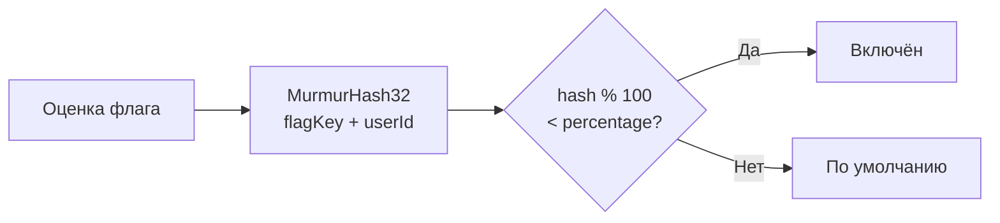
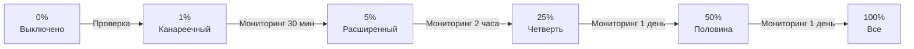

# Роллаут

Роллаут (rollout) — процесс **постепенного включения** фичи для всё большего числа пользователей. **можно**<span class=brand-dot>.</span> поддерживает процентный роллаут с детерминированным распределением на основе MurmurHash32.

## Как работает процентный роллаут

Процентный роллаут — это поле `percentage` (0–100) в настройках стратегии флага. При оценке флага SDK вычисляет:

```
hash = MurmurHash32(flagKey + (userId || sessionId)) % 100
if hash < percentage → enabled
```

MurmurHash32 гарантирует **детерминированность**: один и тот же пользователь всегда получает одинаковый результат для одного флага при неизменном проценте. Пользователь не «прыгает» между включённым и выключенным состоянием.



## Пошаговая стратегия раскатки



### Этапы роллаута

| Этап | Процент | Длительность | Что проверять |
|------|---------|-------------|---------------|
| **0% — Подготовка** | 0% | Перед запуском | Флаг создан, стратегия настроена, код задеплоен |
| **1% — Канареечный** | 1% | 30 минут | Ошибки, latency, расход памяти. Если аномалии — откат |
| **5% — Расширенный** | 5% | 2 часа | Стабильность метрик, бизнес-показатели |
| **25% — Четверть** | 25% | 1 день | Поведение на разнообразной аудитории |
| **50% — Половина** | 50% | 1 день | Сравнение метрик со старым вариантом |
| **100% — Все** | 100% | — | Фича полностью включена |

> **Совет:** Не пропускайте этапы. Даже «безопасная» фича может вызвать непредвиденный рост нагрузки. Канареечный деплой на 1% выявляет проблемы с минимальными последствиями.

## Совмещение с таргетингом

Правила таргетинга и процентный роллаут работают вместе:

1. Сначала проверяются контекстные правила (AND-логика)
2. Затем проверяются сегменты (OR-логика)
3. Если не сработало ни то, ни другое — применяется процентный роллаут
4. Если процентный роллаут не задан — возвращается `true`

**Пример: Internal + 10% external:**

| Приоритет | Тип | Конфигурация |
|-----------|-----|-------------|
| 1 | Контекстное правило | `email` contains `"@company.com"` |
| — | Процентный роллаут | 10% по `userId` |
| — | По умолчанию | `false` |

Все сотрудники получают фичу (правило совпало), и 10% внешних пользователей тоже получают. Остальные 90% внешних — нет.

## Откат (Rollback)

### Мгновенный откат

Отключите стратегию (`enabled: false`) или установите процент в 0:

```bash
curl -X PUT "http://localhost:8080/api/v1/flags/42/strategies" \
  -H "Authorization: Bearer $TOKEN" \
  -H "Content-Type: application/json" \
  -d '{"flagId": 42, "environmentId": 3, "enabled": false}'
```

### Kill Switch — экстренный откат

Для критических ситуаций используйте флаг типа **KILLSWITCH**:

```java
if (!client.isEnabled("payment-gateway-killswitch")) {
    throw new ServiceUnavailableException();
}
```

Kill Switch всегда включён; когда его выключают в панели, `isEnabled()` возвращает `false` — функциональность мгновенно блокируется.

## Роллаут по окружениям

Разные окружения имеют независимые настройки роллаута:

| Окружение | Процент | Правила |
|-----------|---------|---------|
| **dev** | 100% | Без ограничений |
| **staging** | 100% | Сегмент «Тестировщики» |
| **production** | 1% → 100% | Поэтапная раскатка |

Это позволяет тестировать фичу на staging и dev без ограничений, одновременно проводя осторожный роллаут на production.

## Что дальше?

- [Таргетинг](/guide/targeting) — настройка правил и сегментов
- [Работа с флагами](/guide/flags-workflow) — жизненный цикл и командный процесс
- [Аудит](/guide/audit) — отслеживание всех изменений роллаута
