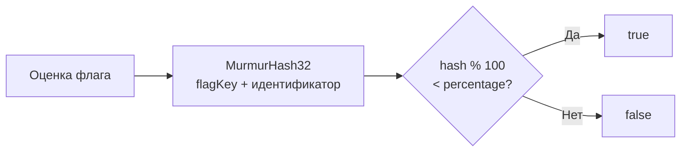
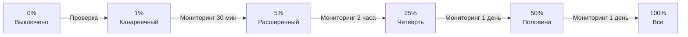
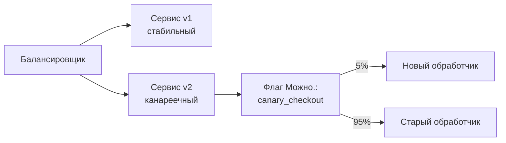

# Роллаут

Роллаут — процесс **постепенного включения** фичи для всё большего числа пользователей. **можно**<span class=brand-dot>.</span> использует процентный роллаут с детерминированным распределением на основе MurmurHash32.

## Как работает процентный роллаут

Процентный роллаут — это поле `percentage` (0–100) в настройках стратегии флага. При оценке флага SDK вычисляет:

```
hash = MurmurHash32(flagKey + идентификатор) % 100
if hash < percentage → enabled
```

MurmurHash32 гарантирует **детерминированность**: один и тот же пользователь всегда получает одинаковый результат для одного флага при неизменном проценте. Пользователь не «прыгает» между включённым и выключенным состоянием.

В качестве идентификатора используется `userId`, затем `sessionId`. Если не передан ни один, SDK автоматически генерирует стабильный анонимный идентификатор (`anonymousId`): в браузерных SDK он сохраняется в localStorage и переживает перезагрузку страницы, в серверных — создаётся при старте клиента и живёт до перезапуска приложения.

Благодаря этому анонимный трафик распределяется по корзинам **равномерно и стабильно**: каждый анонимный пользователь/инстанс всегда попадает в одну и ту же группу, а проценты роллаута честно применяются ко всей аудитории. Поведение управляется опцией `stickyAnonId` (по умолчанию `true`) во всех SDK. Если её отключить, все анонимные запросы без идентификатора попадают в одну группу — SDK выводит предупреждение в лог.

> **При обновлении:** в версиях SDK до появления `stickyAnonId` все анонимные запросы без идентификатора попадали в одну корзину (по ключу флага). После обновления анонимный трафик перейдёт в новые корзины — в браузере привязанные к ID из localStorage, на сервере — к ID инстанса приложения — поэтому эффективный процент роллаута для анонимной аудитории может измениться скачком. Планируйте обновление при проценте 100%/0% либо временно отключите `stickyAnonId`, чтобы сохранить прежнее поведение.

При 100% фича включена для всех; при 0% — выключена.



## Пример стратегии раскатки

Один из возможных сценариев — адаптируйте процент и длительность под свой проект:



| Этап | Процент | Длительность | Что проверять |
|------|---------|-------------|---------------|
| **Подготовка** | 0% | Перед запуском | Флаг создан, стратегия настроена, код задеплоен |
| **Канареечный** | 1% | 30 минут | Ошибки, latency, расход памяти. Если аномалии — откат |
| **Расширенный** | 5% | 2 часа | Стабильность метрик, бизнес-показатели |
| **Четверть** | 25% | 1 день | Поведение на разнообразной аудитории |
| **Половина** | 50% | 1 день | Сравнение метрик со старым вариантом |
| **Все** | 100% | — | Фича полностью включена |

> **Совет:** Не пропускайте этапы. Даже «безопасная» фича может вызвать непредвиденный рост нагрузки. Канареечный деплой на 1% выявляет проблемы с минимальными последствиями.

## Канареечный релиз

Канареечный релиз направляет небольшой процент трафика на новую версию через фиче-флаг:



1. Создайте RELEASE-флаг, по умолчанию выключен
2. Задеплойте обе версии сервиса — v1 и v2
3. Код v2 проверяет `client.isEnabled("flag", context)` перед выполнением новой логики
4. В панели настройте стратегию с **процентным роллаутом 5%**
5. Мониторьте ошибки, latency и бизнес-метрики для канареечной группы
6. Постепенно увеличивайте процент или **откатывайте до 0%** при проблемах

## Роллаут и таргетинг

Процентный роллаут работает **поверх** контекстных условий и сегментов: пользователь сначала должен пройти правила таргетинга, и только потом применяется процент. Подробнее — [Как сочетаются условия и сегменты](/guide/targeting#как-сочетаются-условия-и-сегменты).

## Откат

### Мгновенный откат

Установите процент в 0 или отключите стратегию (`enabled: false`) — фича мгновенно выключится для всех.

### Kill Switch

Для экстренных ситуаций используйте флаг типа **KILLSWITCH**: когда его выключают в панели, `isEnabled()` возвращает `false` для всех — функциональность мгновенно блокируется.

```java
if (!client.isEnabled("payment-gateway-killswitch")) {
    throw new ServiceUnavailableException();
}
```

## Пример настройки по окружениям

Один из возможных подходов — независимый роллаут на каждом окружении:

| Окружение | Процент | Правила |
|-----------|---------|---------|
| **dev** | 100% | Без ограничений |
| **staging** | 100% | Сегмент тестировщиков |
| **production** | 1% → 100% | Поэтапная раскатка |

Это позволяет свободно тестировать на dev и staging, одновременно проводя осторожный роллаут на production.

## Что дальше?

- [Таргетинг](/guide/targeting) — контекстные условия и сегменты
- [Работа с флагами](/guide/flags-workflow) — жизненный цикл флага
- [Аудит](/guide/audit) — отслеживание всех изменений роллаута
