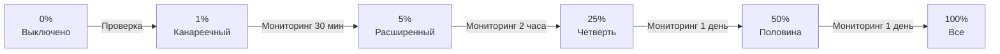

# Роллаут

Роллаут (rollout) — процесс **постепенного включения** фичи для всё большего числа пользователей. **можно.** предоставляет стратегии для контролируемой раскатки от 0% до 100% с возможностью отката на любом этапе.

## Стратегии роллаута

**можно.** поддерживает четыре стратегии. Выбор стратегии зависит от сценария.

| Стратегия | Принцип | Применение |
|-----------|---------|------------|
| **Default** | Включено или выключено для всех | Kill switch, мгновенный запуск |
| **Gradual** | Процентный роллаут | Постепенная раскатка |
| **Scheduled** | По расписанию | Акции, временные фичи |
| **Custom** | Произвольная логика (SPI) | Специфические сценарии |

### Default

Мгновенное включение или выключение. Самая простая стратегия.

```json
{
  "type": "default",
  "value": true
}
```

Используйте для:
- Аварийного отключения фичи (kill switch)
- Фич, которые должны включиться сразу для всех (например, обязательное обновление API)

### Gradual

Постепенная раскатка с контролируемым процентом. **Основная стратегия** для продакшен-роллаутов.

```json
{
  "type": "gradual",
  "percentage": 25,
  "hashProperty": "userId"
}
```

| Параметр | Тип | Обязательно | Описание |
|----------|-----|-------------|----------|
| `percentage` | `int` | Да | Процент пользователей (0–100) |
| `hashProperty` | `string` | Нет | Свойство контекста для хеширования. По умолчанию `userId`. |

Хеширование гарантирует **детерминированность**: один и тот же пользователь всегда получает одинаковый результат при неизменном проценте. Это означает, что пользователь не будет «прыгать» между включённым и выключенным состоянием при перезапросах.

```java
// Хеширование по email для консистентности между устройствами
client.isFlagEnabled("new-feature", ctx.withHashProperty("email"));
```

### Scheduled

Включение по расписанию. Флаг активен только в заданном временном окне.

```json
{
  "type": "scheduled",
  "startAt": "2026-06-25T12:00:00Z",
  "endAt": "2026-07-01T12:00:00Z"
}
```

| Параметр | Тип | Обязательно | Описание |
|----------|-----|-------------|----------|
| `startAt` | `datetime` | Да | Дата и время включения (ISO 8601, UTC) |
| `endAt` | `datetime` | Нет | Дата и время выключения. Если не указано, флаг не выключается автоматически. |

## Процентный роллаут

### Как работает хеширование

При процентном роллауте **можно.** вычисляет хеш от значения указанного атрибута и сравнивает его с порогом:

```
hash(userId) % 100 < percentage → true
hash(userId) % 100 >= percentage → false
```

Алгоритм использует некриптографическую хеш-функцию (MurmurHash3) для равномерного распределения.

### Пошаговая стратегия раскатки



### Этапы роллаута

| Этап | Процент | Длительность | Что проверять |
|------|---------|-------------|---------------|
| **0% — Подготовка** | 0% | Перед запуском | Флаг создан, стратегия настроена, код задеплоен |
| **1% — Канареечный** | 1% | 30 минут | Ошибки, latency, расход памяти. Если есть аномалии — откат. |
| **5% — Расширенный** | 5% | 2 часа | Стабильность метрик, бизнес-показатели (конверсия, отказы) |
| **25% — Четверть** | 25% | 1 день | Поведение на разнообразной аудитории, нагрузка на инфраструктуру |
| **50% — Половина** | 50% | 1 день | Сравнение A/B метрик со старым вариантом |
| **100% — Все** | 100% | — | Фича полностью включена, готовьте удаление старого кода |

> **Совет:** Не пропускайте этапы. Даже «безопасная» фича может вызвать непредвиденный рост нагрузки на базу данных или сторонние сервисы. Канареечный деплой на 1% выявляет такие проблемы с минимальными последствиями.

## Канареечный деплой (Canary Release)

Канареечный деплой — практика проверки новой версии на небольшой группе пользователей перед полным роллаутом.

### Настройка канареечного деплоя в можно.

```json
{
  "key": "canary-api-v2",
  "targeting": [
    {
      "name": "Канареечная группа",
      "rules": [
        { "attribute": "userId", "operator": "percentage", "value": 1 }
      ],
      "serve": true
    }
  ]
}
```

### Совмещение с CI/CD

```yaml
# .github/workflows/canary.yml
name: Canary Release
on:
  workflow_dispatch:
    inputs:
      percentage:
        description: 'Процент роллаута'
        required: true
        default: '1'

jobs:
  canary:
    runs-on: ubuntu-latest
    steps:
      - name: Установить процент роллаута
        run: |
          curl -X PATCH "${{ secrets.MOZHNO_URL }}/api/v1/flags/canary-api-v2/strategies" \
            -H "Authorization: Bearer ${{ secrets.MOZHNO_TOKEN }}" \
            -H "Content-Type: application/json" \
            -d "{\"type\": \"gradual\", \"percentage\": ${{ github.event.inputs.percentage }}}"
```

### Признаки проблем на канареечном этапе

| Метрика | Инструмент | Порог тревоги |
|---------|------------|---------------|
| **Error rate** | Sentry, Grafana | > baseline + 10% |
| **P99 latency** | Prometheus, Datadog | > baseline × 1.5 |
| **CPU / Memory** | Grafana, CloudWatch | > 80% утилизации |
| **Crash rate** | Firebase Crashlytics | > 0.1% |
| **Conversion rate** | Amplitude, Mixpanel | < baseline − 5% |

## Мониторинг роллаута

**можно.** не предоставляет встроенного мониторинга метрик, но интегрируется с вашими инструментами наблюдаемости.

### Подход 1: Логирование в приложении

Логируйте результат оценки флага вместе с контекстом:

```java
boolean enabled = client.isFlagEnabled("new-feature", ctx);
Logger.info("flag=new-feature enabled=" + enabled + " userId=" + ctx.get("userId"));

if (enabled) {
    // новый код
}
```

### Подход 2: Пользовательские события (Custom Events)

Отправляйте события в вашу аналитическую систему при каждом включении флага:

```java
if (client.isFlagEnabled("new-feature", ctx)) {
    analytics.track("Feature Exposed", Map.of(
        "flag", "new-feature",
        "userId", ctx.get("userId"),
        "variant", "enabled"
    ));
    // новый код
}
```

### Подход 3: Метрики через вебхуки

Подпишитесь на вебхук `flag.updated` и логируйте изменения процента роллаута в вашу систему мониторинга:

```json
{
  "webhook": "https://your-monitoring.example.com/hooks/mozhno",
  "events": ["flag.updated"],
  "secret": "whsec_your_secret"
}
```

Подробнее: [Интеграции](/guide/integrations)

### Дашборд роллаута (пример Grafana)

```
Показывает для каждого активного флага:
  - Текущий процент роллаута
  - Error rate для пользователей с флагом vs без флага
  - Latency P50/P99 для пользователей с флагом vs без флага
  - Количество уникальных пользователей, затронутых флагом
```

## Откат (Rollback)

### Мгновенный откат через стратегию Default

Самый быстрый способ — переключить стратегию на `false`:

```bash
curl -X PATCH "http://localhost:8080/api/v1/flags/new-feature/strategies" \
  -H "Authorization: Bearer $JWT_TOKEN" \
  -H "Content-Type: application/json" \
  -d '{"type": "default", "value": false}'
```

### Поэтапный откат

Если проблема не критична, можно уменьшать процент постепенно:

```
100% → 50% → 25% → 5% → 1% → 0%
```

### Автоматический откат через CI/CD

```yaml
# .github/workflows/rollback.yml
name: Rollback Feature Flag
on:
  workflow_dispatch:
    inputs:
      flag_key:
        description: 'Ключ флага для отката'
        required: true

jobs:
  rollback:
    runs-on: ubuntu-latest
    steps:
      - name: Откат флага
        run: |
          curl -X PATCH "${{ secrets.MOZHNO_URL }}/api/v1/flags/${{ github.event.inputs.flag_key }}/strategies" \
            -H "Authorization: Bearer ${{ secrets.MOZHNO_TOKEN }}" \
            -H "Content-Type: application/json" \
            -d '{"type": "default", "value": false}'
```

### Kill Switch — экстренный откат

Для критических ситуаций настройте **Kill Switch**-флаг, который аварийно отключает фичу:

```json
{
  "key": "payment-gateway-killswitch",
  "name": "Аварийное отключение платёжного шлюза",
  "type": "BOOLEAN",
  "strategies": [
    { "type": "default", "value": false }
  ]
}
```

```java
// В коде Kill Switch должен быть ВНЕШНИМ условием
if (!client.isFlagEnabled("payment-gateway-killswitch", ctx)) {
    if (client.isFlagEnabled("new-payment-flow", ctx)) {
        executeNewPaymentFlow();
    } else {
        executeOldPaymentFlow();
    }
} else {
    throw new ServiceUnavailableException();
}
```

> **Предупреждение:** Kill Switch отключает фичу для **всех** пользователей мгновенно. Используйте только для действительно критических ситуаций: падение платёжного шлюза, утечка данных, критические ошибки.

## Мультивариативный роллаут

Для A/B-тестов процентный роллаут распределяет пользователей между вариантами:

```json
{
  "key": "checkout-design",
  "type": "MULTI_VARIATE",
  "variants": [
    { "value": "A", "weight": 50 },
    { "value": "B", "weight": 30 },
    { "value": "C", "weight": 20 }
  ]
}
```

| Вариант | Вес | Процент | Описание |
|---------|-----|---------|----------|
| A | 50 | 50% | Старый дизайн (контрольная группа) |
| B | 30 | 30% | Новый дизайн |
| C | 20 | 20% | Минималистичный дизайн |

При увеличении процента роллаута веса вариантов сохраняются пропорционально.

## Роллаут по окружениям

Разные окружения могут иметь независимые настройки роллаута:

| Окружение | Процент | Правила |
|-----------|---------|---------|
| **dev** | 100% | Все разработчики |
| **staging** | 100% | Сегмент «Тестировщики» |
| **production** | 1% → 100% | Поэтапная раскатка |

Это позволяет тестировать фичу на staging и dev без ограничений, одновременно проводя осторожный роллаут на production.

## Что дальше?

- [Таргетинг](/guide/targeting) — настройка правил и сегментов
- [Работа с флагами](/guide/flags-workflow) — жизненный цикл и командный процесс
- [Аудит](/guide/audit) — отслеживание всех изменений роллаута
- [Стратегии](/concepts/strategies) — подробнее о типах стратегий
