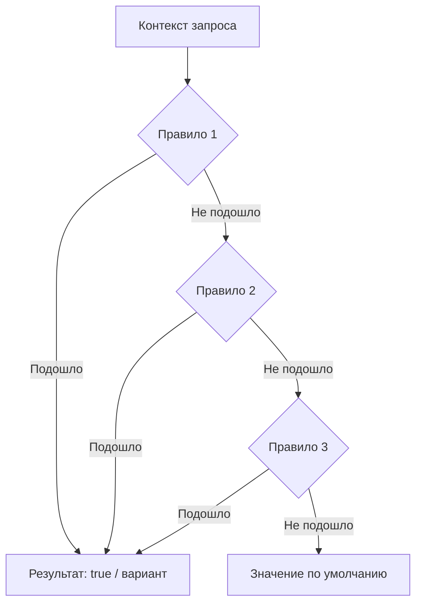
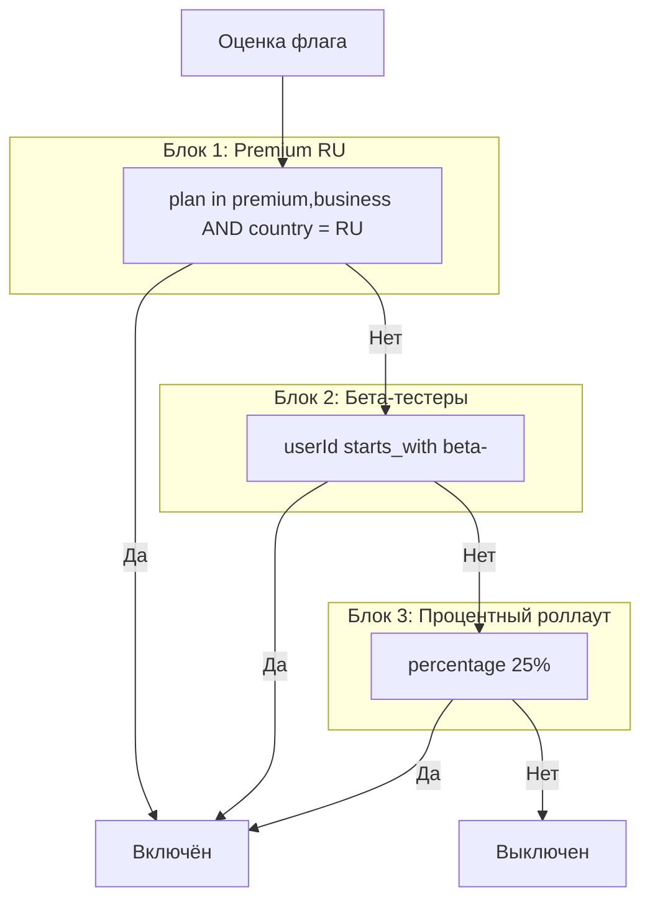
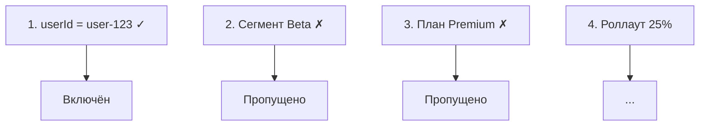

# Таргетинг

Таргетинг определяет, **какие пользователи** увидят фичу. **можно.** позволяет задавать правила на основе любых атрибутов контекста, комбинировать их и переиспользовать через сегменты.

## Как работают правила

При оценке флага SDK последовательно проверяет правила таргетинга. Как только правило срабатывает — применяется его результат. Если ни одно правило не подошло, флаг возвращает значение по умолчанию.



## Атрибуты контекста

Контекст передаётся из приложения в SDK при каждой проверке флага.

### Структура контекста

```java
var ctx = new EvaluationContext()
    .set("userId", "user-123")
    .set("email", "user@example.com")
    .set("country", "RU")
    .set("plan", "premium")
    .set("device", "ios")
    .set("appVersion", "2.4.1")
    .set("loginCount", 42);
```

```typescript
const ctx = {
  userId: 'user-123',
  email: 'user@example.com',
  country: 'RU',
  plan: 'premium',
  device: 'ios',
  appVersion: '2.4.1',
  loginCount: 42,
};
```

### Рекомендуемые атрибуты

| Атрибут | Тип | Назначение | Пример |
|---------|-----|------------|--------|
| `userId` | `string` | Уникальный идентификатор пользователя. Используется для хеширования в процентном роллауте. | `user-123` |
| `email` | `string` | Email пользователя. Полезен для корпоративных правил. | `user@company.com` |
| `country` | `string` | Страна (ISO-код). Гео-таргетинг. | `RU`, `US`, `DE` |
| `plan` | `string` | Тарифный план. Feature-гейтинг по подписке. | `free`, `premium`, `business` |
| `device` | `string` | Тип устройства. Платформенный таргетинг. | `ios`, `android`, `web` |
| `appVersion` | `string` | Версия приложения. Контроль минимальной версии. | `2.4.1` |
| `tenantId` | `string` | ID арендатора в мультитенантных системах. | `tenant-42` |
| `region` | `string` | Регион или дата-центр. Гео-распределённый таргетинг. | `eu-west`, `us-east` |

> **Совет:** Передавайте только те атрибуты, которые действительно используются в правилах. Избыточный контекст увеличивает размер запросов и может раскрыть лишние данные о пользователях.

## Операторы сравнения

**можно.** поддерживает богатый набор операторов для точной настройки правил.

### Строковые операторы

| Оператор | Описание | Пример правила | Подойдёт |
|----------|----------|----------------|----------|
| `equals` | Точное совпадение | `country` equals `RU` | `RU` |
| `not_equals` | Не совпадает | `plan` not_equals `free` | `premium`, `business` |
| `contains` | Содержит подстроку | `email` contains `@company.com` | `user@company.com` |
| `not_contains` | Не содержит подстроку | `email` not_contains `@test.com` | `user@company.com` |
| `in` | Входит в список | `country` in `[RU, BY, KZ]` | `RU`, `BY`, `KZ` |
| `not_in` | Не входит в список | `plan` not_in `[free, trial]` | `premium`, `business` |
| `regex` | Соответствует регулярному выражению | `email` regex `.*@company\.com$` | `user@company.com` |
| `starts_with` | Начинается с | `userId` starts_with `beta-` | `beta-user-123` |
| `ends_with` | Заканчивается на | `email` ends_with `@company.com` | `user@company.com` |

### Числовые операторы

| Оператор | Описание | Пример правила | Подойдёт |
|----------|----------|----------------|----------|
| `gt` | Больше (>) | `loginCount` gt `10` | `11`, `42`, `100` |
| `gte` | Больше или равно (≥) | `age` gte `18` | `18`, `21`, `65` |
| `lt` | Меньше (<) | `latencyMs` lt `100` | `0`, `50`, `99` |
| `lte` | Меньше или равно (≤) | `attempts` lte `3` | `0`, `1`, `2`, `3` |

### Операторы версий

| Оператор | Описание | Пример правила | Подойдёт |
|----------|----------|----------------|----------|
| `version_eq` | Точная версия | `appVersion` version_eq `2.4.1` | `2.4.1` |
| `version_gt` | Версия выше | `appVersion` version_gt `2.4.0` | `2.4.1`, `2.5.0`, `3.0.0` |
| `version_gte` | Версия выше или равна | `appVersion` version_gte `2.4.0` | `2.4.0`, `2.4.1` |
| `version_lt` | Версия ниже | `appVersion` version_lt `3.0.0` | `2.9.9`, `2.4.1` |
| `version_lte` | Версия ниже или равна | `appVersion` version_lte `2.4.1` | `2.0.0`, `2.4.0`, `2.4.1` |

Семантическое версионирование (semver) поддерживается корректно: `2.10.0` > `2.9.0`.

### Специальные операторы

| Оператор | Описание | Пример правила | Подойдёт |
|----------|----------|----------------|----------|
| `is_null` | Атрибут отсутствует или null | `plan` is_null | Контекст без `plan` |
| `is_not_null` | Атрибут присутствует и не null | `email` is_not_null | Контекст с `email` |
| `percentage` | Процентный роллаут по атрибуту | `userId` percentage `25` | 25% пользователей |

## Комбинирование правил

### Логическое И (AND)

Все правила внутри одного блока таргетинга объединяются логическим **И** — пользователь должен удовлетворять **всем** правилам одновременно:

```json
{
  "rules": [
    { "attribute": "plan", "operator": "in", "value": ["premium", "business"] },
    { "attribute": "country", "operator": "equals", "value": "RU" },
    { "attribute": "appVersion", "operator": "version_gte", "value": "2.0.0" }
  ]
}
```

Пользователь попадёт под это правило, только если у него Premium/Business, он из России **и** версия приложения ≥ 2.0.0.

### Логическое ИЛИ (OR)

Несколько блоков таргетинга в цепочке стратегий работают как логическое **ИЛИ** — флаг активируется, если подошёл **хотя бы один** блок:



### Пример: сложная комбинация

Флаг `ai-search` должен быть доступен:

1. Всем Premium-пользователям из России с версией приложения ≥ 2.0.0 — **ИЛИ**
2. Всем пользователям из сегмента «Бета-тестеры» — **ИЛИ**
3. 10% остальных пользователей

```json
{
  "key": "ai-search",
  "targeting": [
    {
      "name": "Premium RU",
      "rules": [
        { "attribute": "plan", "operator": "in", "value": ["premium", "business"] },
        { "attribute": "country", "operator": "equals", "value": "RU" },
        { "attribute": "appVersion", "operator": "version_gte", "value": "2.0.0" }
      ],
      "serve": true
    },
    {
      "name": "Бета-тестеры",
      "segment": "beta-testers",
      "serve": true
    },
    {
      "name": "10% роллаут",
      "rules": [
        { "attribute": "userId", "operator": "percentage", "value": 10 }
      ],
      "serve": true
    }
  ]
}
```

## Использование сегментов в таргетинге

Сегменты — переиспользуемые группы пользователей. Вместо того чтобы дублировать правила на каждом флаге, укажите сегмент.

### Создание сегмента

Через веб-панель: **Сегменты** → **«Создать сегмент»**:

```json
{
  "name": "Бета-тестеры",
  "key": "beta-testers",
  "rules": [
    { "attribute": "userId", "operator": "starts_with", "value": "beta-" },
    { "attribute": "email", "operator": "not_contains", "value": "@test.com" }
  ]
}
```

### Привязка сегмента к флагу

При настройке таргетинга флага выберите **«Добавить сегмент»** вместо ручного ввода правил:

```json
{
  "key": "new-feature",
  "targeting": [
    {
      "segment": "beta-testers",
      "serve": true
    },
    {
      "segment": "premium-users",
      "serve": true
    }
  ]
}
```

### Преимущества сегментов

| Преимущество | Описание |
|--------------|----------|
| **Единая точка правды** | Изменили сегмент — все 50 флагов автоматически обновились |
| **Согласованность** | Все команды используют одни и те же правила |
| **DRY** | Не повторяете `plan in [premium, business]` на каждом флаге |
| **Аудит** | Видно, кто и когда изменил состав сегмента |

## Приоритет правил

Правила таргетинга проверяются **сверху вниз**. Порядок важен — первое подошедшее правило определяет результат.

> **Совет:** Размещайте специфичные правила (сегменты, конкретные userId) выше общих (процентный роллаут). Это гарантирует, что бета-тестеры всегда получат фичу, даже если общий роллаут выключен.



## Отладка таргетинга

### Проверка в веб-панели

На странице флага есть инструмент **«Проверить таргетинг»**:

1. Введите значения атрибутов контекста вручную
2. Нажмите **«Проверить»**
3. Система покажет, какое правило сработало и какой результат вернётся

Это позволяет отладить правила без запуска приложения.

### Проверка через SDK

```java
var ctx = new EvaluationContext()
    .set("userId", "user-123")
    .set("plan", "premium")
    .set("country", "RU");

FlagEvaluation eval = client.getFlagEvaluation("new-feature", ctx);
System.out.println("Результат: " + eval.isEnabled());
System.out.println("Сработавшее правило: " + eval.getMatchedRule());
System.out.println("Причина: " + eval.getReason());
```

```typescript
const eval = await client.getEvaluation('new-feature', {
  userId: 'user-123',
  plan: 'premium',
  country: 'RU',
});
console.log('Результат:', eval.enabled);
console.log('Сработавшее правило:', eval.matchedRule);
console.log('Причина:', eval.reason);
```

Метод `getEvaluation` / `getFlagEvaluation` возвращает не только результат, но и метаданные: какое правило сработало, какой сегмент был использован, причина отказа.

## Что дальше?

- [Роллаут](/guide/rollout) — процентная раскатка и стратегии
- [Сегменты](/concepts/segments) — переиспользуемые группы пользователей
- [Флаги](/concepts/flags) — типы флагов и жизненный цикл
- [SDK: Обзор](/sdk/overview) — как SDK оценивает правила локально
