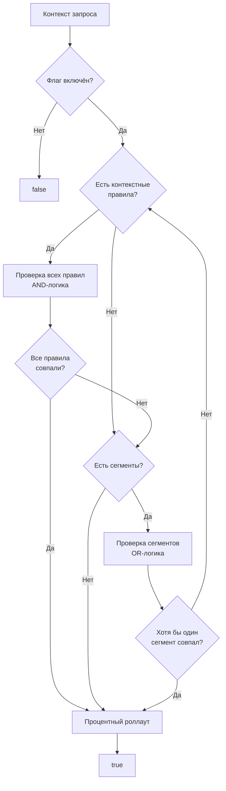

# Таргетинг

Таргетинг определяет, **какие пользователи** увидят фичу. **можно**<span class=brand-dot>.</span> использует контекстные правила (constraints), сегменты и процентный роллаут для точного управления аудиторией.

## Как работает таргетинг

При оценке флага SDK последовательно проверяет:

1. **Флаг включён?** — если флаг (или стратегия) выключен, вернуть `false`
2. **Контекстные правила** — все заданные правила должны совпасть (логическое И)
3. **Сегменты** — хотя бы один сегмент должен совпасть (логическое ИЛИ)
4. **Если заданы и правила, и сегменты** — достаточно совпадения любого из них (ИЛИ)
5. **Процентный роллаут** — детерминированное распределение через MurmurHash32
6. **По умолчанию** — если ничего не задано, вернуть `true`



## Контекстные правила

Каждое правило — это сравнение поля контекста со значением через оператор. Все правила внутри стратегии объединяются логическим **И**.

```json
{
  "field": "country",
  "operator": "in",
  "values": ["RU", "BY", "KZ"]
}
```

Тип контекста (`contextType`) определяет, как оператор интерпретирует значение. Полная матрица совместимости операторов и типов — [Контексты](/concepts/contexts#типы-контекста-и-операторы).

## Сегменты

Сегмент — переиспользуемая группа пользователей со своим набором контекстных правил. Внутри сегмента все правила — AND-логика. Стратегия может ссылаться на несколько сегментов — достаточно совпадения **любого** из них (OR-логика). Подробнее — [Сегменты](/concepts/segments).

### Преимущества сегментов

| Преимущество | Описание |
|--------------|----------|
| **Единая точка правды** | Изменили сегмент — все флаги автоматически обновились |
| **DRY** | Не повторяете одни и те же правила на каждом флаге |
| **Аудит** | Видно, кто и когда изменил состав сегмента |

## Процентный роллаут

Детерминированное распределение через хеширование:

```
hash = MurmurHash32(flagKey + идентификатор) % 100
if hash < percentage → enabled
```

Один и тот же идентификатор всегда получает одинаковый результат для одного флага. В качестве идентификатора используется `userId`, затем `sessionId`; если не передан ни один — SDK использует автоматически сгенерированный стабильный `anonymousId`.

> **Важно:** Если опция `stickyAnonId` отключена и идентификатор не передан, хеш считается только по ключу флага — все анонимные пользователи попадают в одну группу (либо все получают фичу, либо никто). SDK выводит предупреждение в лог. Подробнее — [Роллаут](/guide/rollout).

При 100% роллауте фича включена для всех; при 0% — выключена.

## Как сочетаются условия и сегменты

Одна стратегия может содержать и контекстные условия, и сегменты одновременно:

- Достаточно пройти **хотя бы что-то одно** — условия ИЛИ любой из сегментов
- Не пройдено ни условий, ни сегментов → флаг возвращает `false` (роллаут не применяется)
- Пройдено → применяется процентный роллаут

## Что дальше?

- [Роллаут](/guide/rollout) — процентная раскатка и стратегии
- [Сегменты](/concepts/segments) — переиспользуемые группы пользователей
- [Флаги](/concepts/flags) — типы флагов и жизненный цикл
- [SDK: Обзор](/sdk/overview) — как SDK оценивает правила локально
