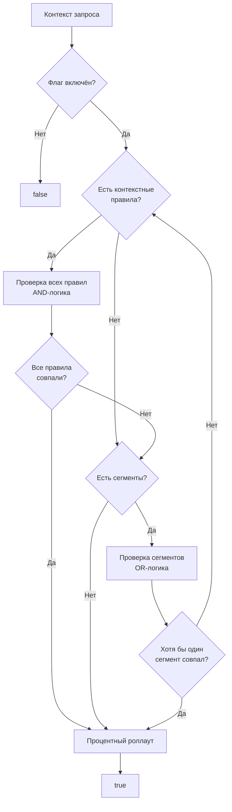

# Таргетинг

Таргетинг определяет, **какие пользователи** увидят фичу. **можно**<span class=brand-dot>.</span> использует контекстные правила (constraints), сегменты и процентный роллаут для точного управления аудиторией.

## Как работает таргетинг

При оценке флага SDK последовательно проверяет:

1. **Флаг включён?** — если флаг (или стратегия) выключен, вернуть `false`
2. **Контекстные правила** — все заданные правила должны совпасть (логическое И)
3. **Сегменты** — хотя бы один сегмент должен совпасть (логическое ИЛИ)
4. **Если заданы и правила, и сегменты** — достаточно совпадения любого из них (ИЛИ)
5. **Процентный роллаут** — детерминированное распределение через MurmurHash32
6. **По умолчанию** — если ничего не задано, вернуть `false`



## Контекстные правила (Constraints)

Каждое правило — это сравнение поля контекста со значением через оператор. Все правила внутри стратегии объединяются логическим **И**.

```json
{
  "field": "country",
  "operator": "in",
  "values": ["RU", "BY", "KZ"]
}
```

### Операторы

| Оператор | Описание | Пример |
|----------|----------|--------|
| `in` | Значение входит в список | `country` in `["RU", "BY"]` |
| `not_in` | Значение НЕ входит в список | `country` not_in `["US", "CA"]` |
| `eq` | Равенство | `plan` eq `"premium"` |
| `ne` | Неравенство | `plan` ne `"free"` |
| `gt` | Больше | `appVersion` gt `"2.0.0"` |
| `gte` | Больше или равно | `age` gte `"18"` |
| `lt` | Меньше | `priority` lt `"5"` |
| `lte` | Меньше или равно | `retries` lte `"3"` |
| `contains` | Содержит подстроку | `email` contains `"@company.com"` |

### Типы контекста

Тип (`contextType`) определяет, как сравниваются значения:

| Тип | Сравнение | Пример |
|-----|-----------|--------|
| `string` (по умолчанию) | Строковое | `country` in `["RU"]` |
| `number` | Числовое (double) | `age` gte `"18"` |
| `time` | ISO8601 дата/время | `eventDate` gt `"2026-01-01T00:00:00Z"` |
| `semver` | Семантическое версионирование | `appVersion` gte `"2.1.0"` |

Семантическое версионирование корректно: `"2.10.0"` > `"2.9.0"`.

### Пример: комбинирование правил

Стратегия для флага `ai-search`:

```json
{
  "contextValuesJson": "[{\"cd\":1,\"op\":\"in\",\"val\":\"RU\"},{\"cd\":2,\"op\":\"eq\",\"val\":\"premium\"}]"
}
```

Пользователь должен быть из России **И** с тарифом Premium (AND-логика).

## Сегменты

Сегмент — переиспользуемая группа пользователей со своим набором контекстных правил. Внутри сегмента все правила — AND-логика. Стратегия может ссылаться на несколько сегментов — достаточно совпадения **любого** из них (OR-логика).

### Преимущества сегментов

| Преимущество | Описание |
|--------------|----------|
| **Единая точка правды** | Изменили сегмент — все флаги автоматически обновились |
| **DRY** | Не повторяете одни и те же правила на каждом флаге |
| **Аудит** | Видно, кто и когда изменил состав сегмента |

## Процентный роллаут

Детерминированное распределение через хеширование:

```
hash = MurmurHash32(flagKey + userId) % 100
if hash < percentage → enabled
```

Один и тот же пользователь всегда получает одинаковый результат для одного флага. Если `userId` отсутствует, используется `sessionId`.

## Совмещение правил и сегментов

Когда в стратегии заданы и контекстные правила, и сегменты:
- Если пользователь удовлетворяет правилам **ИЛИ** попадает в любой из сегментов → флаг включён
- Если не подходит ни под правила, ни под сегменты → применяется процентный роллаут
- Если процентный роллаут тоже не задан → флаг возвращает `false`

## Что дальше?

- [Роллаут](/guide/rollout) — процентная раскатка и стратегии
- [Сегменты](/concepts/segments) — переиспользуемые группы пользователей
- [Флаги](/concepts/flags) — типы флагов и жизненный цикл
- [SDK: Обзор](/sdk/overview) — как SDK оценивает правила локально
