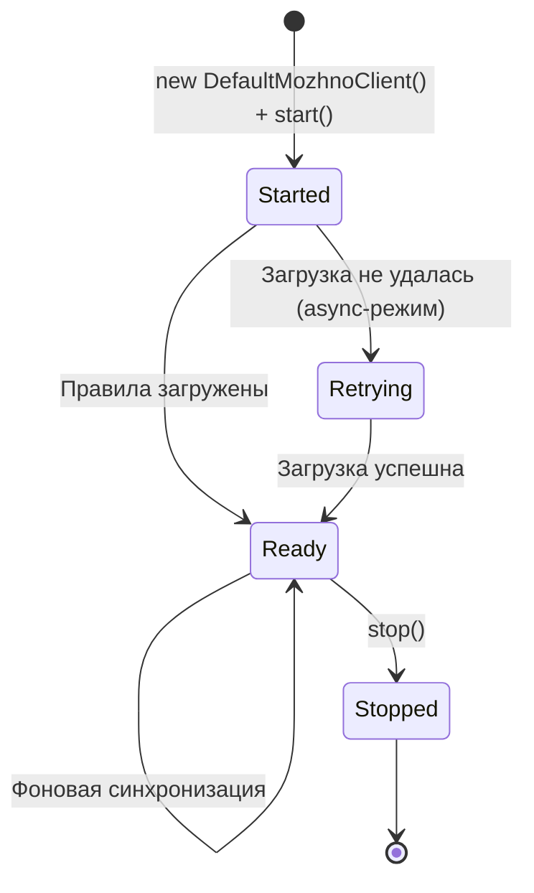

# Java SDK

Java SDK для **можно**<span class=brand-dot>.</span> — клиентская библиотека для JVM-приложений. Оценивает флаги локально, синхронно, и интегрируется со Spring Boot через авто-конфигурацию. Совместим с JDK 17+ (артефакт собирается под Java 17), работает в любых JVM-фреймворках.

## Установка

### Gradle (Kotlin DSL)

```kotlin
repositories {
    mavenCentral()
}

dependencies {
    implementation("dev.mozhno:mozhno-client-java:1.0.1")
}
```

### Gradle (Groovy DSL)

```groovy
repositories {
    mavenCentral()
}

dependencies {
    implementation 'dev.mozhno:mozhno-client-java:1.0.1'
}
```

> **Совет:** актуальную версию смотрите на [странице релизов](https://github.com/mozhno-dev/mozhno/releases).

### Системные требования

| Требование | Минимальная версия |
|------------|-------------------|
| JDK | 17+ |
| Совместимость | Любой JVM-фреймворк (Spring Boot, Quarkus, Micronaut, Vanilla Java) |

## Конфигурация

Конфигурация создаётся через билдер `MozhnoConfig.builder()`, затем на её основе создаётся клиент `DefaultMozhnoClient`. Создавайте один экземпляр клиента и переиспользуйте его во всём приложении:

```java
import dev.mozhno.sdk.MozhnoClient;
import dev.mozhno.sdk.MozhnoConfig;
import dev.mozhno.sdk.MozhnoContext;
import dev.mozhno.sdk.DefaultMozhnoClient;

MozhnoConfig config = MozhnoConfig.builder()
    .appName("my-app")
    .instanceId("instance-1")
    .mozhnoUrl("https://mozhno.example.com")
    .apiKey("<api-key>")
    .fetchTogglesInterval(15)
    .sendMetricsInterval(60)
    .environment("production")
    .build();

MozhnoClient client = new DefaultMozhnoClient(config);
client.start();
```

### Параметры билдера

| Метод | Тип | Обязательно | По умолчанию | Описание |
|-------|-----|-------------|-------------|----------|
| `appName(String)` | `String` | Да | — | Идентификатор приложения |
| `instanceId(String)` | `String` | Да | — | Уникальный идентификатор экземпляра |
| `mozhnoUrl(String)` | `String` | Да | — | Базовый URL сервера **можно**<span class=brand-dot>.</span> |
| `apiKey(String)` | `String` | Да | — | API-ключ окружения |
| `fetchTogglesInterval(int)` | `int` | Нет | `15` | Интервал опроса флагов (секунды) |
| `sendMetricsInterval(int)` | `int` | Нет | `60` | Интервал отправки метрик (секунды) |
| `environment(String)` | `String` | Нет | `null` | Имя окружения |
| `disableMetrics(boolean)` | `boolean` | Нет | `false` | Отключить отправку метрик |
| `synchronousFetchOnInitialisation(boolean)` | `boolean` | Нет | `false` | Блокировать на первичной загрузке правил |
| `contextProvider(MozhnoContextProvider)` | — | Нет | `null` | Кастомный провайдер контекста |
| `proxy(java.net.Proxy)` | `Proxy` | Нет | `null` | HTTP-прокси |

### Интеграция со Spring Boot

SDK предоставляет авто-конфигурацию `MozhnoAutoConfiguration`. Настройка через `application.yml`:

```yaml
mozhno:
  url: https://mozhno.example.com
  api-key: <api-key>
  app-name: my-app
  instance-id: ${random.uuid}
  environment: production
  fetch-toggles-interval: 15
  send-metrics-interval: 60
```

Клиент автоматически создаётся и доступен как Spring-бин:

```java
@Service
public class CheckoutService {

    private final MozhnoClient mozhnoClient;

    public CheckoutService(MozhnoClient mozhnoClient) {
        this.mozhnoClient = mozhnoClient;
    }

    public boolean isNewCheckoutEnabled(String userId) {
        MozhnoContext context = MozhnoContext.builder()
            .userId(userId)
            .addProperty("country", "RU")
            .build();
        return mozhnoClient.isEnabled("new-checkout", context);
    }
}
```

## API Reference

### MozhnoClient

Главная точка входа. Потокобезопасен, рассчитан на долгоживущий синглтон.

```java
public interface MozhnoClient {
    void start();
    void stop();
    boolean isEnabled(String flagKey);
    boolean isEnabled(String flagKey, boolean defaultReturn);
    boolean isEnabled(String flagKey, MozhnoContext context);
    boolean isEnabled(String flagKey, MozhnoContext context, boolean defaultReturn);
    void addEventListener(EventListener listener);
}
```

#### `isEnabled(...)`

Проверяет, включён ли флаг. Перегрузки без параметра `defaultReturn` работают **fail-closed** — возвращают `false`, если флаг не найден. Перегрузки с `defaultReturn` возвращают переданное значение по умолчанию.

```java
MozhnoContext context = MozhnoContext.builder()
    .userId("user-12345")
    .addProperty("country", "RU")
    .addProperty("plan", "enterprise")
    .build();

boolean enabled = client.isEnabled("new-checkout", context, false);

if (enabled) {
    renderNewCheckout();
} else {
    renderOldCheckout();
}
```

| Параметр | Тип | Описание |
|----------|-----|----------|
| `flagKey` | `String` | Ключ флага |
| `context` | `MozhnoContext` | Контекст оценки с атрибутами пользователя/запроса |
| `defaultReturn` | `boolean` | Значение, возвращаемое если флаг не найден (по умолчанию `false`) |

#### Жизненный цикл: `start()` / `stop()`

```java
client.start();   // запускает фоновый поллинг правил
client.stop();    // останавливает поллинг, сбрасывает метрики, завершает executor
```

## MozhnoContext

Объект контекста на основе билдера для передачи атрибутов в момент оценки.

```java
import dev.mozhno.sdk.MozhnoContext;

MozhnoContext context = MozhnoContext.builder()
    .userId("user-12345")
    .sessionId("session-abc")
    .appName("my-app")
    .environment("production")
    .addProperty("country", "RU")
    .addProperty("plan", "enterprise")
    .addProperty("appVersion", "2.4.1")
    .build();
```

Все значения атрибутов — строки. Для числовых сравнений задайте `contextType: number` в правилах таргетинга.

### Методы билдера контекста

| Метод | Описание |
|-------|----------|
| `userId(String)` | Идентификатор пользователя (используется для хеширования при процентном роллауте) |
| `sessionId(String)` | Идентификатор сессии (запасной ключ для хеширования) |
| `appName(String)` | Имя приложения |
| `environment(String)` | Имя окружения |
| `addProperty(String key, String value)` | Произвольный атрибут |

## Обработка ошибок

```java
MozhnoConfig config = MozhnoConfig.builder()
    .appName("checkout-service")
    .instanceId("prod-1")
    .mozhnoUrl("https://mozhno.example.com")
    .apiKey(System.getenv("MOZHNO_API_KEY"))
    .synchronousFetchOnInitialisation(true)
    .build();

MozhnoClient client = new DefaultMozhnoClient(config);
client.start();  // при synchronousFetchOnInitialisation(true) правила грузятся синхронно

MozhnoContext context = MozhnoContext.builder()
    .userId(userId)
    .build();

boolean enabled = client.isEnabled("new-checkout", context, false);
```

| Сценарий сбоя | Поведение |
|---------------|-----------|
| **Первичная загрузка не удалась** | Исключение при `synchronousFetchOnInitialisation(true)`. Иначе — фоновый ретрай. |
| **Флаг не найден** | Возвращается `defaultReturn` (по умолчанию `false`) |
| **Сетевая ошибка при поллинге** | Экспоненциальный backoff (1s → 2s → 4s). Circuit breaker после 5 ошибок подряд (пауза 60s). |

## Жизненный цикл соединения



## Паттерны использования

### Синглтон-клиент в Spring

```java
@Configuration
public class MozhnoClientConfig {

    @Bean(destroyMethod = "stop")
    public MozhnoClient mozhnoClient() {
        MozhnoConfig config = MozhnoConfig.builder()
            .appName("my-app")
            .instanceId(UUID.randomUUID().toString())
            .mozhnoUrl("https://mozhno.example.com")
            .apiKey(System.getenv("MOZHNO_API_KEY"))
            .build();
        return new DefaultMozhnoClient(config);
    }
}
```

Spring вызовет `stop()` при остановке контекста.

### Контекст на каждый запрос

```java
public boolean isFeatureEnabled(String featureKey, HttpServletRequest request) {
    MozhnoContext context = MozhnoContext.builder()
        .userId(request.getHeader("X-User-Id"))
        .addProperty("tenantId", request.getHeader("X-Tenant-Id"))
        .build();
    return client.isEnabled(featureKey, context, false);
}
```

## Производительность

| Сценарий | Типичная задержка |
|----------|-------------------|
| `isEnabled` (локальная оценка, одно правило) | < 0.1 мс |
| `isEnabled` (локальная оценка, 10 правил) | < 0.5 мс |
| Первичная загрузка (100 флагов, LAN) | ~50 мс |
| Фоновый поллинг (без изменений) | ~5 мс (ответ 304) |

SDK рассчитан на высокую нагрузку. Оценка флага не выделяет память после прогрева кеша. Потокобезопасность обеспечивается `ConcurrentHashMap`.

## Что дальше?

- [JavaScript / TypeScript SDK](/sdk/javascript) — установка и интеграция с React
- [Обзор SDK](/sdk/overview) — архитектура и общие концепции
- [Таргетинг](/guide/targeting) — настройка правил и сегментов
- [Быстрый старт](/guide/quick-start) — создание первого флага
