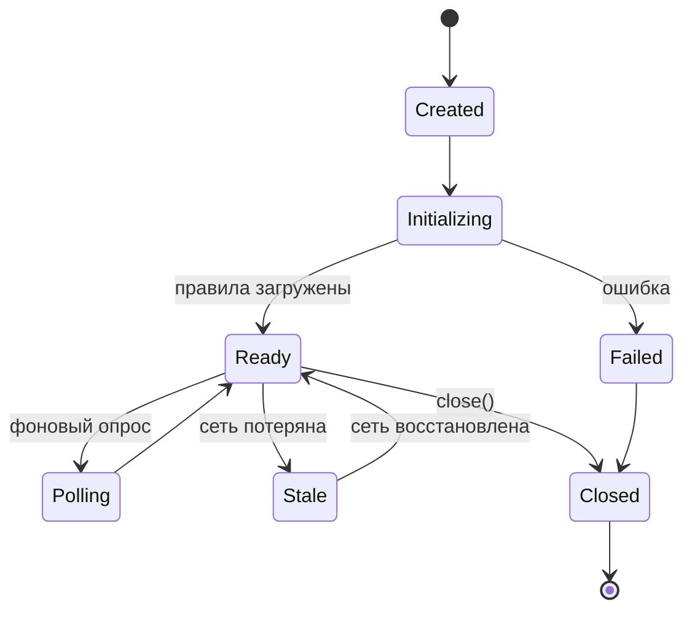

# JavaScript / TypeScript SDK

JavaScript/TypeScript SDK для **можно.** — клиентская библиотека для Node.js и браузерных приложений. Полная поддержка TypeScript, интеграция с React.

## Установка

```bash
npm install @mozhno/client-js
```

```bash
yarn add @mozhno/client-js
```

```bash
pnpm add @mozhno/client-js
```

| Пакет | Реестр | Размер |
|-------|--------|--------|
| `@mozhno/client-js` | npm | ~15 KB gzipped |

### Системные требования

| Среда | Минимальная версия |
|-------|-------------------|
| Node.js | 18+ |
| Браузеры | Последние 2 версии Chrome, Firefox, Safari, Edge |
| TypeScript | 5.0+ (опционально, типы включены в пакет) |

## Конфигурация

### Базовое создание клиента

```typescript
import { MozhnoClient } from '@mozhno/client-js';

const client = new MozhnoClient({
  url: 'http://localhost:8080',
  apiKey: '<api-key>',
  appName: 'my-app',
  refreshInterval: 15,
});
```

### Параметры конфигурации

| Параметр | Тип | Обязательно | По умолчанию | Описание |
|----------|-----|-------------|-------------|----------|
| `url` | `string` | Да | — | URL сервера **можно.** |
| `apiKey` | `string` | Да | — | API-ключ окружения |
| `appName` | `string` | Да | — | Имя вашего приложения |
| `refreshInterval` | `number` | Нет | `15` | Интервал поллинга (секунды) |
| `metricsInterval` | `number` | Нет | `60` | Интервал отправки метрик (секунды) |
| `environment` | `string` | Нет | `"default"` | Имя окружения |
| `disableMetrics` | `boolean` | Нет | `false` | Отключить метрики |

### Расширенная конфигурация

```typescript
const client = new MozhnoClient({
  url: process.env.MOZHNO_URL || 'http://localhost:8080',
  apiKey: process.env.MOZHNO_API_KEY!,
  refreshInterval: 60,        // на проде — реже
  connectTimeout: 3000,
  readTimeout: 8000,
  maxRetries: 5,
  autoInit: true,          // инициализация сразу в конструкторе
  logger: {
    debug: (msg) => { /* ... */ },
    info: (msg) => { /* ... */ },
    warn: (msg) => { /* ... */ },
    error: (msg) => { /* ... */ },
  },
});
```

### Паттерн Singleton

```typescript
// mozhno.ts
import { MozhnoClient } from '@mozhno/client-js';

let instance: MozhnoClient | null = null;

export async function getMozhnoClient(): Promise<MozhnoClient> {
  if (!instance) {
    instance = new MozhnoClient({
      url: process.env.MOZHNO_URL!,
      apiKey: process.env.MOZHNO_API_KEY!,
      autoInit: false,
    });
    await instance.initialize();
  }
  return instance;
}

export function getMozhnoClientSync(): MozhnoClient {
  if (!instance) {
    throw new Error('MozhnoClient not initialized. Call getMozhnoClient() first.');
  }
  return instance;
}
```

## API Reference

### isEnabled

Проверяет, включён ли булев флаг.

```typescript
isEnabled(flagKey: string, ctx: EvaluationContext): Promise<boolean>
```

```typescript
const enabled = await client.isEnabled('new-checkout', {
  userId: 'user-123',
  email: 'user@example.com',
});

if (enabled) {
  renderNewCheckout();
} else {
  renderOldCheckout();
}
```

### isEnabled (детальное)

Проверяет, включён ли флаг для переданного контекста.

```typescript
getValue(flagKey: string, ctx: EvaluationContext, defaultValue?: string): Promise<string>
```

```typescript
const variant = await client.getValue('checkout-design', {
  userId: 'user-123',
}, 'A');

switch (variant) {
  case 'A': renderClassic(); break;
  case 'B': renderModern(); break;
  case 'C': renderMinimal(); break;
}
```

### getAllFlags

Возвращает все флаги для заданного контекста.

```typescript
getAllFlags(ctx: EvaluationContext): Promise<Record<string, boolean>>
```

```typescript
const flags = await client.getAllFlags({ userId: 'user-123' });

// Деструктуризация
const { 'new-checkout': checkout, 'ai-search': aiSearch, 'dark-mode': darkMode } = flags;

// Логирование всех флагов при старте сессии
analytics.track('Flags Snapshot', {
  userId: 'user-123',
  flags,
});
```

### getEvaluation

Возвращает результат оценки с метаданными.

```typescript
getEvaluation(flagKey: string, ctx: EvaluationContext): Promise<FlagEvaluation>
```

```typescript
interface FlagEvaluation {
  enabled: boolean;
  value: string | null;
  matchedRule: string | null;
  reason: 'TARGETING_MATCH' | 'DEFAULT' | 'ERROR' | 'FLAG_NOT_FOUND' | 'DISABLED';
  flagKey: string;
  flagVersion: number;
}

const evaluation = await client.getEvaluation('new-feature', { userId: 'user-123' });
console.log('Результат:', evaluation.enabled);
console.log('Правило:', evaluation.matchedRule);
console.log('Причина:', evaluation.reason);
```

### close

Останавливает фоновый поллинг и освобождает ресурсы.

```typescript
close(): void
```

```typescript
process.on('SIGTERM', () => {
  client.close();
  process.exit(0);
});
```

## EvaluationContext

### Тип

```typescript
interface EvaluationContext {
  userId?: string;
  email?: string;
  country?: string;
  plan?: string;
  device?: string;
  appVersion?: string;
  tenantId?: string;
  [key: string]: string | number | boolean | undefined;
}
```

Контекст — это произвольный объект с парами `ключ: значение`. Допускаются типы: `string`, `number`, `boolean`, `undefined`.

### Примеры

```typescript
// Минимальный
const ctx = { userId: 'user-123' };

// Полный
const ctx = {
  userId: 'user-123',
  email: 'user@example.com',
  country: 'RU',
  plan: 'premium',
  device: 'ios',
  appVersion: '2.4.1',
  tenantId: 'tenant-42',
  loginCount: 42,
};

// Динамический
function buildContext(req: Request): EvaluationContext {
  return {
    userId: req.headers['x-user-id'] as string,
    country: req.headers['x-country'] as string,
    plan: req.headers['x-plan'] as string,
    device: req.headers['user-agent']?.includes('Mobile') ? 'mobile' : 'desktop',
  };
}
```

## React интеграция

### MozhnoProvider

```tsx
// providers/MozhnoProvider.tsx
import React, { createContext, useContext, useEffect, useState } from 'react';
import { MozhnoClient, EvaluationContext } from '@mozhno/client-js';

interface MozhnoContextValue {
  client: MozhnoClient | null;
  isEnabled: (flagKey: string, ctx?: EvaluationContext) => Promise<boolean>;
  getValue: (flagKey: string, ctx?: EvaluationContext, defaultValue?: string) => Promise<string>;
  loading: boolean;
  error: Error | null;
}

const MozhnoContext = createContext<MozhnoContextValue>({
  client: null,
  isEnabled: async () => false,
  getValue: async () => '',
  loading: true,
  error: null,
});

export function MozhnoProvider({
  children,
  config,
  defaultContext,
}: {
  children: React.ReactNode;
  config: { url: string; apiKey: string };
  defaultContext?: EvaluationContext;
}) {
  const [client, setClient] = useState<MozhnoClient | null>(null);
  const [loading, setLoading] = useState(true);
  const [error, setError] = useState<Error | null>(null);

  useEffect(() => {
    const c = new MozhnoClient({ ...config, autoInit: false });
    c.initialize()
      .then(() => {
        setClient(c);
        setLoading(false);
      })
      .catch((err) => {
        setError(err);
        setLoading(false);
      });

    return () => { c.close(); };
  }, [config.url, config.apiKey]);

  const isEnabled = async (flagKey: string, ctx?: EvaluationContext) => {
    if (!client) return false;
    return client.isEnabled(flagKey, { ...defaultContext, ...ctx });
  };

  const getValue = async (flagKey: string, ctx?: EvaluationContext, defaultValue?: string) => {
    if (!client) return defaultValue ?? '';
    return client.getValue(flagKey, { ...defaultContext, ...ctx }, defaultValue);
  };

  return (
    <MozhnoContext.Provider value={{ client, isEnabled, getValue, loading, error }}>
      {children}
    </MozhnoContext.Provider>
  );
}

export function useMozhno() {
  return useContext(MozhnoContext);
}
```

### Хук useFlag

```tsx
// hooks/useFlag.ts
import { useEffect, useState } from 'react';
import { useMozhno } from '../providers/MozhnoProvider';
import { EvaluationContext } from '@mozhno/client-js';

export function useFlag(flagKey: string, ctx?: EvaluationContext) {
  const { isEnabled, loading, error } = useMozhno();
  const [enabled, setEnabled] = useState(false);
  const [evaluating, setEvaluating] = useState(true);

  useEffect(() => {
    if (loading) return;
    setEvaluating(true);
    isEnabled(flagKey, ctx)
      .then(setEnabled)
      .finally(() => setEvaluating(false));
  }, [flagKey, loading]);

  return { enabled, loading: loading || evaluating, error };
}
```

### Хук useFlagValue

```tsx
// hooks/useFlagValue.ts
import { useEffect, useState } from 'react';
import { useMozhno } from '../providers/MozhnoProvider';
import { EvaluationContext } from '@mozhno/client-js';

export function useFlagValue(flagKey: string, ctx?: EvaluationContext, defaultValue?: string) {
  const { getValue, loading } = useMozhno();
  const [value, setValue] = useState(defaultValue ?? '');
  const [evaluating, setEvaluating] = useState(true);

  useEffect(() => {
    if (loading) return;
    setEvaluating(true);
    getValue(flagKey, ctx, defaultValue)
      .then(setValue)
      .finally(() => setEvaluating(false));
  }, [flagKey, loading]);

  return { value, loading: loading || evaluating };
}
```

### Использование в компонентах

```tsx
// App.tsx
import { MozhnoProvider } from './providers/MozhnoProvider';

export default function App() {
  const user = useUser();  // ваш хук получения пользователя

  return (
    <MozhnoProvider
      config={{
        url: import.meta.env.VITE_MOZHNO_URL,
        apiKey: import.meta.env.VITE_MOZHNO_API_KEY,
      }}
      defaultContext={{
        userId: user.id,
        email: user.email,
        country: user.country,
        plan: user.plan,
      }}
    >
      <CheckoutPage />
    </MozhnoProvider>
  );
}
```

```tsx
// CheckoutPage.tsx
import { useFlag, useFlagValue } from '../hooks';

function CheckoutPage() {
  const { enabled: newCheckout, loading } = useFlag('new-checkout');
  const { value: design } = useFlagValue('checkout-design', undefined, 'A');

  if (loading) return <Skeleton />;

  if (newCheckout) {
    return <NewCheckoutFlow />;
  }

  return <OldCheckoutFlow design={design} />;
}
```

## Асинхронные паттерны

### Promise-based API

Все методы SDK асинхронны. Оценка происходит локально и синхронно, но результат возвращается через Promise для консистентности API:

```typescript
// ❌ Неправильно — не ждём Promise
const enabled = client.isEnabled('flag', ctx);
if (enabled) { ... }  // enabled — это Promise<boolean>, всегда truthy!

// ✅ Правильно
const enabled = await client.isEnabled('flag', ctx);
if (enabled) { ... }
```

### Параллельные проверки

```typescript
const [checkout, aiSearch, darkMode] = await Promise.all([
  client.isEnabled('new-checkout', ctx),
  client.isEnabled('ai-search', ctx),
  client.isEnabled('dark-mode', ctx),
]);
```

### Пакетная проверка

```typescript
const flags = await client.getAllFlags(ctx);

if (flags['new-checkout']) {
  // ...
}
```

Метод `getAllFlags` эффективнее множественных вызовов `isEnabled`, так как оценивает все флаги за один проход.

## Обработка ошибок

```typescript
class MozhnoError extends Error {
  constructor(message: string, public readonly code: string) {
    super(message);
    this.name = 'MozhnoError';
  }
}
```

| Код ошибки | Когда |
|------------|-------|
| `INITIALIZATION_FAILED` | Сервер недоступен при старте |
| `NETWORK_ERROR` | Сетевая ошибка при обновлении |
| `INVALID_API_KEY` | API-ключ недействителен |
| `PARSE_ERROR` | Ошибка разбора ответа сервера |
| `TIMEOUT` | Таймаут запроса |

### Рекомендуемая обработка

```typescript
let enabled = false;
try {
  enabled = await client.isEnabled('critical-feature', ctx);
} catch (err) {
  if (err instanceof MozhnoError) {
    logger.error(`Mozhno SDK error [${err.code}]: ${err.message}`);
  } else {
    logger.error('Unexpected error evaluating flag', err);
  }
  enabled = false;  // безопасное значение по умолчанию
}
```

### Graceful Degradation

```typescript
class FeatureService {
  private client: MozhnoClient;
  private healthy = true;

  async isEnabled(flagKey: string, ctx: EvaluationContext): Promise<boolean> {
    if (!this.healthy) return false;
    try {
      return await this.client.isEnabled(flagKey, ctx);
    } catch {
      this.healthy = false;
      return false;  // деградация: все флаги выключены
    }
  }

  async getValue(flagKey: string, ctx: EvaluationContext, defaultValue: string): Promise<string> {
    if (!this.healthy) return defaultValue;
    try {
      return await this.client.getValue(flagKey, ctx, defaultValue);
    } catch {
      this.healthy = false;
      return defaultValue;
    }
  }
}
```

## Жизненный цикл



### Инициализация

```typescript
// Явная инициализация
const client = new MozhnoClient({ url, apiKey, autoInit: false });
await client.initialize();  // блокирующая загрузка правил

// Автоинициализация
const client = new MozhnoClient({ url, apiKey, autoInit: true });
// Конструктор запускает initialize() асинхронно
// Используйте client.waitForInit() для ожидания готовности
await client.waitForInit();
```

### Завершение

```typescript
// Node.js
process.on('SIGTERM', () => {
  client.close();
  process.exit(0);
});

process.on('SIGINT', () => {
  client.close();
  process.exit(0);
});
```

```typescript
// Браузер
window.addEventListener('beforeunload', () => {
  client.close();
});
```

## Полный пример: Express.js Middleware

```typescript
// middleware/mozhno.ts
import { Request, Response, NextFunction } from 'express';
import { MozhnoClient, EvaluationContext } from '@mozhno/client-js';

const mozhno = new MozhnoClient({
  url: process.env.MOZHNO_URL!,
  apiKey: process.env.MOZHNO_API_KEY!,
  autoInit: true,
});

declare global {
  namespace Express {
    interface Request {
      mozhno: {
        isEnabled: (flagKey: string, ctx?: EvaluationContext) => Promise<boolean>;
        getValue: (flagKey: string, ctx?: EvaluationContext, defaultValue?: string) => Promise<string>;
        ctx: EvaluationContext;
      };
    }
  }
}

export function mozhnoMiddleware(req: Request, res: Response, next: NextFunction) {
  const ctx: EvaluationContext = {
    userId: req.headers['x-user-id'] as string,
    email: req.headers['x-user-email'] as string,
    country: (req.headers['x-country'] as string) || 'RU',
    plan: req.headers['x-plan'] as string,
    device: req.headers['user-agent']?.includes('Mobile') ? 'mobile' : 'desktop',
  };

  req.mozhno = {
    isEnabled: (flagKey: string, overrideCtx?: EvaluationContext) =>
      mozhno.isEnabled(flagKey, { ...ctx, ...overrideCtx }),
    getValue: (flagKey: string, overrideCtx?: EvaluationContext, defaultValue?: string) =>
      mozhno.getValue(flagKey, { ...ctx, ...overrideCtx }, defaultValue),
    ctx,
  };

  next();
}

// Использование
app.use(mozhnoMiddleware);

app.get('/api/checkout', async (req, res) => {
  if (await req.mozhno.isEnabled('new-checkout')) {
    return res.json({ flow: 'new' });
  }
  return res.json({ flow: 'old' });
});
```

## Server-Side Rendering (Next.js)

```typescript
// lib/mozhno.ts
import { MozhnoClient, EvaluationContext } from '@mozhno/client-js';

let client: MozhnoClient;

export function getMozhnoClient(): MozhnoClient {
  if (!client) {
    client = new MozhnoClient({
      url: process.env.MOZHNO_URL!,
      apiKey: process.env.MOZHNO_API_KEY!,
      autoInit: true,
    });
  }
  return client;
}

// app/page.tsx (App Router)
import { getMozhnoClient } from '@/lib/mozhno';

export default async function HomePage() {
  const mozhno = getMozhnoClient();
  await mozhno.waitForInit();

  const showNewHero = await mozhno.isEnabled('new-hero', {
    userId: 'anonymous',
    country: 'RU',
  });

  return (
    <main>
      {showNewHero ? <NewHero /> : <OldHero />}
    </main>
  );
}
```

> **Предупреждение:** В Next.js App Router используйте React Cache или глобальный singleton, чтобы избежать создания нового клиента на каждый запрос. Клиент должен быть долгоживущим.

## Что дальше?

- [Java SDK](/sdk/java) — установка и API для Java
- [Обзор SDK](/sdk/overview) — архитектура и общие концепции
- [Таргетинг](/guide/targeting) — настройка правил и сегментов
- [Быстрый старт](/guide/quick-start) — создание первого флага
