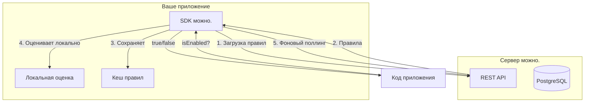
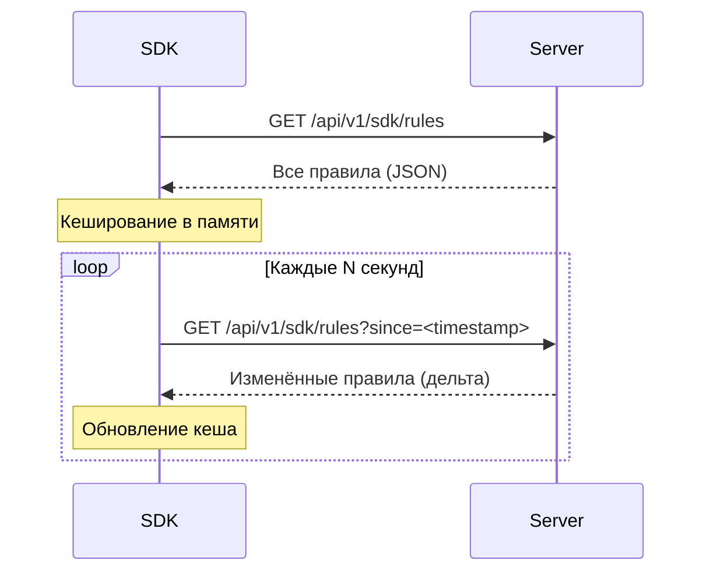
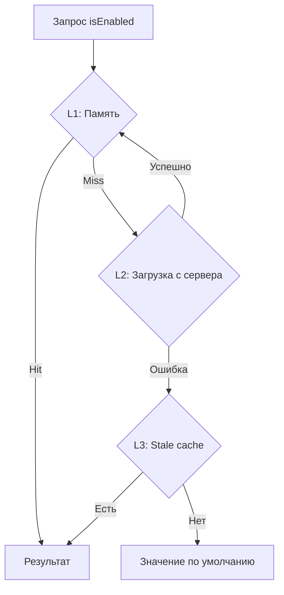
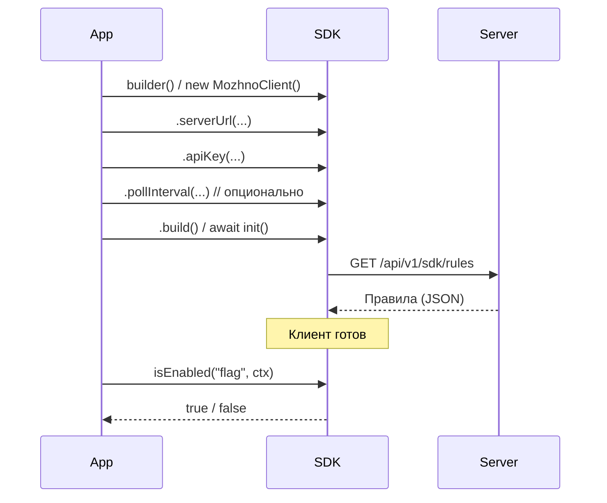
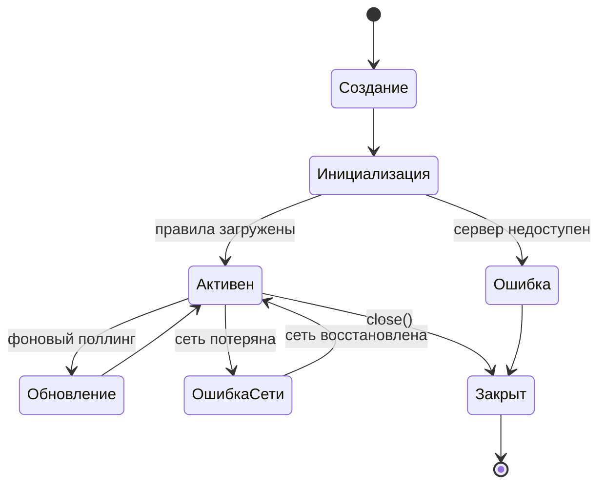

# Обзор SDK

SDK **можно.** — это клиентские библиотеки, которые загружают правила с сервера и **локально** оценивают фиче-флаги в вашем приложении.

## Архитектура



### Принцип локальной оценки

В отличие от централизованных систем, где приложение на каждый чих ходит к серверу, SDK **можно.** работает так:

1. **Старт:** SDK загружает все правила флагов с сервера **один раз**.
2. **Кеширование:** Правила сохраняются в памяти.
3. **Локальная оценка:** Каждый вызов `isEnabled()` / `getValue()` оценивается **локально** — без задержки сети.
4. **Фоновое обновление:** SDK периодически опрашивает сервер на предмет изменений и обновляет кеш.

Преимущества локальной оценки:

| Преимущество | Описание |
|--------------|----------|
| **Нулевая задержка** | Оценка флага: доли микросекунды |
| **Нет single point of failure** | Если сервер недоступен, SDK продолжает работать с закешированными правилами |
| **Масштабируемость** | Сервер не нагружается запросами оценки флагов |
| **Offline-режим** | Приложение работает даже без связи с сервером |

## Синхронизация правил: Polling vs Streaming

**можно.** SDK использует механизм **Polling** (периодический опрос) для обновления правил.



### Polling (текущая реализация)

| Параметр | Значение по умолчанию | Описание |
|----------|----------------------|----------|
| Интервал опроса | 30 секунд | Как часто SDK проверяет обновления |
| Начальная загрузка | При создании клиента | Полная загрузка всех правил |
| Дельта-обновления | Через `?since=<timestamp>` | Передаются только изменённые правила |
| Retry при ошибке | Экспоненциальный backoff | 1с → 2с → 4с → 8с → максимум 60с |

### Streaming (в Roadmap)

В будущих версиях SDK будет поддерживать Server-Sent Events (SSE) или WebSocket для мгновенной доставки изменений:

```
GET /api/v1/sdk/rules/stream
Content-Type: text/event-stream

event: flag-updated
data: {"key": "new-checkout", "version": 42, ...}

event: flag-deleted
data: {"key": "old-feature"}
```

## Стратегия кеширования

### Уровни кеша



### Поведение кеша

| Сценарий | Поведение |
|----------|-----------|
| **Нормальная работа** | Правила в памяти, оценка мгновенная |
| **Обновление правил** | Фоновый поток обновляет кеш, атомарная замена |
| **Сервер недоступен** | Используется последний успешный кеш |
| **Холодный старт без сервера** | Ошибка инициализации, значения по умолчанию |
| **Сервер вернулся** | Следующий цикл поллинга восстанавливает связь |

### Инвалидация кеша

Кеш инвалидируется атомарно — полная замена набора правил:

```
Версия правил: 1 (начальная загрузка)
Версия правил: 2 (флаг new-feature изменён)
Версия правил: 3 (флаг old-feature удалён)
```

SDK всегда работает с одной целостной версией правил. Это гарантирует консистентность: оценка флага всегда использует правила из одного снапшота.

## Общая поверхность API SDK

Все SDK реализуют единый контракт:

```java
// Java
public interface MozhnoClient {
    boolean isFlagEnabled(String flagKey, EvaluationContext ctx);
    String getFlagValue(String flagKey, EvaluationContext ctx, String defaultValue);
    Map<String, Boolean> getFlags(EvaluationContext ctx);
    FlagEvaluation getFlagEvaluation(String flagKey, EvaluationContext ctx);
    void close();
}
```

```typescript
// TypeScript
interface MozhnoClient {
  isEnabled(flagKey: string, ctx: EvaluationContext): Promise<boolean>;
  getValue(flagKey: string, ctx: EvaluationContext, defaultValue?: string): Promise<string>;
  getAllFlags(ctx: EvaluationContext): Promise<Record<string, boolean>>;
  getEvaluation(flagKey: string, ctx: EvaluationContext): Promise<FlagEvaluation>;
  close(): void;
}
```

### Основные методы

| Метод | Назначение | Возвращает |
|-------|------------|------------|
| `isFlagEnabled` / `isEnabled` | Проверить, включён ли булев флаг | `boolean` |
| `getFlagValue` / `getValue` | Получить значение мультивариативного флага | `String` / `string` |
| `getFlags` / `getAllFlags` | Получить все флаги для переданного контекста | `Map<String, Boolean>` / `Record<string, boolean>` |
| `getFlagEvaluation` / `getEvaluation` | Получить результат с метаданными (какое правило сработало) | `FlagEvaluation` |

### Контекст оценки

Контекст — это map атрибутов, описывающих текущий запрос или пользователя:

```java
var ctx = new EvaluationContext()
    .set("userId", "user-123")
    .set("email", "user@example.com")
    .set("country", "RU")
    .set("plan", "premium")
    .withHashProperty("userId");  // для детерминированного роллаута
```

```typescript
const ctx: EvaluationContext = {
  userId: 'user-123',
  email: 'user@example.com',
  country: 'RU',
  plan: 'premium',
};
```

### Результат оценки с метаданными

```java
FlagEvaluation eval = client.getFlagEvaluation("new-feature", ctx);

eval.isEnabled();         // true / false
eval.getValue();          // для multi-variate: "A", "B", "C"
eval.getMatchedRule();    // какое правило сработало (или null)
eval.getReason();         // причина: TARGETING_MATCH, DEFAULT, ERROR
eval.getFlagKey();        // ключ флага
eval.getFlagVersion();    // версия правил
```

## Инициализация клиента

Общий паттерн инициализации для всех SDK:



### Общие параметры конфигурации

| Параметр | Тип | Обязательно | По умолчанию | Описание |
|----------|-----|-------------|-------------|----------|
| `serverUrl` | `string` | Да | — | URL сервера **можно.** |
| `apiKey` | `string` | Да | — | API-ключ окружения |
| `pollInterval` | `int` | Нет | `30` | Интервал опроса в секундах |
| `connectTimeout` | `int` | Нет | `5000` | Таймаут соединения в мс |
| `readTimeout` | `int` | Нет | `10000` | Таймаут чтения в мс |
| `maxRetries` | `int` | Нет | `3` | Максимальное количество повторных попыток |

## Обработка ошибок

### Уровни деградации

| Ситуация | Поведение | Пример |
|----------|-----------|--------|
| **Сервер недоступен при старте** | Клиент не инициализируется, выбрасывается исключение | `MozhnoClientException` |
| **Сервер недоступен в работе** | Используется закешированное состояние | Лог WARN, работа продолжается |
| **Флаг не найден** | Возвращается значение по умолчанию (`false` / `defaultValue`) | Лог DEBUG |
| **Ошибка в правилах** | Флаг возвращает значение по умолчанию | Лог ERROR с деталями |
| **Контекст null** | `NullPointerException` / `TypeError` | Быстрое падение, не silently ignore |
| **Сеть недоступна** | Закешированные правила, фоновые ретраи | Лог WARN |

### Рекомендации по обработке

```java
try {
    boolean enabled = client.isFlagEnabled("new-feature", ctx);
    // используем результат
} catch (MozhnoClientException e) {
    // Критическая ошибка: клиент не инициализирован
    log.error("Mozhno SDK unavailable, using safe defaults", e);
    boolean enabled = false;  // безопасное значение по умолчанию
}
```

> **Совет:** Всегда задавайте осмысленное значение по умолчанию. Для новых фич — `false`. Для kill switch — `true` (чтобы при недоступности SDK фича продолжала работать).

## Жизненный цикл подключения



### Завершение работы

Всегда вызывайте `close()` / `shutdown()` при остановке приложения:

```java
// Java — через try-with-resources
try (var client = MozhnoClient.builder().serverUrl(...).apiKey(...).build()) {
    // работа с клиентом
}  // автоматический close()
```

```typescript
// TypeScript
process.on('SIGTERM', () => {
  client.close();
  process.exit(0);
});
```

Это останавливает фоновые потоки поллинга и освобождает ресурсы.

## Поддерживаемые SDK

| Язык | Пакет | Статус | Документация |
|------|-------|--------|-------------|
| **Java** | `com.mozhno:client-java` | Стабильный | [Java SDK](/sdk/java) |
| **JavaScript / TypeScript** | `@mozhno/client-js` | Стабильный | [JS SDK](/sdk/javascript) |
| **Python** | `mozhno-client` | В разработке | — |
| **Go** | `github.com/mozhno/client-go` | В разработке | — |
| **.NET** | `Mozhno.Client` | В разработке | — |

## Что дальше?

- [Java SDK](/sdk/java) — установка, конфигурация и API для Java
- [JavaScript / TypeScript SDK](/sdk/javascript) — установка и интеграция с React
- [Быстрый старт](/guide/quick-start) — создание первого флага
- [REST API](/api/rest) — прямое взаимодействие с API сервера
