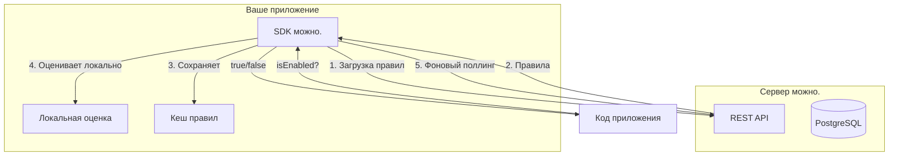
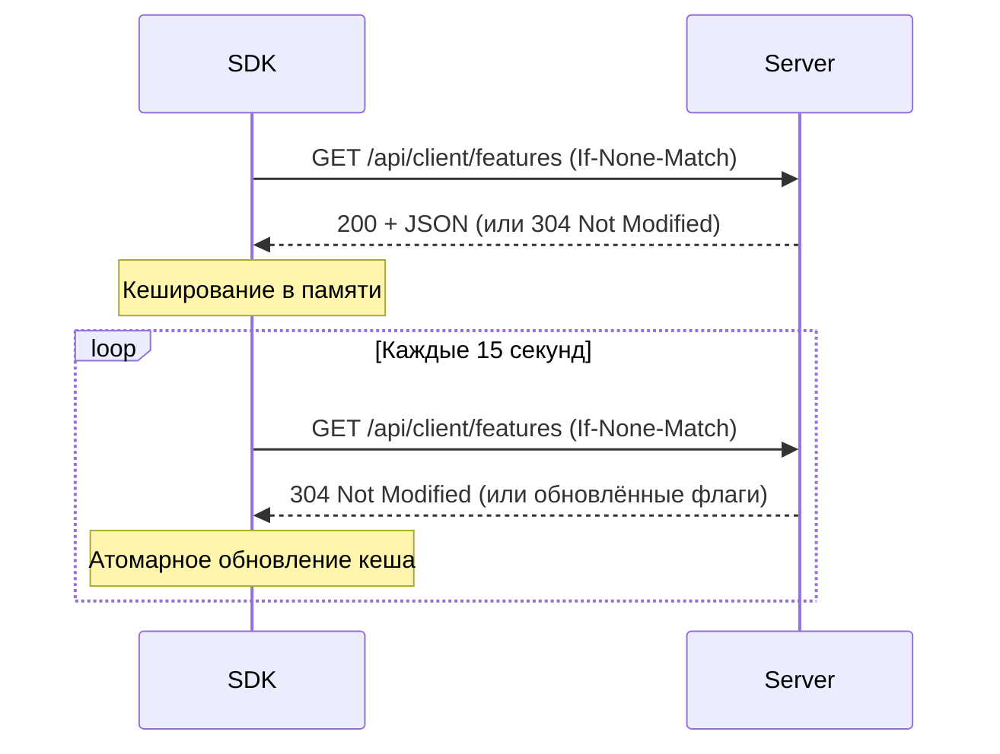

# Обзор SDK

SDK **можно.** — это клиентские библиотеки, которые загружают правила с сервера и **локально** оценивают фиче-флаги в вашем приложении.

## Архитектура



### Принцип локальной оценки

1. **Старт:** SDK загружает все правила флагов с сервера **один раз**.
2. **Кеширование:** Правила сохраняются в памяти.
3. **Локальная оценка:** Каждый вызов `isEnabled()` оценивается **локально** — без задержки сети.
4. **Фоновое обновление:** SDK периодически опрашивает сервер (по умолчанию каждые 15 секунд) и обновляет кеш. Используется `ETag` / `If-None-Match` для эффективных дельта-обновлений.

| Преимущество | Описание |
|--------------|----------|
| **Нулевая задержка** | Оценка флага: доли микросекунды |
| **Нет single point of failure** | Если сервер недоступен, SDK продолжает работать с закешированными правилами |
| **Масштабируемость** | Сервер не нагружается запросами оценки флагов |

## Логика оценки

SDK оценивает флаг в следующем порядке:

1. **Флаг выключен?** → `false`
2. **Нет стратегии/activation?** → `true`
3. **Ограничения (constraints):** все правила должны совпасть с контекстом (И)
4. **Сегменты:** хотя бы один сегмент должен совпасть (ИЛИ)
5. **Если есть и то, и другое:** достаточно совпадения одного (ИЛИ)
6. **Процентный роллаут:** MurmurHash3 от `flagKey + (userId || sessionId)`, сравнение с процентом
7. **Ничего не совпало** → `false`

### Поддерживаемые операторы

| Оператор | Описание |
|----------|----------|
| `in` | Значение входит в список |
| `not_in` | Значение не входит в список |
| `eq` | Равенство (числовое для `contextType: number`) |
| `ne` | Неравенство |
| `gt` | Больше |
| `gte` | Больше или равно |
| `lt` | Меньше |
| `lte` | Меньше или равно |
| `contains` | Подстрока |

### Типы контекста

| Тип | Поведение |
|-----|-----------|
| `string` (по умолчанию) | Строковое сравнение |
| `number` | Числовое сравнение |
| `time` | Сравнение ISO8601 дат |
| `semver` | Семантическое версионирование |

## Синхронизация правил

SDK использует механизм **Polling** (периодический опрос). Интервал по умолчанию — **15 секунд**.



| Параметр | Значение по умолчанию | Описание |
|----------|----------------------|----------|
| Интервал опроса | 15 секунд | `refreshInterval` (JS) / `fetchTogglesInterval` (Java) |
| Retry при ошибке | Экспоненциальный backoff | 1с → 2с → 4с |
| Circuit breaker (Java) | 5 ошибок → 60с пауза | Защита от перегрузки сервера |

## Инициализация клиента

### Java SDK

```java
MozhnoClient client = MozhnoConfig.builder()
    .appName("my-app")
    .instanceId("instance-1")
    .mozhnoUrl("http://localhost:8080")
    .apiKey("<api-key>")
    .fetchTogglesInterval(15)
    .sendMetricsInterval(60)
    .environment("production")
    .build();

client.start();
boolean enabled = client.isEnabled("new-checkout", context);
```

### JavaScript / TypeScript SDK

```typescript
import { MozhnoClient } from '@mozhno/client-js';

const client = new MozhnoClient({
  url: 'http://localhost:8080',
  apiKey: '<api-key>',
  appName: 'my-app',
  refreshInterval: 15,
  metricsInterval: 60,
  environment: 'production',
});

await client.start();
const enabled = client.isEnabled('new-checkout', { userId: 'user-123' });
```

### Общие параметры конфигурации

| Параметр | JS ключ | Java ключ | По умолчанию | Описание |
|----------|---------|-----------|-------------|----------|
| URL сервера | `url` | `mozhnoUrl` | **Обязательно** | Базовый URL сервера |
| API-ключ | `apiKey` | `apiKey` | **Обязательно** | API-ключ окружения |
| Имя приложения | `appName` | `appName` | **Обязательно** | Идентификатор приложения |
| ID экземпляра | `instanceId` | `instanceId` | **Обязательно** (Java) | Уникальный ID инстанса |
| Интервал опроса (с) | `refreshInterval` | `fetchTogglesInterval` | `15` | Частота поллинга |
| Интервал метрик (с) | `metricsInterval` | `sendMetricsInterval` | `60` | Частота отправки метрик |
| Окружение | `environment` | `environment` | `"default"` | Имя окружения |
| Отключить метрики | `disableMetrics` | `disableMetrics` | `false` | Отключение метрик |

## Контекст оценки

Контекст — это map атрибутов, описывающих текущий запрос или пользователя:

```java
MozhnoContext context = MozhnoContext.builder()
    .userId("user-123")
    .sessionId("session-abc")
    .addProperty("country", "RU")
    .addProperty("plan", "premium")
    .build();
```

```typescript
const context = {
  userId: 'user-123',
  sessionId: 'session-abc',
  country: 'RU',
  plan: 'premium',
};
```

## Обработка ошибок

| Ситуация | Поведение |
|----------|-----------|
| **Сервер недоступен при старте** | Клиент выбрасывает исключение / отклоняет Promise |
| **Сервер недоступен в работе** | Используется закешированное состояние |
| **Флаг не найден** | Возвращается `false` |
| **Атрибут отсутствует в контексте** | Правило с этим атрибутом возвращает `false` |
| **Сеть недоступна** | Закешированные правила, фоновые ретраи |

## Поддерживаемые SDK

| Язык | Пакет | Документация |
|------|-------|-------------|
| **Java** | `dev.mozhno:mozhno-client-java` (Gradle) | [Java SDK](/sdk/java) |
| **JavaScript / TypeScript** | `@mozhno/client-js` (npm) | [JS SDK](/sdk/javascript) |

## Что дальше?

- [Java SDK](/sdk/java) — установка, конфигурация и API для Java
- [JavaScript / TypeScript SDK](/sdk/javascript) — установка и интеграция с React
- [Быстрый старт](/guide/quick-start) — создание первого флага
- [REST API](/api/rest) — прямое взаимодействие с API сервера
