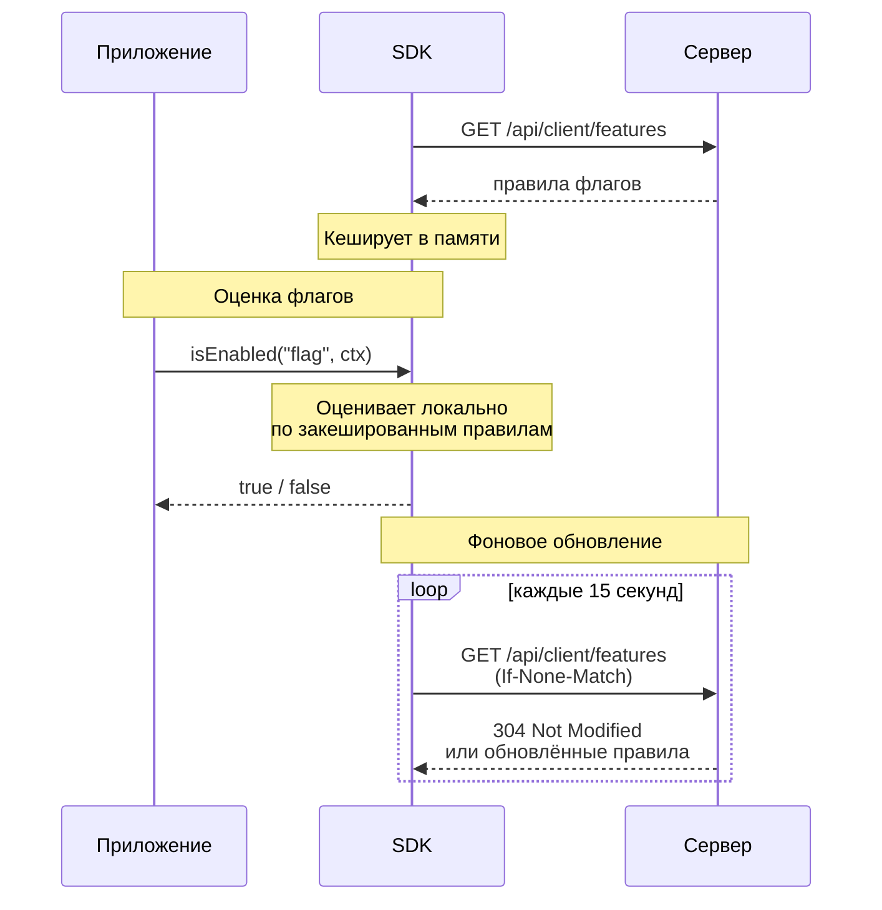
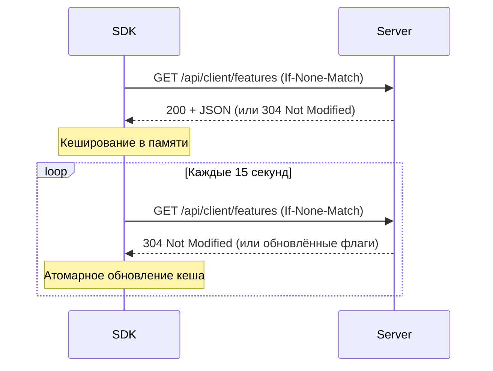

# Обзор SDK

SDK **можно**<span class=brand-dot>.</span> — это клиентские библиотеки, которые загружают правила с сервера и **локально** оценивают фиче-флаги в вашем приложении.

## Архитектура



### Принцип локальной оценки

1. **Старт:** SDK загружает все правила флагов с сервера **один раз**.
2. **Кеширование:** Правила сохраняются в памяти.
3. **Локальная оценка:** Каждый вызов `isEnabled()` оценивается **локально** — без задержки сети.
4. **Фоновое обновление:** SDK периодически опрашивает сервер (по умолчанию каждые 15 секунд) и обновляет кеш. Используется `ETag` / `If-None-Match` для эффективных дельта-обновлений.

| Преимущество | Описание |
|--------------|----------|
| **Нулевая задержка** | Оценка флага: доли микросекунды |
| **Нет single point of failure** | Если сервер недоступен, SDK продолжает работать с закешированными правилами |
| **Масштабируемость** | Сервер не нагружается запросами оценки флагов |

## Логика оценки

Порядок оценки флага — [Таргетинг](/guide/targeting#как-работает-таргетинг). Операторы и типы контекста — [Контексты](/concepts/contexts#типы-контекста-и-операторы).

## Синхронизация правил

SDK использует механизм **Polling** (периодический опрос). Интервал по умолчанию — **15 секунд**.



| Параметр | Значение по умолчанию | Описание |
|----------|----------------------|----------|
| Интервал опроса | 15 секунд | `refreshInterval` (JS) / `fetchTogglesInterval` (Java) |
| Retry при ошибке | Экспоненциальный backoff | 1с → 2с → 4с |
| Circuit breaker (Java) | 5 ошибок → 60с пауза | Защита от перегрузки сервера |

## Контекст оценки

Контекст — это map атрибутов, описывающих текущий запрос или пользователя:

```java
MozhnoContext context = MozhnoContext.builder()
    .userId("user-123")
    .sessionId("session-abc")
    .addProperty("country", "RU")
    .addProperty("plan", "premium")
    .build();
```

```typescript
const context = {
  userId: 'user-123',
  sessionId: 'session-abc',
  country: 'RU',
  plan: 'premium',
};
```

## Обработка ошибок и отказоустойчивость

### Правила поведения

| Ситуация | Поведение |
|----------|-----------|
| **Сервер недоступен при старте** | SDK запускается и продолжает попытки подключения в фоне. Вызовы `isEnabled()` возвращают `false` до первой успешной загрузки правил |
| **Сервер стал недоступен в работе** | SDK продолжает работать с закешированными правилами. Фоновые попытки переподключения |
| **Флаг не найден** | Возвращается `false` (fail-closed) |
| **Атрибут отсутствует в контексте** | Правило с этим атрибутом возвращает `false` |
| **Кеш пуст** | Возвращается `false` |

### Задержка обновлений

Изменения флага в веб-панели доходят до SDK за время **polling-интервала** (по умолчанию 15 секунд).

## Что дальше?

- [Java SDK](/sdk/java) — установка, конфигурация и API для Java
- [JavaScript / TypeScript SDK](/sdk/javascript) — установка и интеграция с React
- [Быстрый старт](/intro/quick-start) — создание первого флага
- [REST API](/api/rest) — прямое взаимодействие с API сервера
