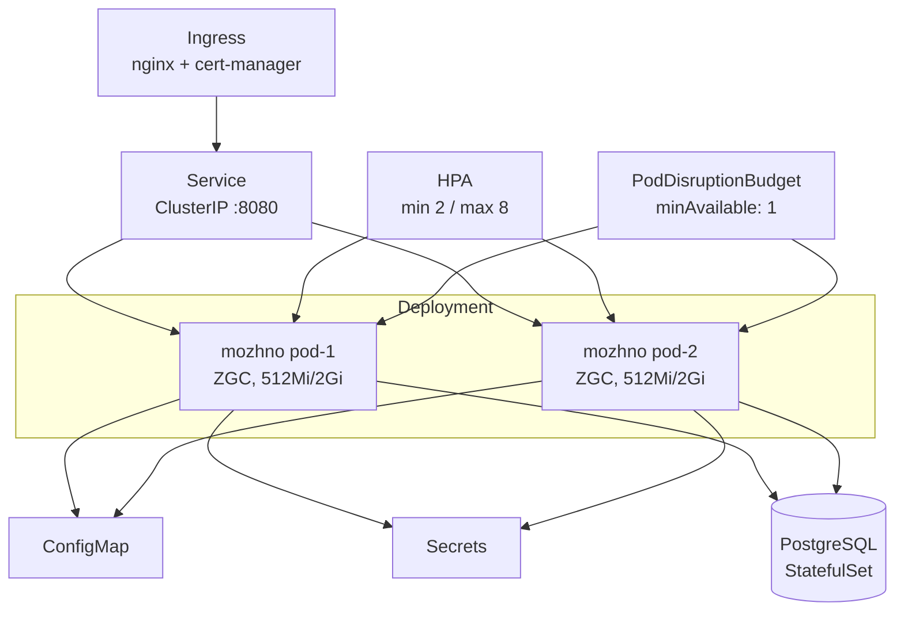

# Kubernetes-деплой

Развёртывание **можно.** в кластере Kubernetes: Deployment, Service, HPA, PDB, пробы и управление секретами.

## Обзор манифестов

Все манифесты расположены в директории `k8s/` репозитория:

```
k8s/
├── deployment.yaml
├── service.yaml
├── hpa.yaml
├── pdb.yaml
├── configmap.yaml
└── secrets.yaml
```

Применение:

```bash
kubectl apply -f k8s/
```

## Deployment

```yaml
apiVersion: apps/v1
kind: Deployment
metadata:
  name: mozhno
  labels:
    app: mozhno
spec:
  replicas: 2
  strategy:
    type: RollingUpdate
    rollingUpdate:
      maxUnavailable: 0
      maxSurge: 1
  selector:
    matchLabels:
      app: mozhno
  template:
    metadata:
      labels:
        app: mozhno
    spec:
      serviceAccountName: mozhno
      securityContext:
        runAsNonRoot: true
        runAsUser: 1000
        fsGroup: 1000
        readOnlyRootFilesystem: true
      containers:
        - name: mozhno
          image: ghcr.io/edgar-dev20/mozhno:latest
          imagePullPolicy: IfNotPresent
          ports:
            - containerPort: 8080
              protocol: TCP
          envFrom:
            - configMapRef:
                name: mozhno-config
            - secretRef:
                name: mozhno-secrets
          env:
            - name: JAVA_OPTS
              value: >
                -XX:+UseZGC
                -XX:MaxRAMPercentage=75
                -XX:+ZGenerational
                -XX:ConcGCThreads=4
                -Djava.security.egd=file:/dev/./urandom
          resources:
            requests:
              memory: '512Mi'
              cpu: '250m'
            limits:
              memory: '2Gi'
              cpu: '2000m'
          readinessProbe:
            httpGet:
              path: /actuator/health
              port: 8080
            initialDelaySeconds: 20
            periodSeconds: 5
            failureThreshold: 3
          livenessProbe:
            httpGet:
              path: /actuator/health
              port: 8080
            initialDelaySeconds: 60
            periodSeconds: 15
            failureThreshold: 3
          startupProbe:
            httpGet:
              path: /actuator/health
              port: 8080
            initialDelaySeconds: 10
            periodSeconds: 5
            failureThreshold: 30
```

### Параметры развёртывания

| Параметр | Значение | Обоснование |
|----------|----------|-------------|
| `replicas` | 2 | Минимальная избыточность для высокой доступности |
| `maxUnavailable` | 0 | Ни один под не выключается во время обновления (zero-downtime) |
| `maxSurge` | 1 | Допускается один дополнительный под при rolling update |
| `memory requests` | 512Mi | Минимальный запас памяти для JVM и кешей |
| `memory limits` | 2Gi | Верхняя граница с учётом MaxRAMPercentage=75 (~1.5G для heap) |
| `cpu requests` | 250m | Гарантированная доля CPU для отзывчивости |
| `cpu limits` | 2000m | Потолок CPU для пиковых нагрузок |
| `runAsNonRoot` | true | Запуск от непривилегированного пользователя |
| `runAsUser` | 1000 | UID пользователя `mozhno` внутри контейнера |
| `readOnlyRootFilesystem` | true | Защита от записи в корневую ФС |

### Стратегия обновления

RollingUpdate с `maxUnavailable: 0` гарантирует, что в любой момент времени доступен хотя бы один под. Новый под (`maxSurge: 1`) запускается и проходит readiness-пробу до того, как старый будет остановлен. Это обеспечивает zero-downtime деплой.

### JVM и ZGC

```bash
-XX:+UseZGC              # Z Garbage Collector — сверхнизкие паузы (< 1 мс)
-XX:MaxRAMPercentage=75  # JVM не превышает 75% от лимита памяти контейнера
-XX:+ZGenerational       # Поколенческий режим ZGC (JDK 25+)
-XX:ConcGCThreads=4      # Фиксированное число потоков GC
```

При лимите в 2Gi JVM выделит не более 1.5 GiB под heap. Оставшаяся память — для Metaspace, JIT-компилятора, стека потоков и нативных библиотек.

## Пробы (Probes)

### startupProbe

```yaml
startupProbe:
  httpGet:
    path: /actuator/health
    port: 8080
  initialDelaySeconds: 10
  periodSeconds: 5
  failureThreshold: 30    # до 150 секунд на первый запуск
```

Защищает медленно стартующие поды от убийства liveness-пробой. Даёт приложению до 150 секунд (10 + 5 × 30) на запуск, включая применение Flyway-миграций и прогрев пула соединений.

### readinessProbe

```yaml
readinessProbe:
  httpGet:
    path: /actuator/health
    port: 8080
  initialDelaySeconds: 20
  periodSeconds: 5
  failureThreshold: 3
```

Определяет, готов ли под принимать трафик. При провале трёх проверок под исключается из Service — новые запросы к нему не направляются. Восстанавливается автоматически при возвращении `UP`.

### livenessProbe

```yaml
livenessProbe:
  httpGet:
    path: /actuator/health
    port: 8080
  initialDelaySeconds: 60
  periodSeconds: 15
  failureThreshold: 3
```

Обнаруживает зависшие или deadlocked поды. При трёх последовательных провалах (45 секунд) kubelet перезапускает контейнер.

## Horizontal Pod Autoscaler (HPA)

```yaml
apiVersion: autoscaling/v2
kind: HorizontalPodAutoscaler
metadata:
  name: mozhno-hpa
spec:
  scaleTargetRef:
    apiVersion: apps/v1
    kind: Deployment
    name: mozhno
  minReplicas: 2
  maxReplicas: 8
  metrics:
    - type: Resource
      resource:
        name: cpu
        target:
          type: Utilization
          averageUtilization: 70
    - type: Resource
      resource:
        name: memory
        target:
          type: Utilization
          averageUtilization: 80
  behavior:
    scaleDown:
      stabilizationWindowSeconds: 300
      policies:
        - type: Percent
          value: 50
          periodSeconds: 60
    scaleUp:
      stabilizationWindowSeconds: 60
      policies:
        - type: Percent
          value: 100
          periodSeconds: 30
```

### Параметры масштабирования

| Параметр | Значение | Обоснование |
|----------|----------|-------------|
| `minReplicas` | 2 | Минимальная избыточность |
| `maxReplicas` | 8 | Ограничение расхода ресурсов кластера |
| CPU target | 70% | Упреждающее масштабирование до насыщения CPU |
| Memory target | 80% | Защита от OOMKill до срабатывания лимитов |
| `scaleDown.stabilizationWindowSeconds` | 300 | 5 минут ожидания перед уменьшением (избегание flapping) |
| `scaleDown.policies` | 50%/мин | Не более 50% подов в минуту при уменьшении |
| `scaleUp.policies` | 100%/30с | Быстрая реакция на рост нагрузки |

## Pod Disruption Budget (PDB)

```yaml
apiVersion: policy/v1
kind: PodDisruptionBudget
metadata:
  name: mozhno-pdb
spec:
  minAvailable: 1
  selector:
    matchLabels:
      app: mozhno
```

Гарантирует, что минимум 1 под всегда доступен при добровольных нарушениях (drain ноды, обновление кластера). Это особенно важно для zero-downtime.

## Service

```yaml
apiVersion: v1
kind: Service
metadata:
  name: mozhno
  labels:
    app: mozhno
spec:
  type: ClusterIP
  ports:
    - port: 8080
      targetPort: 8080
      protocol: TCP
      name: http
  selector:
    app: mozhno
```

| Параметр | Значение | Описание |
|----------|----------|----------|
| `type` | `ClusterIP` | Доступен только внутри кластера |
| `port` | 8080 | Порт, на котором сервис принимает трафик |
| `targetPort` | 8080 | Порт контейнера, куда направляется трафик |

Для доступа извне кластера используйте Ingress:

```yaml
apiVersion: networking.k8s.io/v1
kind: Ingress
metadata:
  name: mozhno
  annotations:
    cert-manager.io/cluster-issuer: letsencrypt-prod
spec:
  ingressClassName: nginx
  tls:
    - hosts:
        - flags.example.com
      secretName: mozhno-tls
  rules:
    - host: flags.example.com
      http:
        paths:
          - path: /
            pathType: Prefix
            backend:
              service:
                name: mozhno
                port:
                  number: 8080
```

## ConfigMap

```yaml
apiVersion: v1
kind: ConfigMap
metadata:
  name: mozhno-config
data:
  SERVER_PORT: '8080'
  APP_BASE_URL: 'https://flags.example.com'

  SPRING_DATASOURCE_URL: 'jdbc:postgresql://postgres.db.svc.cluster.local:5432/feature_flags'
  SPRING_DATASOURCE_HIKARI_MAXIMUM_POOL_SIZE: '30'
  SPRING_DATASOURCE_HIKARI_MINIMUM_IDLE: '5'
  SPRING_DATASOURCE_HIKARI_CONNECTION_TIMEOUT: '30000'
  SPRING_DATASOURCE_HIKARI_IDLE_TIMEOUT: '600000'

  JWT_ACCESS_TOKEN_EXPIRATION: '900000'
  JWT_REFRESH_TOKEN_EXPIRATION: '604800000'
  JWT_REFRESH_TOKEN_ROTATION_ENABLED: 'true'

  SPRING_FLYWAY_ENABLED: 'true'
  SPRING_FLYWAY_LOCATIONS: 'classpath:db/migration'
```

Несекретные настройки выносятся в ConfigMap. Это позволяет изменять конфигурацию без пересборки образа — достаточно обновить ConfigMap и перезапустить поды:

```bash
kubectl rollout restart deployment/mozhno
```

Альтернативно используйте [Reloader](https://github.com/stakater/Reloader) для автоматического перезапуска подов при изменении ConfigMap.

## Secrets

```yaml
apiVersion: v1
kind: Secret
metadata:
  name: mozhno-secrets
type: Opaque
stringData:
  SPRING_DATASOURCE_USERNAME: 'flags_user'
  SPRING_DATASOURCE_PASSWORD: '<secure-password>'
  JWT_SECRET: '<256-bit-secret>'
```

Секреты хранятся в Kubernetes Secret и монтируются в под как переменные окружения через `secretRef`. Для продакшен-окружения рекомендуется использовать:

- **Sealed Secrets** от Bitnami — шифрованные секреты, которые можно хранить в Git
- **External Secrets Operator** — синхронизация с AWS Secrets Manager, HashiCorp Vault или GCP Secret Manager
- **SOPS** от Mozilla — шифрование YAML/JSON файлов с интеграцией в GitOps

### Sealed Secrets

```bash
kubeseal --format yaml < mozhno-secrets.yaml > mozhno-sealed-secrets.yaml
kubectl apply -f mozhno-sealed-secrets.yaml
```

### External Secrets Operator

```yaml
apiVersion: external-secrets.io/v1beta1
kind: ExternalSecret
metadata:
  name: mozhno
spec:
  refreshInterval: 1h
  secretStoreRef:
    name: vault-backend
    kind: ClusterSecretStore
  target:
    name: mozhno-secrets
  data:
    - secretKey: JWT_SECRET
      remoteRef:
        key: secret/mozhno
        property: jwt_secret
    - secretKey: SPRING_DATASOURCE_PASSWORD
      remoteRef:
        key: secret/mozhno
        property: db_password
```

## ServiceAccount и RBAC

```yaml
apiVersion: v1
kind: ServiceAccount
metadata:
  name: mozhno
```

Если приложению не требуется доступ к Kubernetes API, не назначайте RBAC-ролей. ServiceAccount создаётся явно для возможности будущего расширения (например, интеграции с метриками).

## NetworkPolicy

Для ограничения сетевого взаимодействия:

```yaml
apiVersion: networking.k8s.io/v1
kind: NetworkPolicy
metadata:
  name: mozhno
spec:
  podSelector:
    matchLabels:
      app: mozhno
  policyTypes:
    - Ingress
    - Egress
  ingress:
    - from:
        - namespaceSelector:
            matchLabels:
              name: ingress-nginx
      ports:
        - port: 8080
  egress:
    - to:
        - podSelector:
            matchLabels:
              app: postgres
      ports:
        - port: 5432
```

Разрешает входящий трафик только от Ingress-контроллера и исходящий — только к PostgreSQL.

## Диаграмма компонентов



## Проверка развёртывания

```bash
kubectl get pods -l app=mozhno
kubectl get svc mozhno
kubectl get hpa mozhno-hpa
kubectl describe pdb mozhno-pdb

kubectl logs -l app=mozhno --tail=50
kubectl port-forward svc/mozhno 8080:8080
curl localhost:8080/actuator/health
```

## Что дальше?

- [Docker](/self-hosting/docker) — контейнеризация без оркестрации
- [База данных](/self-hosting/database) — настройка PostgreSQL, Flyway, бэкапы
- [Масштабирование](/self-hosting/scaling) — стратегии горизонтального масштабирования
- [Архитектура](/advanced/architecture) — модульная структура сервера
