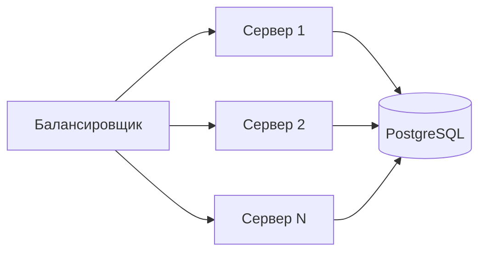
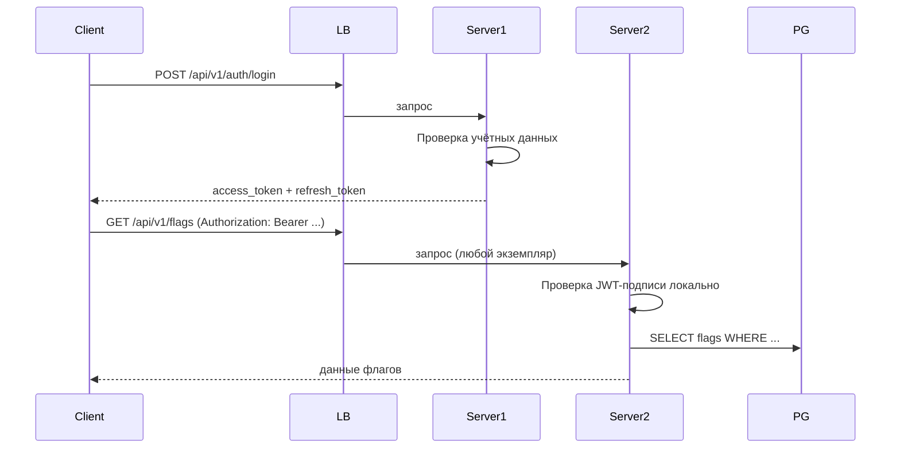
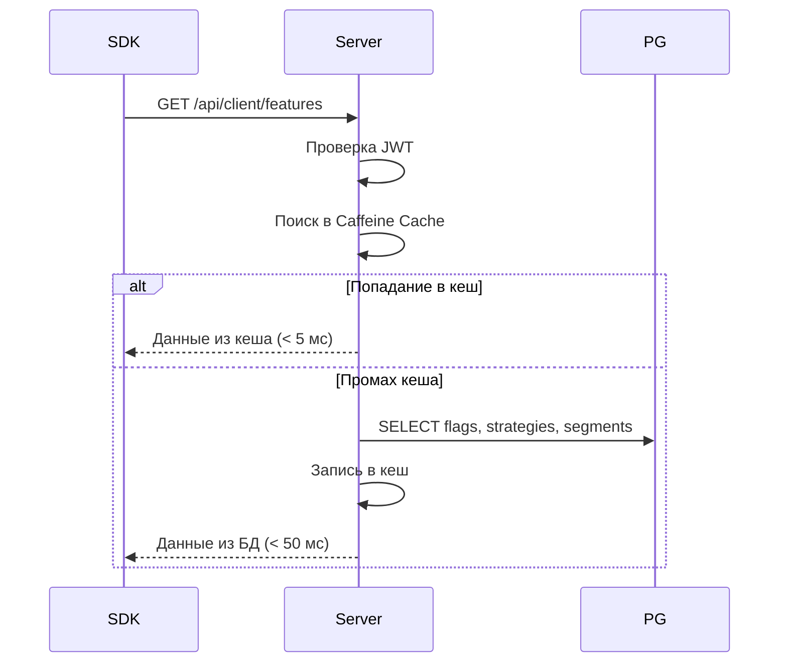

# Горизонтальное масштабирование

Стратегии масштабирования **можно**<span class=brand-dot>.</span>: Stateless-архитектура, балансировка нагрузки, кеширование, пул соединений и целевые показатели производительности.

## Stateless-архитектура

**можно**<span class=brand-dot>.</span> спроектирован как stateless-сервис — каждый экземпляр сервера полностью автономен и не хранит состояние между запросами.

### Как это работает



Ключевые принципы:

1. **JWT-аутентификация без sticky sessions** — каждый JWT-токен самодостаточен. Сервер проверяет подпись HMAC-SHA256 локально, без обращения к общей сессии. Запрос может попасть на любой экземпляр.

2. **Общее состояние в PostgreSQL** — флаги, сегменты, стратегии, аудит-логи и API-ключи хранятся в базе данных. Все экземпляры читают и пишут в один и тот же PostgreSQL.

3. **Отсутствие sticky sessions** — балансировщик может распределять запросы round-robin, least-connections или любым другим алгоритмом. Не требуется привязка пользователя к конкретному экземпляру.

### Механика JWT



Токены:

| Тип | Время жизни | Ротация | Назначение |
|-----|------------|---------|------------|
| Access token | 15 минут | Нет | Доступ к API |
| Refresh token | 30 дней | Семейная ротация | Обновление access-токена |

Refresh-токены хранятся в базе данных. При обновлении старый токен инвалидируется через `SELECT ... FOR UPDATE` — это атомарно и безопасно при конкурентных запросах с разных экземпляров.

## Балансировка нагрузки

### Стратегии балансировки

| Алгоритм | Рекомендация | Примечание |
|----------|-------------|------------|
| Round-robin | Подходит | Равномерное распределение при stateless |
| Least-connections | Рекомендуется | Учитывает занятость экземпляров |
| IP-hash | Не нужен | Не требуется sticky sessions |
| Random | Подходит | Простая альтернатива round-robin |

### Nginx (обратный прокси)

```nginx
upstream mozhno_backend {
    least_conn;
    server mozhno-1:8080 max_fails=3 fail_timeout=30s;
    server mozhno-2:8080 max_fails=3 fail_timeout=30s;
    server mozhno-3:8080 max_fails=3 fail_timeout=30s;
}

server {
    listen 443 ssl http2;
    server_name flags.example.com;

    location / {
        proxy_pass http://mozhno_backend;
        proxy_set_header Host $host;
        proxy_set_header X-Real-IP $remote_addr;
        proxy_set_header X-Forwarded-For $proxy_add_x_forwarded_for;
        proxy_set_header X-Forwarded-Proto $scheme;

        proxy_read_timeout 30s;
        proxy_connect_timeout 5s;
    }
}
```

## Кеширование

**можно**<span class=brand-dot>.</span> использует **Caffeine** — локальный in-memory кеш в рамках одной JVM. Без Redis, без распределённого кеша.

### Что кешируется

| Кеш | Данные | Инвалидация |
|-----|-------|------------|
| `clientFlags` | Ответ `GET /api/client/features` для SDK | `@CacheEvict` при любом изменении флага, сегмента, стратегии, контекста |
| `flags` | Запросы флагов (админ-панель) | `@CacheEvict` при создании/изменении/удалении флага |
| `segments` | Запросы сегментов | `@CacheEvict` при создании/изменении/удалении сегмента |
| `projects` | Список проектов | `@CacheEvict` при создании/изменении/сбросе проекта |
| `tags` | Список тегов | `@CacheEvict` при создании/изменении/удалении тега |
| `contextDefinitions` | Определения контекстов | `@CacheEvict` при создании/изменении/удалении контекста |

Все кеши имеют **единый TTL** — `MOZHNO_CACHE_TTL_MINUTES` (по умолчанию 5 минут). Максимальный размер — 5000 записей на кеш.

### Как работает инвалидация

При изменении флага через REST API:

```
POST /api/v1/flags/42 → @CacheEvict(allEntries = true) → clientFlags кеш очищен
```

**Но очищается только на том инстансе, который обработал запрос.** Другие инстансы узнают об изменении через TTL.

### Нюанс multi-node

```mermaid
graph LR
    Admin -->|POST /api/v1/flags/42| LB
    LB -->|запрос попал на| S1[Инстанс 1]
    S1 -->|@CacheEvict<br/>локально| C1[Caffeine ✓ очищен]
    S1 --> PG[(PostgreSQL)]
    
    S2[Инстанс 2] -->|кеш не очищен<br/>ждёт TTL| C2[Caffeine ✗ устарел]
    
    SDK -->|GET /api/client/features| S2
    S2 -->|отдаёт старые правила| SDK
```

Инстанс-1: кеш очищен мгновенно. Инстанс-2: кеш устарел до истечения TTL (до 5 минут).

Это не баг — это следствие локального кеша. Фиче-флаги не требуют real-time консистентности. Задержка в несколько минут приемлема для постепенной раскатки.

### Рекомендации

| Режим | `MOZHNO_CACHE_TTL_MINUTES` | Почему |
|-------|---------------------|--------|
| **1 инстанс** | `5` (по умолчанию) | Кеш очищается мгновенно при изменении |
| **Multi-node** | `1` или `0` | Минимизирует окно несогласованности между инстансами. `0` = кеш отключен |
| **Enterprise** | `5` + Redis | Добавьте `spring-boot-starter-data-redis`, смените `MOZHNO_CACHE_TYPE` на `redis`, настройте `SPRING_DATA_REDIS_*`. Инвалидация через Redis Pub/Sub — мгновенно на всех инстансах |

## Пул соединений при масштабировании

При горизонтальном масштабировании каждый под открывает собственный пул соединений к PostgreSQL. Необходимо следить за общим числом соединений.

### Расчёт

| Параметр | Значение |
|----------|----------|
| Поды (max) | 8 (HPA max) |
| HikariCP max на под | 30 |
| Общее макс. соединений | 240 |
| PostgreSQL `max_connections` | ≥ 300 |

Настройка PostgreSQL:

```ini
# postgresql.conf
max_connections = 300
shared_buffers = 2GB          # 25% RAM
effective_cache_size = 6GB    # 75% RAM
work_mem = 64MB               # на каждую операцию сортировки
maintenance_work_mem = 512MB  # для VACUUM, CREATE INDEX
```

### Формула HikariCP

```
pool_size = Tn × (Cm − 1) + 1

Где:
- Tn = максимальное число потоков на под
- Cm = максимальное число одновременных соединений к БД, ожидаемое одним потоком

Пример для 4 потоков, 1 соединение на поток:
pool_size = 4 × (1 − 1) + 1 = 1
```

На практике для веб-приложения **можно**<span class=brand-dot>.</span> с короткими транзакциями:

```
pool_size = 30 (рекомендуемое значение для продакшена)
```

## Производительность

### Целевые показатели

| Метрика | Цель | Условия |
|---------|------|---------|
| Оценка флага (SDK) | < 1 мс | Локально, без сети |
| Загрузка правил (SDK → сервер) | < 50 мс | P95, из кеша |
| REST API запрос | < 100 мс | P95, с аутентификацией |
| Время запуска пода | < 30 с | Включая миграции Flyway |
| Пропускная способность | > 10 000 RPS | На один под |

### Загрузка правил SDK



### Профиль нагрузки

| Операция | Доля | Характер |
|----------|------|----------|
| Загрузка правил SDK | 70% | Чтение, кеширование |
| REST API (администрирование) | 20% | Чтение/запись, аутентификация |
| Аудит-записи | 5% | Только запись |
| Аутентификация (login/refresh) | 5% | Чтение/запись refresh-токенов |

### Рекомендации по оптимизации

1. **Увеличивайте TTL кеша** для редко изменяемых данных (стратегии, сегменты)
2. **Используйте пул соединений** с предварительным прогревом (`minimumIdle: 5`)
3. **Настройте ZGC** для минимизации GC-пауз даже при высокой нагрузке
4. **Добавляйте поды** при достижении 70% CPU utilisation — HPA сделает это автоматически
5. **Мониторьте пул соединений** — если `active` приближается к `max`, увеличивайте пул или добавляйте поды

## Мониторинг масштабирования

Ключевые метрики для отслеживания:

| Метрика | Источник | Порог тревоги |
|---------|----------|--------------|
| response_time_p95 | Actuator / Micrometer | > 200 мс |
| hikaricp_active_connections | Actuator | > 80% от max |
| hikaricp_pending_connections | Actuator | > 0 постоянно |
| jvm_memory_used | Actuator | > 85% лимита |
| cpu_usage | cAdvisor / metrics-server | > 70% |

Подключение Prometheus и Grafana:

```yaml
# application.properties
management.endpoints.web.exposure.include=health,metrics,prometheus
management.metrics.export.prometheus.enabled=true
```

```yaml
# ServiceMonitor (Prometheus Operator)
apiVersion: monitoring.coreos.com/v1
kind: ServiceMonitor
metadata:
  name: mozhno
spec:
  selector:
    matchLabels:
      app: mozhno
  endpoints:
    - port: http
      path: /actuator/prometheus
```

## Что дальше?

- [База данных](/self-hosting/database) — бэкапы, репликация, пул соединений, индексы
- [Docker](/self-hosting/docker) — ресурсные ограничения контейнера
- [Архитектура](/advanced/architecture) — модульная структура сервера
