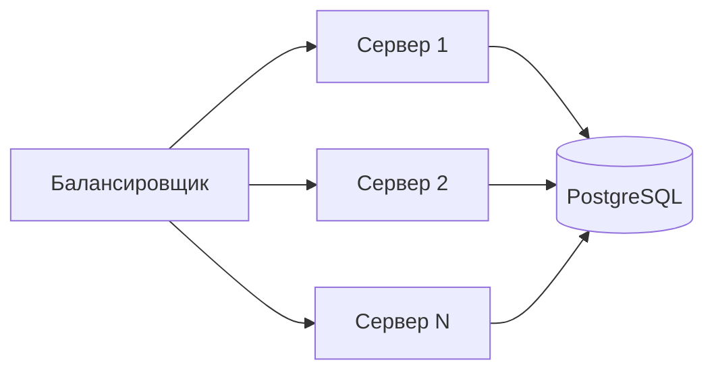
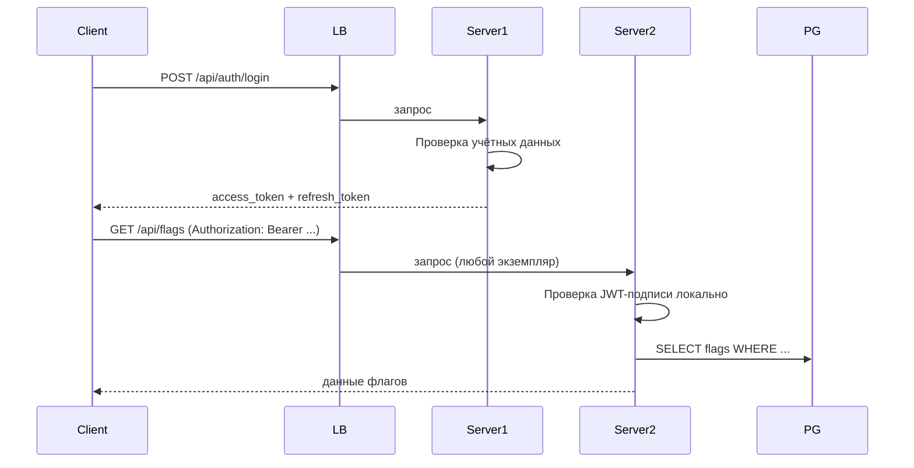
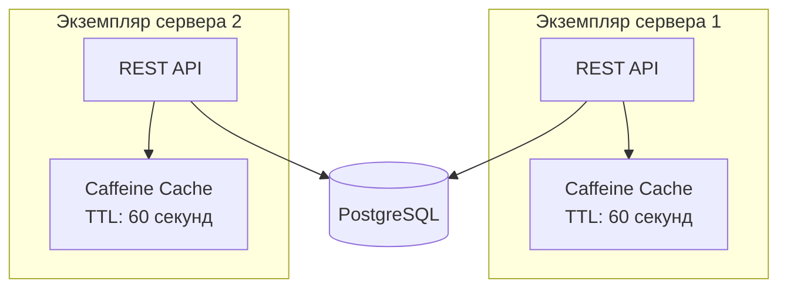
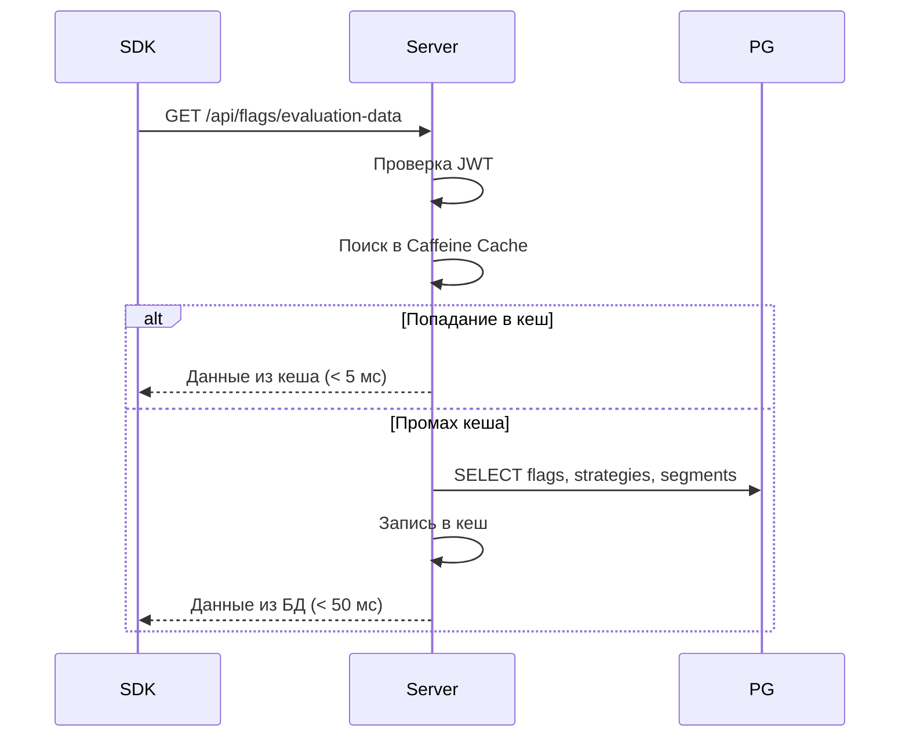

# Горизонтальное масштабирование

Стратегии масштабирования **можно.**: Stateless-архитектура, балансировка нагрузки, кеширование, пул соединений и целевые показатели производительности.

## Stateless-архитектура

**можно.** спроектирован как stateless-сервис — каждый экземпляр сервера полностью автономен и не хранит состояние между запросами.

### Как это работает



Ключевые принципы:

1. **JWT-аутентификация без sticky sessions** — каждый JWT-токен самодостаточен. Сервер проверяет подпись HMAC-SHA256 локально, без обращения к общей сессии. Запрос может попасть на любой экземпляр.

2. **Общее состояние в PostgreSQL** — флаги, сегменты, стратегии, аудит-логи и API-ключи хранятся в базе данных. Все экземпляры читают и пишут в один и тот же PostgreSQL.

3. **Отсутствие sticky sessions** — балансировщик может распределять запросы round-robin, least-connections или любым другим алгоритмом. Не требуется привязка пользователя к конкретному экземпляру.

### Механика JWT



Токены:

| Тип | Время жизни | Ротация | Назначение |
|-----|------------|---------|------------|
| Access token | 15 минут | Нет | Доступ к API |
| Refresh token | 7 дней | Семейная ротация | Обновление access-токена |

Refresh-токены хранятся в базе данных. При обновлении старый токен инвалидируется через `SELECT ... FOR UPDATE` — это атомарно и безопасно при конкурентных запросах с разных экземпляров.

## Балансировка нагрузки

### Стратегии балансировки

| Алгоритм | Рекомендация | Примечание |
|----------|-------------|------------|
| Round-robin | Подходит | Равномерное распределение при stateless |
| Least-connections | Рекомендуется | Учитывает занятость экземпляров |
| IP-hash | Не нужен | Не требуется sticky sessions |
| Random | Подходит | Простая альтернатива round-robin |

### Nginx (обратный прокси)

```nginx
upstream mozhno_backend {
    least_conn;
    server mozhno-1:8080 max_fails=3 fail_timeout=30s;
    server mozhno-2:8080 max_fails=3 fail_timeout=30s;
    server mozhno-3:8080 max_fails=3 fail_timeout=30s;
}

server {
    listen 443 ssl http2;
    server_name flags.example.com;

    location / {
        proxy_pass http://mozhno_backend;
        proxy_set_header Host $host;
        proxy_set_header X-Real-IP $remote_addr;
        proxy_set_header X-Forwarded-For $proxy_add_x_forwarded_for;
        proxy_set_header X-Forwarded-Proto $scheme;

        proxy_read_timeout 30s;
        proxy_connect_timeout 5s;
    }
}
```

### Kubernetes

В Kubernetes балансировка обеспечивается Service (kube-proxy) и Ingress-контроллером:

```yaml
spec:
  type: ClusterIP
  ports:
    - port: 8080
```

kube-proxy распределяет трафик между подами. Ingress (nginx-ingress, Traefik) добавляет TLS-терминацию и балансировку на уровне HTTP.

## Кеширование

**можно.** использует **локальный кеш Caffeine** на каждом экземпляре сервера. Это ин-мемори кеш в рамках одной JVM — без Redis, без распределённого кеша.

### Архитектура кеширования



### Что кешируется

| Данные | Размер кеша | TTL | Обоснование |
|--------|-----------|-----|-------------|
| Конфигурация флагов | 10 000 записей | 60 с | Самая частая операция чтения |
| Правила сегментов | 5 000 записей | 120 с | Редко изменяются |
| API-ключи | 1 000 записей | 300 с | Проверяются при каждом запросе |
| Стратегии | 500 записей | 120 с | Справочные данные |

### Конфигурация Caffeine

Настройка через `application.properties` или переменные окружения:

```
MOZHNO_CACHE_FLAGS_MAX_SIZE=10000
MOZHNO_CACHE_FLAGS_EXPIRE_AFTER_WRITE_SECONDS=60
MOZHNO_CACHE_SEGMENTS_MAX_SIZE=5000
MOZHNO_CACHE_SEGMENTS_EXPIRE_AFTER_WRITE_SECONDS=120
MOZHNO_CACHE_API_KEYS_MAX_SIZE=1000
MOZHNO_CACHE_API_KEYS_EXPIRE_AFTER_WRITE_SECONDS=300
```

### Инвалидация кеша

Кеш инвалидируется двумя способами:

1. **TTL** — автоматически по истечении времени жизни
2. **Явная инвалидация** — при изменении флага через REST API кеш сбрасывается на **локальном** экземпляре, обработавшем запрос

Другие экземпляры узнают об изменении через TTL. Это означает, что **изменение флага распространяется на все поды в течение TTL (60 секунд)**. Такая модель (stale-while-revalidate) приемлема для системы фича-флагов, где задержка в 60 секунд не критична.

Если требуется мгновенная инвалидация, добавьте Redis Pub/Sub для оповещения всех экземпляров — но это платная Enterprise-функция через `FeatureGateSpi`.

## Пул соединений при масштабировании

При горизонтальном масштабировании каждый под открывает собственный пул соединений к PostgreSQL. Необходимо следить за общим числом соединений.

### Расчёт

| Параметр | Значение |
|----------|----------|
| Поды (max) | 8 (HPA max) |
| HikariCP max на под | 30 |
| Общее макс. соединений | 240 |
| PostgreSQL `max_connections` | ≥ 300 |

Настройка PostgreSQL:

```ini
# postgresql.conf
max_connections = 300
shared_buffers = 2GB          # 25% RAM
effective_cache_size = 6GB    # 75% RAM
work_mem = 64MB               # на каждую операцию сортировки
maintenance_work_mem = 512MB  # для VACUUM, CREATE INDEX
```

### Формула HikariCP

```
pool_size = Tn × (Cm − 1) + 1

Где:
- Tn = максимальное число потоков на под
- Cm = максимальное число одновременных соединений к БД, ожидаемое одним потоком

Пример для 4 потоков, 1 соединение на поток:
pool_size = 4 × (1 − 1) + 1 = 1
```

На практике для веб-приложения **можно.** с короткими транзакциями:

```
pool_size = 30 (рекомендуемое значение для продакшена)
```

## Производительность

### Целевые показатели

| Метрика | Цель | Условия |
|---------|------|---------|
| Оценка флага (SDK) | < 1 мс | Локально, без сети |
| Загрузка правил (SDK → сервер) | < 50 мс | P95, из кеша |
| REST API запрос | < 100 мс | P95, с аутентификацией |
| Время запуска пода | < 30 с | Включая миграции Flyway |
| Пропускная способность | > 10 000 RPS | На один под |

### Загрузка правил SDK



### Профиль нагрузки

| Операция | Доля | Характер |
|----------|------|----------|
| Загрузка правил SDK | 70% | Чтение, кеширование |
| REST API (администрирование) | 20% | Чтение/запись, аутентификация |
| Аудит-записи | 5% | Только запись |
| Аутентификация (login/refresh) | 5% | Чтение/запись refresh-токенов |

### Рекомендации по оптимизации

1. **Увеличивайте TTL кеша** для редко изменяемых данных (стратегии, сегменты)
2. **Используйте пул соединений** с предварительным прогревом (`minimumIdle: 5`)
3. **Настройте ZGC** для минимизации GC-пауз даже при высокой нагрузке
4. **Добавляйте поды** при достижении 70% CPU utilisation — HPA сделает это автоматически
5. **Мониторьте пул соединений** — если `active` приближается к `max`, увеличивайте пул или добавляйте поды

## Мониторинг масштабирования

Ключевые метрики для отслеживания:

| Метрика | Источник | Порог тревоги |
|---------|----------|--------------|
| response_time_p95 | Actuator / Micrometer | > 200 мс |
| hikaricp_active_connections | Actuator | > 80% от max |
| hikaricp_pending_connections | Actuator | > 0 постоянно |
| jvm_memory_used | Actuator | > 85% лимита |
| cpu_usage | cAdvisor / metrics-server | > 70% (триггер HPA) |
| pod_restarts | Kubernetes | > 0 за 5 мин |

Подключение Prometheus и Grafana:

```yaml
# application.properties
management.endpoints.web.exposure.include=health,metrics,prometheus
management.metrics.export.prometheus.enabled=true
```

```yaml
# ServiceMonitor (Prometheus Operator)
apiVersion: monitoring.coreos.com/v1
kind: ServiceMonitor
metadata:
  name: mozhno
spec:
  selector:
    matchLabels:
      app: mozhno
  endpoints:
    - port: http
      path: /actuator/prometheus
```

## Что дальше?

- [Kubernetes](/self-hosting/kubernetes) — HPA, Deployment, пробы
- [База данных](/self-hosting/database) — пул соединений, индексы
- [Docker](/self-hosting/docker) — ресурсные ограничения контейнера
- [Архитектура](/advanced/architecture) — модульная структура сервера
